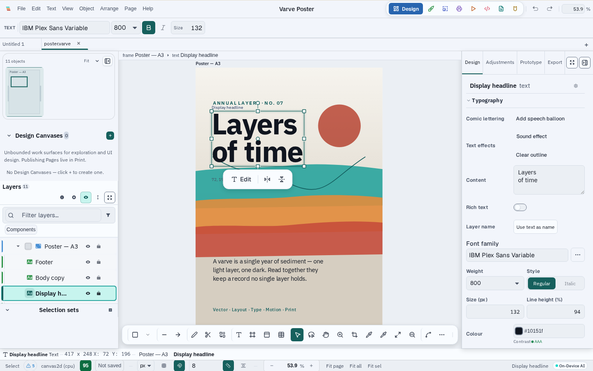

# Varve

Local-first design suite for vector, layout, typography, motion, prototyping, and
print production. Runs natively on Linux, macOS, and Windows — no subscription,
no cloud dependency.

> Public beta — breaking changes may occur. See [releases](https://github.com/K-Arthur/varve/releases).

## The workspace



Vector, layout, typography, motion, prototyping, and print in one document
model — a native Rust engine on desktop, the same engine compiled to WASM on
the web.

Screenshots are generated by the deterministic capture pipeline
(`pnpm screenshots:product`) from the running application, not by hand; see
[scripts/screenshots/README.md](scripts/screenshots/README.md).

## Quick start

```bash
pnpm install
pnpm --filter @varve/ui storybook
```

See [docs/development/setup.md](docs/development/setup.md) for full setup instructions.

## Key packages

| Package | Purpose |
|---------|---------|
| `@varve/ui` | Design system tokens, APG-pattern components, icon system |
| `@varve/editor` | Editor shell, canvas, layers, inspector, tools, shortcuts |
| `@varve/engine` | WASM/native/stub engine facade with IR-replay renderer |
| `@varve/scene` | Immutable document model with ops |
| `@varve/codegen` | SVG/React/Flutter/SwiftUI code export |
| `@varve/platform` | Platform abstraction (Tauri/web/memory) |

## Architecture

Varve uses an IR (intermediate representation) replay pattern: the Rust engine
computes a scene and emits compact render IR; the webview replays it to
Canvas2D or WebGPU. See [ADR-0001](docs/adr/0001-native-render-in-tauri-webview.md)
for the rationale and [docs/architecture/render-pipeline.md](docs/architecture/render-pipeline.md)
for the full pipeline.

## Documentation

- **Setup**: [docs/development/setup.md](docs/development/setup.md)
- **Testing**: [docs/development/setup.md#testing](docs/development/setup.md#testing)
- **Architecture decisions**: [docs/adr/](docs/adr/)
- **Full index**: [docs/README.md](docs/README.md)

## Contributing

See [CONTRIBUTING.md](CONTRIBUTING.md) — external contributions are not yet
open; when they open, they will require a DCO sign-off.

## License

Varve Community Edition is licensed under the **Functional Source License,
Version 1.1, MIT Future License** (FSL-1.1-MIT), with an automatic conversion
to the **MIT License** after two years from each release. See
[LICENSE](LICENSE) for full terms.

"Varve" is a trademark of K-Arthur (formerly "Strata"). See [TRADEMARKS.md](TRADEMARKS.md) for usage guidelines.

Third-party component attribution is in [THIRD_PARTY_NOTICES](THIRD_PARTY_NOTICES).
