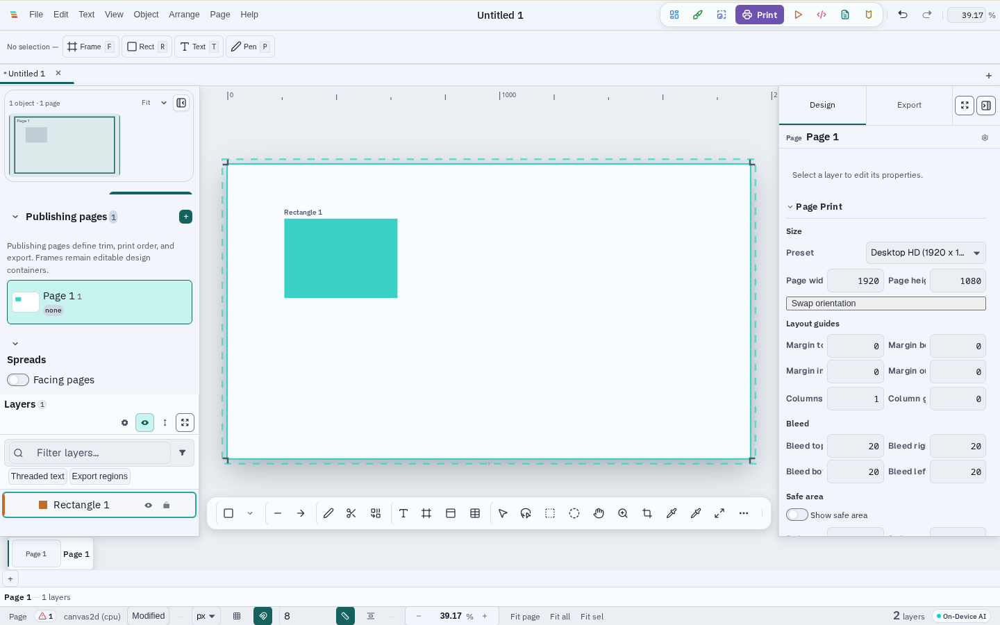
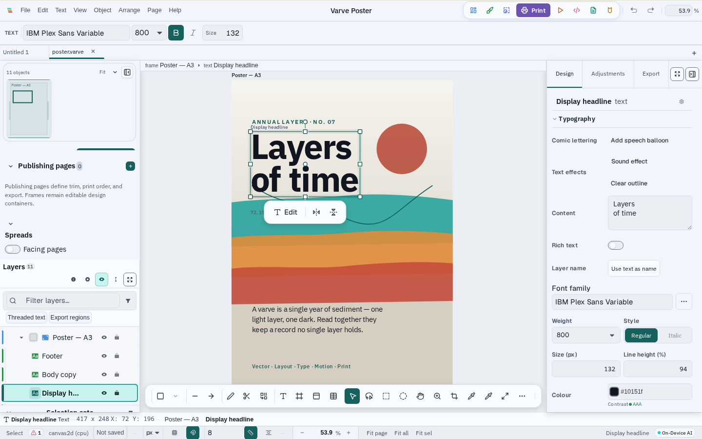
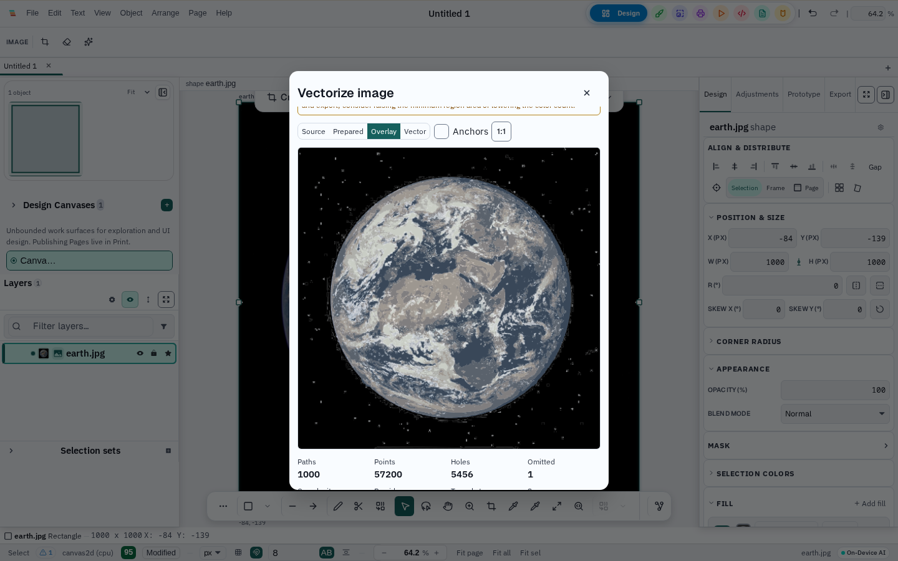
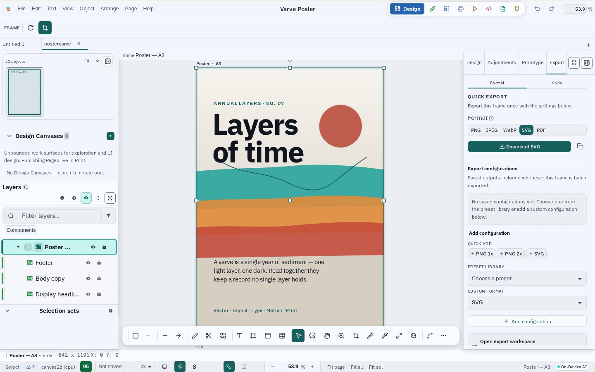
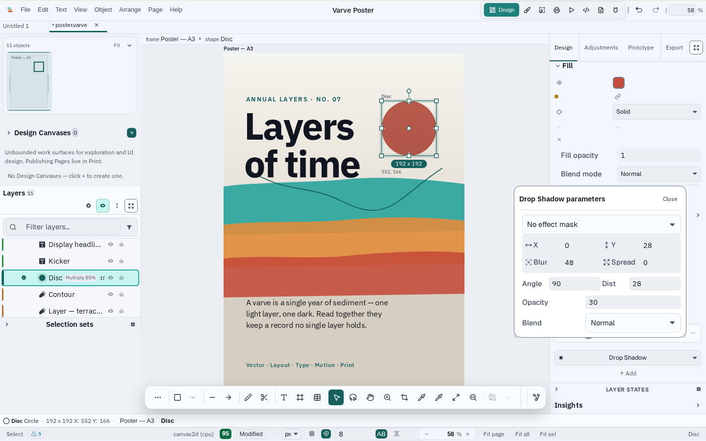
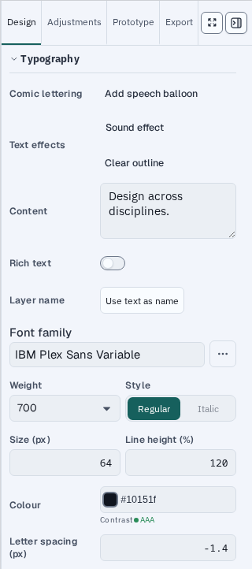

<p align="center">
  <br><br>
  
  
</p>

<h1 align="center">Varve</h1>
<p align="center"><strong>Local-first design software for vector, layout, typography, motion, prototyping, and print — one application, no subscription, no cloud account.</strong></p>

<p align="center">
  <a href="https://github.com/K-Arthur/varve/actions/workflows/ci.yml"></a>
  <a href="https://github.com/K-Arthur/varve/releases/latest"></a>
  <a href="LICENSE"></a>
  <a href="#project-status"></a>
  <a href="https://github.com/sponsors/K-Arthur"></a>
</p>

> **Public beta.** The latest published application release is `v0.1.2`.
> This checkout is preparing the `v0.2.0` release candidate. Installers are
> published for Linux, macOS, and Windows. Core workflows are usable today,
> but the `.varve` document format and interfaces can still change, and
> Windows/macOS builds are not yet code-signed.

<p align="center">
  <a href="https://varve.studio/download"><strong>Download Varve</strong></a> ·
  <a href="https://varve.studio"><strong>Website</strong></a> ·
  <a href="https://varve.studio/docs"><strong>Docs</strong></a> ·
  <a href="https://github.com/K-Arthur/varve/releases"><strong>Releases</strong></a> ·
  <a href="https://github.com/K-Arthur/varve/discussions"><strong>Discussions</strong></a> ·
  <a href="https://github.com/sponsors/K-Arthur"><strong>Sponsor</strong></a>
</p>

**For designers, illustrators, and print professionals** who want a local-first
alternative to subscription design tools. Built with a shared Rust rendering
engine, Varve runs natively on Linux, macOS, and Windows — and compiles to
WASM for the browser. No account, no forced cloud sync, no feature paywall.

<p align="center">
  
  
</p>

## What works today

- **Vector editing** — paths, shapes, node/Bézier editing, boolean ops
- **Page layout** — multi-page documents, flex/grid layout, reusable components
- **Typography** — paragraph/character styling, OpenType features, variable fonts, text-on-path
- **Motion** (alpha) — timeline with keyframes, easing, auto-keyframe assist
- **Print production** (desktop) — CMYK via ICC profiles, PDF/X export, crop/registration marks
- **Export** — SVG, React, Svelte, Vue, Flutter, SwiftUI, email HTML,
  Web Components, Tailwind, Lottie/CSS/SVG animation — computed locally,
  no network round-trip
- **Images and local intelligence** — adjustments, effects, raster-to-vector
  trace, background removal, optional on-device enhancement, palette
  extraction, object selection, depth blur, and asset search
- **Email design** (desktop) — visual email authoring, preview, and
  multi-format export (HTML, plain text) with preflight diagnostics

**Not yet implemented:** real-time collaboration exists only as UI scaffolding.
The WASM/browser build exists for development — the supported product path is
the native desktop application.

## See Varve in action

Screenshots are generated by the deterministic capture pipeline
(`pnpm screenshots:product`) from the running application against seeded
demo documents — never hand-edited. See
[scripts/screenshots/README.md](scripts/screenshots/README.md).

<table>
<tr>
<td width="50%">

<p align="center">Node editing with live Bézier handles</p>
</td>
<td width="50%">

<p align="center">A multi-page editorial spread</p>
</td>
</tr>
<tr>
<td width="50%">

<p align="center">A type hierarchy set on the canvas</p>
</td>
<td width="50%">

<p align="center">The timeline panel in the motion workspace</p>
</td>
</tr>
<tr>
<td width="50%">

<p align="center">Bleed and trim guides for print production</p>
</td>
<td width="50%">

<p align="center">Workspaces swap panels for the task</p>
</td>
</tr>
<tr>
<td width="50%">

<p align="center">Trace an image into editable paths</p>
</td>
<td width="50%">

<p align="center">Export to SVG, PNG, WebP, or PDF</p>
</td>
</tr>
<tr>
<td width="50%">

<p align="center">Stackable, non-destructive effects</p>
</td>
<td width="50%">

<p align="center">Type controls for the selected text</p>
</td>
</tr>
</table>

## Download

**[varve.studio/download](https://varve.studio/download)** — the website
renders every download link and checksum directly from the published release
manifest, so it never goes stale. You can also get the same installers from
[GitHub Releases](https://github.com/K-Arthur/varve/releases) (look for a
release named `Varve vX.Y.Z` — a separate `Varve optional AI models` release
also exists on that page for on-demand model assets and is not an application
release). GitHub's
[latest-release shortcut](https://github.com/K-Arthur/varve/releases/latest)
points to the latest Varve application release, not the model artifacts.

## Platform support

| Platform | Package | Status | Signing |
|---|---|---|---|
| Linux x86_64 | AppImage · `.deb` · `.rpm` | Supported in the published release | Unsigned — SHA-256 checksums, SBOM, and build provenance published |
| Linux ARM64 | AppImage · `.deb` · `.rpm` | Supported in the published release | Unsigned — SHA-256 checksums, SBOM, and build provenance published |
| macOS 13+ Apple Silicon (arm64) | `.dmg` | Experimental — CI-built and smoke-tested | Unsigned, not notarized |
| Windows 10 (1809+) / 11 x86_64 | NSIS `.exe` | Experimental — CI-built and smoke-tested | Unsigned |
| Windows 10 (1809+) / 11 ARM64 | NSIS `.exe` | Experimental — CI-built and smoke-tested | Unsigned |
| macOS Intel (x86_64) | — | Not published | — |

Minimum 4 GB RAM (8 GB recommended), 500 MB storage. Full detail and the
policy behind each tier:
[docs/release/platform-support-matrix.md](docs/release/platform-support-matrix.md).

## Privacy and local-first operation

Core editing works fully offline and no account is required. Varve does not
send analytics or crash reports by default. Network access is feature-specific
and may be used for:

- **Optional model downloads**, fetched from the model provider shown in the
  model dialog and verified against a pinned checksum when one is available.
- **Online font and icon search**, when you invoke those providers.
- **Update checks**, only after you enable them and only for an install whose
  release channel has a published signed feed. The current release does not
  include a signed feed, so manual updates are currently the dependable path.
- **Optional cloud providers**, only when you configure and invoke one (for
  example, a user-supplied background-removal endpoint).
- **Consent-gated aggregate analytics**. Crash reports remain local unless a
  build explicitly configures an upload endpoint; the public build does not.

## Develop Varve

Full instructions, prerequisites, and per-OS system packages:
[docs/development/setup.md](docs/development/setup.md).

```bash
git clone https://github.com/K-Arthur/varve
cd varve
pnpm install
just check-env             # verify Rust/pnpm/just/Node toolchain
```

Run the application:

```bash
cd apps/desktop
pnpm tauri:dev              # native desktop window (Tauri)
# or
pnpm dev                    # web build via Vite → http://localhost:1420
```

`pnpm --filter @varve/ui storybook` runs Storybook, the UI **component**
development environment — it is not the application.

Test and validate:

```bash
pnpm verify:affected        # impact-aware validation (default inner loop)
just test-rust              # cargo test --workspace
just test-js                # Vitest
```

See [docs/development/setup.md#testing](docs/development/setup.md#testing)
for the full validation strategy.

## Architecture

```
Desktop shell (Tauri)
        ↓
Editor / scene model  (@varve/editor, @varve/scene)
        ↓
Engine abstraction     (@varve/engine — Tauri / WASM / in-memory)
        ↓
Rust native ⇄ WASM     (crates/varve-core, varve-layout, varve-effects, …)
        ↓
Render IR
        ↓
Canvas2D / WebGPU
```

The Rust engine computes a scene and emits a compact render IR; the webview
replays it to Canvas2D or WebGPU. See
[ADR-0001](docs/adr/0001-native-render-in-tauri-webview.md) for the
rationale and [docs/architecture/render-pipeline.md](docs/architecture/render-pipeline.md)
for the full pipeline. A bounded browser demo is hosted at
[varve.studio/try](https://varve.studio/try/) with honest capability
messaging; the full product path is the native desktop application.

| Package | Purpose |
|---|---|
| `@varve/ui` | Design system tokens, APG-pattern components, icon system |
| `@varve/editor` | Editor shell, canvas, layers, inspector, tools, shortcuts |
| `@varve/engine` | WASM/native/stub engine facade with IR-replay renderer |
| `@varve/scene` | Immutable document model with ops |
| `@varve/codegen` | SVG, React, Svelte, Vue, Flutter, SwiftUI, Web Components, email HTML, and more |
| `@varve/platform` | Platform abstraction (Tauri/web/memory) |

```
apps/       desktop shell + website (Astro)
packages/   TypeScript packages (editor, engine, scene, ui, codegen, …)
crates/     Rust workspace (varve-core, varve-layout, varve-effects, …)
docs/       architecture, ADRs, release engineering, security, privacy
scripts/    release, screenshot, and quality-gate tooling
.github/    CI/CD workflows, issue templates, Dependabot
```

## Project status

Varve is in **public beta**. The latest published application release is
`v0.1.2` (published installer releases are `v0.1.0`, `v0.1.1`, and `v0.1.2`),
covering Linux, macOS (Apple Silicon), and Windows. The checkout represented
by this source tree is version `<!-- VARVE_VERSION -->0.2.0<!-- /VARVE_VERSION -->`. Versioning follows [SemVer](https://semver.org/); release notes are
kept in [CHANGELOG.md](CHANGELOG.md). Expect rough edges, and keep backups —
the `.varve` document format can still change between releases. Documents
saved with the legacy `.strata` extension (from before the project's rename
from Strata to Varve) remain openable through the versioned migration pipeline.

## Frequently asked questions

<details>
<summary><strong>Is Varve free?</strong></summary>
<br>
Yes. The Community Edition is free to download and use, with no
subscription and no feature paywall.
</details>

<details>
<summary><strong>Is Varve open source or source-available?</strong></summary>
<br>
The application is source-available under FSL-1.1-MIT: the source is public
and you may use, modify, and redistribute it for any purpose that doesn't
compete commercially with Varve. Each release automatically converts to the
plain MIT license two years after it ships. See <a href="LICENSE">LICENSE</a>.

Several engine crates (<code>varve-core</code>, <code>varve-colour</code>,
<code>varve-trace</code>, and others) are published separately under
<strong>MIT OR Apache-2.0</strong> — genuine OSI-approved open source. See
<a href="docs/licensing/mixed-license-model.md">docs/licensing/mixed-license-model.md</a>.
</details>

<details>
<summary><strong>Does Varve require an account or the cloud?</strong></summary>
<br>
No account is required, and core editing works fully offline. Optional
network features include model downloads, online font/icon search, consented
update checks, user-configured cloud providers, and aggregate analytics — see
<a href="#privacy-and-local-first-operation">Privacy and local-first operation</a>.
</details>

<details>
<summary><strong>What operating systems does Varve support?</strong></summary>
<br>
Linux, macOS, and Windows. See <a href="#platform-support">Platform support</a>
for per-platform maturity and signing status. There is no mobile build.
</details>

<details>
<summary><strong>Does Varve support vector and raster graphics?</strong></summary>
<br>
Yes to both: vector paths/shapes/boolean ops, and a raster adjustment/filter
pipeline including on-device background removal.
</details>

<details>
<summary><strong>Does Varve support CMYK and print workflows?</strong></summary>
<br>
Yes, on desktop: CMYK via ICC profiles, PDF/X-1a and PDF/X-4 export, crop
and registration marks, and preflight checks. Print export is not available
in the web/WASM build.
</details>

<details>
<summary><strong>Where are Varve files stored?</strong></summary>
<br>
The desktop app writes local <code>.varve</code> files to locations you
choose. The browser build uses local IndexedDB/browser storage. There is no
mandatory cloud sync.
</details>

<details>
<summary><strong>Does Varve include AI features?</strong></summary>
<br>
Yes, as optional local workflows. Depending on the build, these include
background removal, image enhancement, object selection, depth-aware effects,
palette extraction, and local asset search. Some small baseline models ship
with the app; larger models are downloaded on demand, verified against a
checksum when available, and run locally. There is no Varve-hosted inference
service.
</details>

<details>
<summary><strong>Does Varve support real-time collaboration?</strong></summary>
<br>
Not yet. There is UI scaffolding for it, but no collaboration transport or
protocol is implemented today.
</details>

<details>
<summary><strong>Is Varve production ready?</strong></summary>
<br>
It's public beta software. Core workflows are usable, but interfaces and
the document format can still change — see
<a href="#project-status">Project status</a>.
</details>

<details>
<summary><strong>Does Varve work in a browser?</strong></summary>
<br>
A bounded browser demo is available at
<a href="https://varve.studio/try/">varve.studio/try</a> — no download
required. It runs a curated sample document with honest capability messaging
about what the browser build can and cannot do. The full product experience
is the native desktop application; the WASM target also supports the browser
compatibility build and test harness.
</details>

<details>
<summary><strong>How do I report a bug or a security vulnerability?</strong></summary>
<br>
Bugs and feature feedback: <a href="https://github.com/K-Arthur/varve/issues">GitHub Issues</a>.
Security vulnerabilities: report privately per <a href="SECURITY.md">SECURITY.md</a>
— do not open a public issue.
</details>

## Contributing

External code contributions are temporarily paused while the project
stabilizes its build, release, and documentation foundations. See
[CONTRIBUTING.md](CONTRIBUTING.md) and the [current contributor guide](docs/development/contributing.md)
for the status and future PR workflow. Bug reports, feature ideas, testing,
documentation, and design feedback are welcome now via
[Issues](https://github.com/K-Arthur/varve/issues) and
[Discussions](https://github.com/K-Arthur/varve/discussions).

## Security

Report vulnerabilities privately through
[GitHub Security Advisories](https://github.com/K-Arthur/varve/security/advisories) —
see [SECURITY.md](SECURITY.md) for scope and process. Do not file a public
issue for a security report.

## Support

[Product support](mailto:support@varve.studio) is available for private installation,
download, troubleshooting, and usage questions. Use [GitHub Issues](https://github.com/K-Arthur/varve/issues)
for reproducible non-sensitive bugs and [Discussions](https://github.com/K-Arthur/varve/discussions)
for public questions and workflows. See [SUPPORT.md](SUPPORT.md) or the complete
[contact directory](https://varve.studio/contact). This is an independently maintained project;
availability and response times vary.

## Contact

- General: [hello@varve.studio](mailto:hello@varve.studio)
- Support: [support@varve.studio](mailto:support@varve.studio)
- Security: [security@varve.studio](mailto:security@varve.studio), or GitHub [Private Vulnerability Reporting](https://github.com/K-Arthur/varve/security/advisories)

## License

Varve Community Edition is licensed under the **Functional Source License,
Version 1.1, MIT Future License** (FSL-1.1-MIT) — source-available, not
OSI-approved open source, with an automatic conversion to the **MIT
License** two years after each release. See [LICENSE](LICENSE) for full
terms.

Several engine crates (`varve-core`, `varve-colour`, `varve-trace`,
`varve-layout`, `varve-media`, `varve-effects`, `varve-upscale`,
`varve-bgremove`) are licensed under **MIT OR Apache-2.0** for ecosystem
reuse and grant eligibility. See
[mixed-license model](docs/licensing/mixed-license-model.md).

"Varve" is a trademark of K-Arthur (formerly "Strata"). See
[TRADEMARKS.md](TRADEMARKS.md) for usage guidelines. Third-party component
attribution is in [THIRD_PARTY_NOTICES](THIRD_PARTY_NOTICES).
