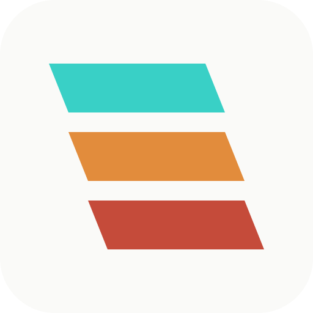
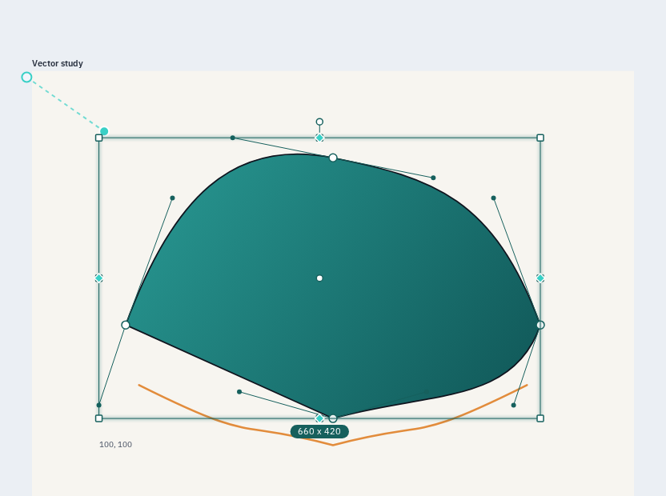
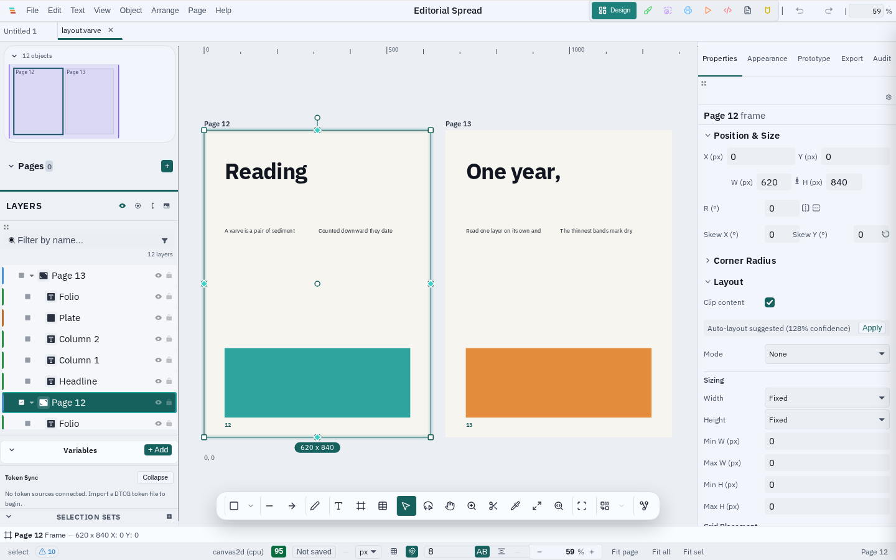
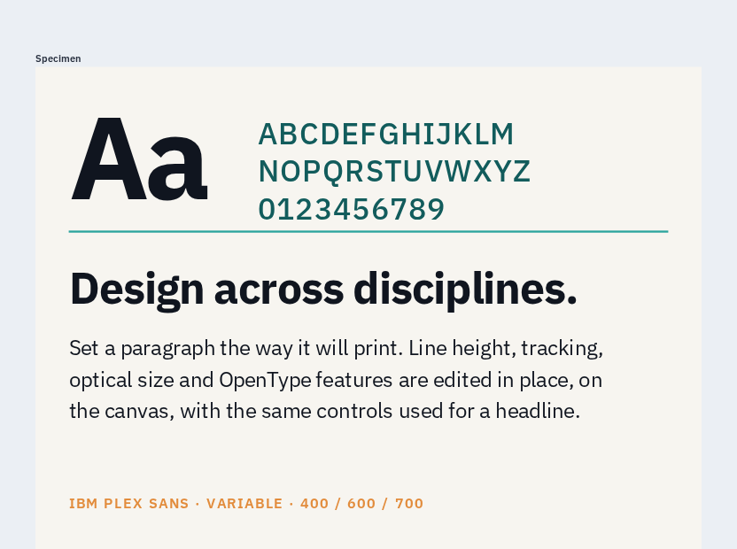
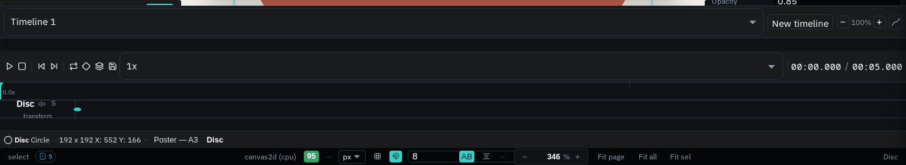

<p align="center">
  <br><br>
  
  
</p>

<h1 align="center">Varve</h1>
<p align="center"><strong>Local-first design software for vector, layout, typography, motion, prototyping, and print — one application, no subscription, no cloud account.</strong></p>

<p align="center">
  <a href="https://github.com/K-Arthur/varve/actions/workflows/ci.yml"></a>
  <a href="https://github.com/K-Arthur/varve/releases/latest"></a>
  <a href="LICENSE"></a>
  <a href="#project-status"></a>
</p>

<p align="center">
  <a href="https://varve.studio"><strong>Website</strong></a> ·
  <a href="https://varve.studio/download"><strong>Download</strong></a> ·
  <a href="https://varve.studio/docs"><strong>Documentation</strong></a> ·
  <a href="https://github.com/K-Arthur/varve/releases"><strong>Releases</strong></a> ·
  <a href="https://github.com/K-Arthur/varve/discussions"><strong>Discussions</strong></a>
</p>

> **Public beta.** The latest published application release is `v0.1.1`.
> Installers are published for Linux, macOS, and Windows. Core workflows are
> usable today, but the `.varve` document format and interfaces can still
> change, and Windows/macOS builds are not yet code-signed. The source tree is
> already on the next `0.1.2` development line; see [Project status](#project-status).

<p align="center">
  
  
</p>

## What is Varve?

Varve is a local-first, cross-platform design application for vector
graphics, page layout, typography, motion, prototyping, and print
production, built as one application around one document model. The desktop
app runs natively on Linux, macOS, and Windows with a shared Rust engine; the
same architecture also compiles to WASM for the browser build. Core editing
does not require an account, cloud subscription, or internet connection. The
desktop app writes projects to local files and the browser build uses local
browser storage; no hosted web editor is available yet. Varve is free to use
today under a source-available license (see [License](#license)).

## Why Varve

- **Local-first** — documents are files on your disk, not records in
  someone else's database. No account, no forced cloud sync.
- **No subscription** — the Community Edition is free, with no feature
  paywall.
- **One engine, every surface** — the shared Rust rendering and layout
  architecture runs natively on desktop and compiles to WASM for the browser
  build, so behavior does not need to fork between platforms.
- **Cross-platform** — Linux, macOS, and Windows from one codebase, packaged
  with [Tauri](https://tauri.app).
- **Source-available today, MIT tomorrow** — the source is public now under
  FSL-1.1-MIT; each release converts to plain MIT two years after it ships.

## Features

Maturity is called out honestly below — see [Project status](#project-status)
for what "public beta" means in practice.

- **Vector editing** — paths, shapes, node/Bézier editing, and boolean
  union/subtract/intersect/exclude operations.
- **Layout** — multi-page documents, flex/grid-based layout (via
  [Taffy](https://github.com/DioxusLabs/taffy)), and reusable components
  with typed variants.
- **Typography** — paragraph/character styling, OpenType features, variable
  fonts, text-on-path, and font detection/estimation tooling.
- **Raster tools** — adjustment/filter pipeline, live effects (bloom,
  dither, CRT, VHS, and more), and non-AI + optional on-device background
  removal.
- **Print production** *(desktop only)* — CMYK via ICC profiles, PDF/X-1a
  and PDF/X-4 export, crop/registration marks, and preflight checks.
- **Prototyping** — interactions, transitions, Smart Animate, and
  responsive/scroll behavior.
- **Motion** *(alpha)* — a timeline with keyframes, easing, and an
  auto-keyframe assist.
- **Code export** — SVG, React (Tailwind or CSS Modules), Svelte, Flutter,
  SwiftUI, HTML, and Lottie/CSS/SVG animation export, computed locally with
  no network round-trip.
- **Images and local intelligence** — import common image formats, use
  non-destructive adjustments and effects, trace raster images into vectors,
  remove backgrounds, and access optional on-device workflows such as image
  enhancement, object selection, depth-aware effects, palette extraction,
  and local asset search. Some small baseline models are bundled; larger
  models are downloaded explicitly, pinned by SHA-256 where available, and
  run locally rather than through a Varve inference service. Availability can
  vary between the published release and the development build.

Not yet implemented: real-time multi-user collaboration exists only as UI
scaffolding — see the [FAQ](#frequently-asked-questions).

## See Varve in action

Screenshots are generated by the deterministic capture pipeline
(`pnpm screenshots:product`) from the running application against seeded demo
documents — never hand-edited. See
[scripts/screenshots/README.md](scripts/screenshots/README.md).

<table>
<tr>
<td width="50%">

<p align="center">Node editing with live Bézier handles</p>
</td>
<td width="50%">

<p align="center">A multi-page editorial spread</p>
</td>
</tr>
<tr>
<td width="50%">

<p align="center">A type hierarchy set on the canvas</p>
</td>
<td width="50%">

<p align="center">The timeline panel in the motion workspace</p>
</td>
</tr>
</table>

## Platform support

| Platform | Package | Status | Signing |
|---|---|---|---|
| Linux x86_64 | AppImage · `.deb` · `.rpm` | Supported in the published release | Unsigned — SHA-256 checksums, SBOM, and build provenance published |
| Windows 10 (1809+) / 11 x86_64 | NSIS `.exe` | Experimental — CI-built and smoke-tested | Unsigned |
| macOS 13+ Apple Silicon (arm64) | `.dmg` | Experimental — CI-built and smoke-tested | Unsigned, not notarized |
| Linux ARM64 / Windows ARM64 | — | Not published | — |
| macOS Intel (x86_64) | — | Not published | — |

Minimum 4 GB RAM (8 GB recommended), 500 MB storage. Full detail and the
policy behind each tier: [docs/release/platform-support-matrix.md](docs/release/platform-support-matrix.md).

## Download

**[varve.studio/download](https://varve.studio/download)** — the website
renders every download link and checksum directly from the published
release manifest, so it never goes stale. You can also get the same
installers from [GitHub Releases](https://github.com/K-Arthur/varve/releases)
(look for a release named `Varve vX.Y.Z` — a separate `Varve optional AI
models` release also exists on that page for on-demand model assets and is
not an application release). GitHub's [latest-release shortcut](https://github.com/K-Arthur/varve/releases/latest)
points to the latest Varve application release, not the model artifacts.

## Privacy and local-first operation

Core editing works fully offline and no account is required. Varve does not
send analytics or crash reports by default. Network access is feature-specific
and may be used for:

- **Optional model downloads**, fetched from the model provider shown in the
  model dialog and verified against a pinned checksum when one is available.
- **Online font and icon search**, when you invoke those providers.
- **Update checks**, only after you enable them and only for an install whose
  release channel has a published signed feed. The public `v0.1.1` release
  predates that feed, so manual updates are currently the dependable path.
- **Optional cloud providers**, only when you configure and invoke one (for
  example, a user-supplied background-removal endpoint).
- **Consent-gated aggregate analytics**. Crash reports remain local unless a
  build explicitly configures an upload endpoint; the public build does not.

## Architecture

```
Desktop shell (Tauri)
        ↓
Editor / scene model  (@varve/editor, @varve/scene)
        ↓
Engine abstraction     (@varve/engine — Tauri / WASM / in-memory)
        ↓
Rust native ⇄ WASM     (crates/varve-core, varve-layout, varve-effects, …)
        ↓
Render IR
        ↓
Canvas2D / WebGPU
```

The Rust engine computes a scene and emits a compact render IR; the webview
replays it to Canvas2D or WebGPU. See
[ADR-0001](docs/adr/0001-native-render-in-tauri-webview.md) for the
rationale and [docs/architecture/render-pipeline.md](docs/architecture/render-pipeline.md)
for the full pipeline. A hosted browser editor is not currently deployed;
the WASM target is used by the browser compatibility build and test harness.

| Package | Purpose |
|---|---|
| `@varve/ui` | Design system tokens, APG-pattern components, icon system |
| `@varve/editor` | Editor shell, canvas, layers, inspector, tools, shortcuts |
| `@varve/engine` | WASM/native/stub engine facade with IR-replay renderer |
| `@varve/scene` | Immutable document model with ops |
| `@varve/codegen` | SVG/React/Svelte/Flutter/SwiftUI code export |
| `@varve/platform` | Platform abstraction (Tauri/web/memory) |

```
apps/       desktop shell + website (Astro)
packages/   TypeScript packages (editor, engine, scene, ui, codegen, …)
crates/     Rust workspace (varve-core, varve-layout, varve-effects, …)
docs/       architecture, ADRs, release engineering, security, privacy
scripts/    release, screenshot, and quality-gate tooling
.github/    CI/CD workflows, issue templates, Dependabot
```

## Develop Varve

Full instructions, prerequisites, and per-OS system packages:
[docs/development/setup.md](docs/development/setup.md).

```bash
git clone https://github.com/K-Arthur/varve
cd varve
pnpm install
just check-env             # verify Rust/pnpm/just/Node toolchain
```

Run the application:

```bash
cd apps/desktop
pnpm tauri:dev              # native desktop window (Tauri)
# or
pnpm dev                    # web build via Vite → http://localhost:1420
```

`pnpm --filter @varve/ui storybook` runs Storybook, the UI **component**
development environment — it is not the application.

Test and validate:

```bash
pnpm verify:affected        # impact-aware validation (default inner loop)
just test-rust              # cargo test --workspace
just test-js                # Vitest
```

See [docs/development/setup.md#testing](docs/development/setup.md#testing)
for the full validation strategy.

## Documentation

**For users**
- [Getting started](https://varve.studio/docs/getting-started)
- [Keyboard shortcuts](https://varve.studio/docs/keyboard-shortcuts)
- [File formats](https://varve.studio/docs/file-formats)
- [Download & install](https://varve.studio/download)

**For developers**
- [Development setup](docs/development/setup.md)
- [Architecture decision records](docs/adr/)
- [Documentation index](docs/README.md)
- [Release engineering](docs/release/README.md)

**Project**
- [Security policy](SECURITY.md)
- [Contributing](CONTRIBUTING.md)
- [License](LICENSE)
- [Trademark policy](TRADEMARKS.md)

## Project status

Varve is in **public beta**. The latest published application release is
`v0.1.1` (the two published installer releases are `v0.1.0` and `v0.1.1`),
covering Linux, macOS (Apple Silicon), and Windows. The checkout represented
by this source tree is version `0.1.2` and is not yet a published GitHub
release. Versioning follows [SemVer](https://semver.org/); release notes are
kept in [CHANGELOG.md](CHANGELOG.md). Expect rough edges, and keep backups —
the `.varve` document format can still change between releases. Documents
saved with the legacy `.strata` extension (from before the project's rename
from Strata to Varve) remain openable through the versioned migration pipeline.

## Frequently asked questions

<details>
<summary><strong>Is Varve free?</strong></summary>
<br>
Yes. The Community Edition is free to download and use, with no
subscription and no feature paywall.
</details>

<details>
<summary><strong>Is Varve open source or source-available?</strong></summary>
<br>
Source-available, not OSI-approved open source. Varve is licensed under the
Functional Source License 1.1 with MIT Future License (FSL-1.1-MIT): the
source is public and you may use, modify, and redistribute it for any
purpose that doesn't compete commercially with Varve. Each release
automatically converts to the plain MIT license two years after it ships.
See <a href="LICENSE">LICENSE</a>.
</details>

<details>
<summary><strong>Does Varve require an account or the cloud?</strong></summary>
<br>
No account is required, and core editing works fully offline. Optional
network features include model downloads, online font/icon search, consented
update checks, user-configured cloud providers, and aggregate analytics — see
<a href="#privacy-and-local-first-operation">Privacy and local-first operation</a>.
</details>

<details>
<summary><strong>What operating systems does Varve support?</strong></summary>
<br>
Linux, macOS, and Windows. See <a href="#platform-support">Platform support</a>
for per-platform maturity and signing status. There is no mobile build.
</details>

<details>
<summary><strong>Does Varve support vector and raster graphics?</strong></summary>
<br>
Yes to both: vector paths/shapes/boolean ops, and a raster adjustment/filter
pipeline including on-device background removal.
</details>

<details>
<summary><strong>Does Varve support CMYK and print workflows?</strong></summary>
<br>
Yes, on desktop: CMYK via ICC profiles, PDF/X-1a and PDF/X-4 export, crop
and registration marks, and preflight checks. Print export is not available
in the web/WASM build.
</details>

<details>
<summary><strong>Where are Varve files stored?</strong></summary>
<br>
The desktop app writes local <code>.varve</code> files to locations you
choose. The browser build uses local IndexedDB/browser storage. There is no
mandatory cloud sync.
</details>

<details>
<summary><strong>Does Varve include AI features?</strong></summary>
<br>
Yes, as optional local workflows. Depending on the build, these include
background removal, image enhancement, object selection, depth-aware effects,
palette extraction, and local asset search. Some small baseline models ship
with the app; larger models are downloaded on demand, verified against a
checksum when available, and run locally. There is no Varve-hosted inference
service.
</details>

<details>
<summary><strong>Does Varve support real-time collaboration?</strong></summary>
<br>
Not yet. There is UI scaffolding for it, but no collaboration transport or
protocol is implemented today.
</details>

<details>
<summary><strong>Is Varve production ready?</strong></summary>
<br>
It's public beta software. Core workflows are usable, but interfaces and
the document format can still change — see
<a href="#project-status">Project status</a>.
</details>

<details>
<summary><strong>Does Varve work in a browser?</strong></summary>
<br>
A WASM/browser build exists for compatibility and development, but there is
no hosted browser editor today. The supported product path is the native
desktop application.
</details>

<details>
<summary><strong>How do I report a bug or a security vulnerability?</strong></summary>
<br>
Bugs and feature feedback: <a href="https://github.com/K-Arthur/varve/issues">GitHub Issues</a>.
Security vulnerabilities: report privately per <a href="SECURITY.md">SECURITY.md</a>
— do not open a public issue.
</details>

## Contributing

External code contributions are temporarily paused while the project
stabilizes its build, release, and documentation foundations. See
[CONTRIBUTING.md](CONTRIBUTING.md) and the [current contributor guide](docs/development/contributing.md)
for the status and future PR workflow. Bug reports, feature ideas, testing,
documentation, and design feedback are welcome now via
[Issues](https://github.com/K-Arthur/varve/issues) and
[Discussions](https://github.com/K-Arthur/varve/discussions).

## Security

Report vulnerabilities privately through
[GitHub Security Advisories](https://github.com/K-Arthur/varve/security/advisories) —
see [SECURITY.md](SECURITY.md) for scope and process. Do not file a public
issue for a security report.

## Support

[GitHub Issues](https://github.com/K-Arthur/varve/issues) and
[Discussions](https://github.com/K-Arthur/varve/discussions) are the
public support channels — see [SUPPORT.md](SUPPORT.md). This is a
solo-developed project; response times may vary.

## License

Varve Community Edition is licensed under the **Functional Source License,
Version 1.1, MIT Future License** (FSL-1.1-MIT) — source-available, not
OSI-approved open source, with an automatic conversion to the **MIT
License** two years after each release. See [LICENSE](LICENSE) for full
terms.

"Varve" is a trademark of K-Arthur (formerly "Strata"). See
[TRADEMARKS.md](TRADEMARKS.md) for usage guidelines. Third-party component
attribution is in [THIRD_PARTY_NOTICES](THIRD_PARTY_NOTICES).
