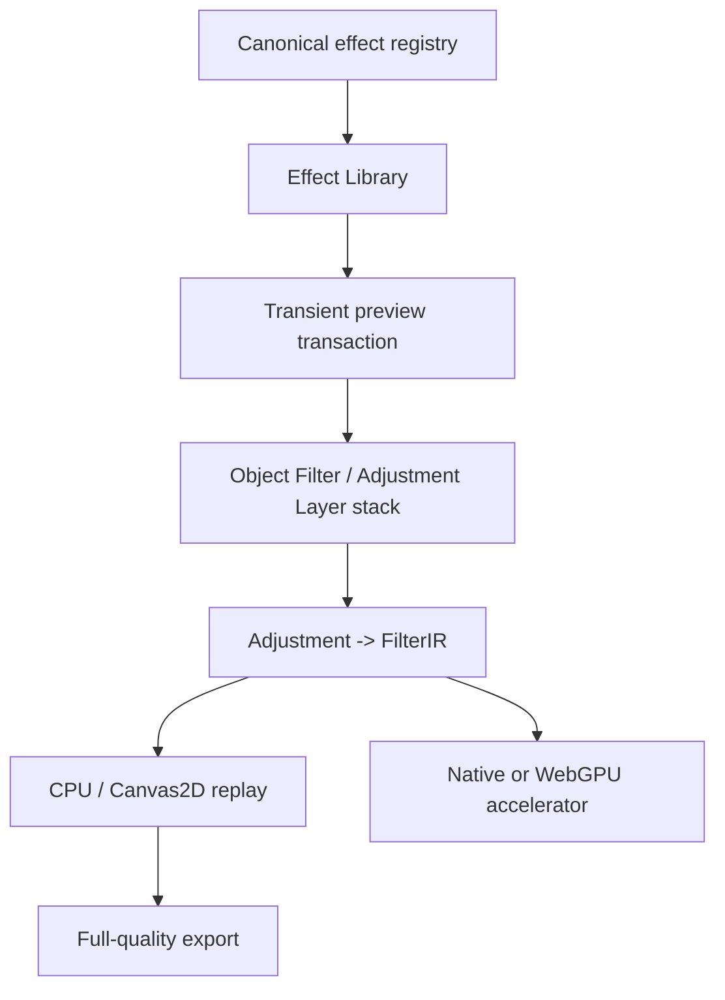

# ADR-0225: Effect Studio integrates the existing effect pipeline

- **Status:** Accepted
- **Date:** 2026-08-29

## Context

Varve already has a shared adjustment/filter pipeline, node-local Object
Filters, scoped Adjustment Layers, appearance effects, native and GPU
accelerators, and raster export fallbacks. A new gallery-specific model would
duplicate document state and make preview, export, and undo diverge.

## Decision

1. Effect Studio is a discovery/editor surface over the existing `Adjustment`
   and `FilterIR` contracts.
2. `effectRegistry.ts` is the canonical catalog for Effect Studio metadata. It
   derives definitions from the existing stable adjustment kinds, defaults,
   effect contracts, and capability properties.
3. Object Filters remain node-local; Adjustment Layers remain scoped scene
   nodes; appearance effects remain a separate appearance-stage model.
4. The persisted stack is the execution order. Reordering is a document
   operation and is undoable; transient candidate previews are not saved.
5. Canvas2D/CPU remains the correctness fallback. Native and WebGPU paths are
   accelerators only and cannot change serialized semantics.
6. Looks are ordered, validated recipes, not raster snapshots or executable
   imports.

## Consequences

- The expanded UI can share the existing Inspector editors and history.
- Adding an effect requires catalog metadata plus the existing engine/render
  wiring; it does not require another menu list or renderer.
- Preview and export can be tested against the same semantic render graph.
- The registry is a compatibility surface and must be tested for complete
  coverage of `ADJUSTMENT_KINDS`.

## Component and render flow

## Rejected alternatives

- A separate gallery-only filter model: duplicates persistence and rendering.
- Making every treatment an Adjustment Layer: loses object-local semantics.
- GPU-only preview: unavailable on the primary WebKitGTK environment and not
  a safe correctness boundary.
- Persisting preview state: risks autosave and stale-target mutations.
