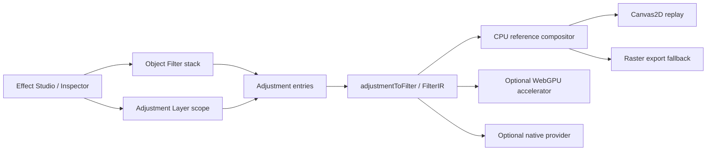
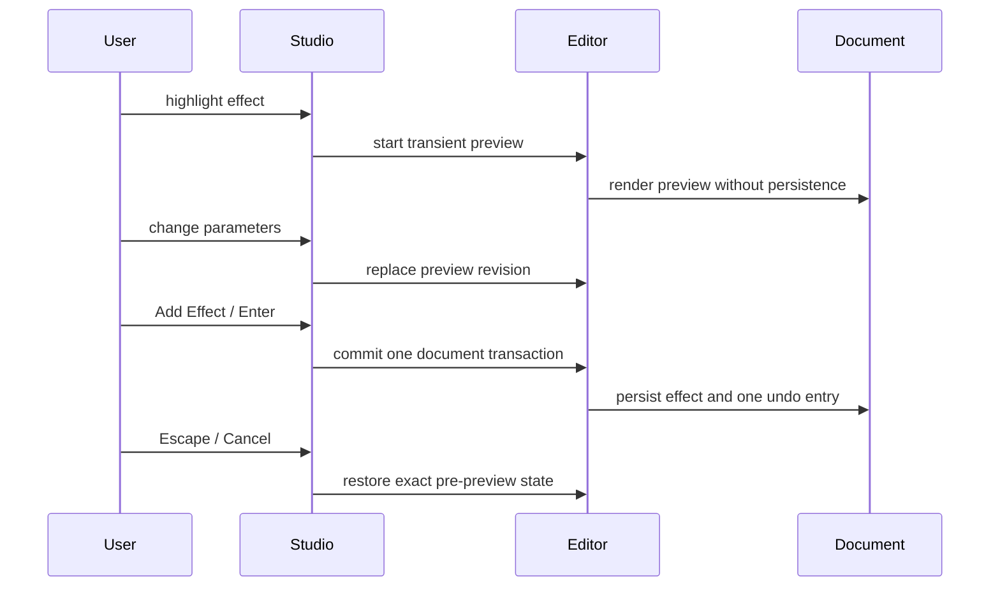

# Effect Studio

**Status:** current architecture · **Date:** 2026-08-29

Effect Studio is Varve's discovery and editing surface for non-destructive
visual treatments. It is an integrated workflow over the existing effect
pipeline, not a second renderer or a second document model.

## Current architecture

The two attachment semantics remain deliberately distinct:

| Surface | Ownership | Scope | Export behaviour |
| --- | --- | --- | --- |
| Object Filters | renderable scene node `smartFilters` | that node's rendered result | replay the smallest affected boundary; rasterize when required |
| Adjustment Layer | `AdjustmentNode` scene node | explicit image-local, target, container, or document scope | rasterize the affected scope when the target format cannot represent it |
| Appearance effects | node `effects` array | appearance stage (shadows, glows, blur, materials) | preserve native representation where reliable; otherwise explicit raster fallback |

All three are persisted document state. Hover, selected cards, preview buffers,
GPU handles, and generated thumbnails are not persisted.

## Rendering contract

The stack array is the execution order: entry 0 runs first, then each later
entry receives the prior result. UI controls must preserve that ordering and
announce positions using one-based labels. Object Filters and Adjustment Layers
share `Adjustment`, `adjustmentToFilter()`, `FilterIR`, the CPU compositor,
bounds expansion, alpha handling, and export classification.

Preview quality may reduce resolution or sample count, but it uses the same
semantic FilterIR path as settled preview and export. Export always requests
full quality and never consumes a thumbnail or interaction proxy.

## Preview transaction

The current Inspector stack is the first integration point. Expanded library
controls should call the same scene operations as the Inspector and must not
append a parallel effect list.

## Catalog contract

`packages/engine/src/effectRegistry.ts` is the UI-facing catalog. It derives
each definition from the stable `AdjustmentKind`, defaults, render contract,
and capability classification. Stable IDs are the adjustment kinds; display
labels and descriptions are separate localizable keys. The registry exposes:

- intent-oriented categories and searchable tags;
- target and scope compatibility;
- parameter keys and defaults for generic controls;
- Canvas2D, WebGPU, native, and export capability state;
- schema version `1` for the current parameter contract.

The registry does not own scene state. It cannot contain selection, hover,
thumbnail URLs, worker handles, or cache entries.

## Looks

Looks are declarative recipes of stable effect IDs, ordered parameters, enabled
state, opacity, and blend mode. They are validated before application and are
never flattened images. A missing definition remains an unavailable recipe
entry so applying a Look cannot silently delete content.

## Verification boundaries

Verified in the repository:

- Object Filters and Adjustment Layers share one adjustment catalog.
- CPU/Canvas2D is the correctness fallback for all registered effects.
- bounds expansion, alpha rules, seeded determinism, and export rasterization
  are covered by existing engine/editor tests.
- adjustment edits use the existing transaction API for one undo entry per
  continuous interaction.

Not claimed by this document: native Windows/macOS runs, screen-reader runs,
WebGPU availability on WebKitGTK, or cross-browser visual parity. Those require
the platform-specific gates described in the validation strategy.
