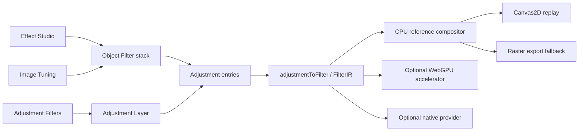

# Effect Studio

**Status:** current architecture · **Date:** 2026-08-29

Effect Studio is Varve's discovery surface for object-local creative effects.
It is a Filter Gallery-style way to explore, preview, and apply designed
visual treatments. It is not a second renderer, a second effect model, or a
replacement for the advanced Object Filters stack.

## Product boundary

Varve has four related surfaces with different jobs:

| Surface | Scope | Catalog | Raster behavior | Vector behavior |
| --- | --- | --- | --- | --- |
| Effect Studio | Object-local creative treatment | Artistic Media, Print Strokes, Distort, Sketch & Poster, Stylize, Texture & Tape | Processes the rendered image object while preserving source fill, placement, and crop | Uses a temporary effect surface; geometry, fill, and text remain editable |
| Image Tuning | Image-local photographic correction | Light, Color, Detail, Local Contrast & Depth, Finish | Tunes image pixels with source and placement preserved | Not offered; use Object Filters or Effect Studio |
| Adjustment Filters | Backdrop-scoped tonal and colour correction | Correction operators and print-safe tonal tools | Applies to rendered content below the adjustment layer and its scope/mask | Applies after vector content is rendered into the backdrop; geometry remains editable |
| Object Filters | Advanced ordered object-local stack | Full `ADJUSTMENT_KINDS` escape hatch | Filters the selected rendered result with order, opacity, blend, and mask controls | Filters the rendered vector result while source geometry remains editable |

The same operator can intentionally appear in more than one surface when its
scope changes. For example, Contrast belongs in Image Tuning for image-local
photo work and in Adjustment Filters for a shared backdrop correction. It does
not make the surfaces equivalent. Effect Studio excludes photographic
corrections and the Image Tuning-only treatment family from its discovery
catalog.

## Architecture

`packages/engine/src/effectRegistry.ts` owns the shared definition metadata.
`packages/engine/src/surfacePresets.ts` owns the three discovery recipe
families. The scene owns attachment, order, identity, and persistence. The
renderer owns execution. No UI surface creates a parallel effect list.

## Effect Studio catalog

Effect Studio currently exposes these creative kinds:

- Artistic Media: Duotone, Tritone, Palette Snap
- Print Strokes: Color Halftone
- Distort: RGB Split, Caustics
- Sketch & Poster: Dither
- Stylize: Bloom, Light Shafts, Lens Flare, Light Leak, CRT
- Texture & Tape: VHS

The library supplies searchable cards, category filters, Favorites, Recent
effects, and five multi-effect Studio presets. Presets append to the selected
Object Filter stack in one batch update. They do not flatten artwork or alter
the source geometry.

## Shared rendering contract

The stack array is execution order: entry 0 runs first, then each later entry
receives the previous result. Object Filters and Adjustment Layers share the
`Adjustment`, `adjustmentToFilter()`, `FilterIR`, CPU compositor, bounds,
alpha, and export contracts. Their attachment semantics remain separate.

Preview quality may reduce resolution or sample count, but it uses the same
semantic FilterIR path as settled preview and export. Export requests full
quality and never consumes a thumbnail or interaction proxy.

All registered effects preserve source alpha. Neighbourhood and light effects
declare whether bounds expand, and the adjustment pipeline reserves that
space before filtering. Deterministic effects retain their stable seed and do
not sample frame time or viewport pixels.

## Preview and Compare View

Effect previews use a preview transaction. The document state can render the
candidate effect immediately, but preview updates do not mark the document
dirty, publish a remote mutation, or create undo history. Add/Enter commits one
undoable document edit; Cancel/Escape restores the exact pre-preview state.

Compare View uses the same preview transaction to temporarily bypass the
object stack. Showing the original therefore does not persist a
`smartFiltersEnabled` change and does not create an undo entry. Changing the
selection or leaving the surface cancels the transient comparison.

## Looks

Looks are document-local declarative recipes of stable effect IDs, ordered
parameters, enabled state, opacity, and blend mode. Applying a Look appends
new entries to Object Filters; it never stores a flattened image. A missing or
future definition remains an unavailable recipe entry, so an older build does
not silently delete content when it loads or reorders a newer stack.

## Raster and vector rules

Effect Studio, Object Filters, and Adjustment Filters operate on rendered
surfaces where the selected result requires it. This does not make a vector
node destructive: path geometry, text, fills, and transforms remain in the
scene model and can still be edited. A user who needs a filter to follow one
object chooses Object Filters or Effect Studio. A user who needs one correction
to affect several objects chooses an Adjustment Layer. A user editing a photo's
global tone, detail, or finishing balance chooses Image Tuning.

## Verification boundaries

Verified in the repository:

- surface catalogs and category IDs are engine-owned and tested;
- each surface has explicit raster/vector guidance;
- presets are non-empty, surface-specific, and include multi-effect recipes;
- Effect Studio, Image Tuning, Adjustment Filters, and Object Filters have
  focused frontend coverage for discovery, application, bypass, and unknown
  future entries; and
- preview and Compare View use the transaction contract without dirtying a
  cancelled preview.

Not claimed by this document: native Windows/macOS runs, screen-reader runs,
WebGPU availability on WebKitGTK, or cross-browser visual parity. Those need
the platform-specific gates in the validation strategy.
