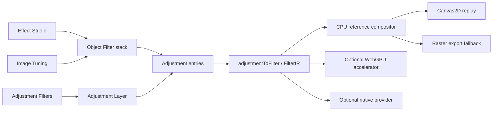

# Effect Studio

**Status:** current architecture · **Date:** 2026-09-08

Effect Studio is Varve's discovery surface for object-local creative effects.
It is a Filter Gallery-style way to explore, preview, and apply designed
visual treatments. It is not a second renderer, a second effect model, or a
replacement for the advanced Object Filters stack.

## Product boundary

Varve has four related surfaces with different jobs:

| Surface | Scope | Catalog | Raster behavior | Vector behavior |
| --- | --- | --- | --- | --- |
| Effect Studio | Object-local creative treatment | Illustrative, Mark Making, Optics & Shift, Drawing & Graphic, Light & Signal, Print & Material | Processes the rendered image object while preserving source fill, placement, and crop | Uses a temporary effect surface; geometry, fill, and text remain editable |
| Image Tuning | Image-local photographic correction | Light, Color, Detail, Local Contrast & Depth, Finish | Tunes image pixels with source and placement preserved | Not offered; use Object Filters or Effect Studio |
| Adjustment Filters | Backdrop-scoped tonal and colour correction | Correction operators and print-safe tonal tools | Applies to rendered content below the adjustment layer and its scope/mask | Applies after vector content is rendered into the backdrop; geometry remains editable |
| Object Filters | Advanced ordered object-local stack | Full `ADJUSTMENT_KINDS` escape hatch | Filters the selected rendered result with order, opacity, blend, and mask controls | Filters the rendered vector result while source geometry remains editable |

The same operator can intentionally appear in more than one surface when its
scope changes. For example, Contrast belongs in Image Tuning for image-local
photo work and in Adjustment Filters for a shared backdrop correction. It does
not make the surfaces equivalent. Effect Studio excludes photographic
correction controls and the Image Tuning workflow from its primary discovery
catalog. A Studio recipe can still compose a shared primitive such as Grain or
Highlight Glow when that primitive is needed to create a material result on a
rendered raster or vector object; the recipe does not expose that primitive as
an image-development control.

## Architecture

`packages/engine/src/effectRegistry.ts` owns the shared definition metadata.
`packages/engine/src/surfacePresets.ts` owns the three discovery recipe
families. The scene owns attachment, order, identity, and persistence. The
renderer owns execution. No UI surface creates a parallel effect list.

## Effect Studio catalog

Effect Studio exposes 35 named treatment recipes across six outcome-oriented
families. The labels intentionally describe the result rather than reproduce a
generic filter-menu taxonomy:

| Family | Treatments | What it helps a designer do |
| --- | --- | --- |
| Illustrative | Palette Cut, Pigment Wash, Inked Paper, Screen Print | Turn an object into a limited-palette illustration, wash, or print response. |
| Mark Making | Dry Ink, Crosshatch, Ink Wash, Sprayed Stroke | Build drawn marks, hatching, ink, and loose sprayed media. |
| Optics & Shift | Glass Shift, Ocean Ripple, Refracted Light, Prism Flare | Refract, split, ripple, or optically scatter the rendered result. |
| Drawing & Graphic | Relief Study, Chalk Field, Pencil Poster, Stamp Cut, Graphic Pen, Dot Study, Halftone Pattern, Paper Copy, Contour Dither | Produce graphic drawing studies without pretending the source has become destructive pixels. |
| Light & Signal | Chromatic Bloom, Cinema Shafts, Neon Phosphor, Light Leak, Aperture Star, Laser Streak, Solar Shift, Terminal Glow | Add luminous, cinematic, electronic, or surreal light behaviour. |
| Print & Material | Analog Signal, Newsprint, Riso Ink, Water Paper, Worn Tape, Reticulation | Give an object a printed, fibrous, weathered, taped, or irregular surface language. |

Each card represents an ordered recipe of two or more editable effects. The
card art is a category cue rather than a pre-rendered promise: the canvas
Preview command is the authoritative visual result for the selected object.
Apply appends the full recipe in one batch update; it does not flatten artwork
or alter source geometry. If a different recipe is being previewed when Apply
is pressed, Varve commits that preview first and then appends the requested
recipe, so an explicit Apply action cannot silently discard an earlier effect.

The dialog follows a three-zone workflow: a large rendered preview, a compact
treatment browser, and a focused applied-stack/settings column. The gallery
has search, category filters, saved treatments, recent treatments, and
preview/keep/cancel. The preview offers Before this edit, Current candidate,
and a keyboard-accessible split comparison; its two images are canonical rendered
variants of the selected object rather than card art. A collapsed **Individual creative
effects** section retains the thirteen raw Studio primitives for users who
already know the operator they want. It explicitly directs parameter editing,
order, masks, and blending to Object Filters instead of creating a second
stack editor.

## Treatment identity and direct controls

A Studio treatment is more than a coincidental sequence of operators. Each
recipe member persists a bounded **studioTreatment** record containing its
treatment id, instance id, recipe index, and intent-level control values. The
renderer ignores that record; it exists so the Studio can find an applied
recipe without making a user hunt through a long raw stack.

The owner still keeps the executable truth: every Object Filter has its own
stable filter id and occupies one position in the ordered `smartFilters`
array. Studio grouping uses the **pair** of treatment id and instance id, so
an imported or legacy instance-id collision cannot merge unrelated named
treatments. Applying a Look gives every filter a fresh id and every treatment
instance a fresh instance id. Copying one raw member deliberately clears its
Studio provenance; it becomes an ordinary independent filter.

The **Applied treatments** list is therefore the canonical place to tune a
named result. It exposes a small set of coherent controls rather than every
primitive parameter. Every recipe has Amount, and relevant treatments add at
most two safe outcome controls. For example, Varve's **Reticulation** is a
blue-noise clustered dither followed by seeded material grain. Its controls
are Amount, Cluster density, Tone steps, and Material grain. It is a
Varve-native irregular-tone/material treatment, not a claim to reproduce
another application's implementation.

Moving an entire named treatment swaps its contiguous recipe block with the
next or previous stack block, so its identity and curated meaning remain
intact. The advanced filter-order disclosure exposes the individual entries
when a designer deliberately needs to move one derived member; that marks only
the corresponding treatment **Customized**. An interleaved customized recipe
cannot be moved as a whole until it is restored, which prevents a misleading
named order from hiding its real execution order.

### Halftone Pattern + Reticulation

For the dense monochrome result commonly made with a **Halftone Pattern**
followed by **Reticulation**, apply Varve's named **Halftone Pattern** first,
then **Reticulation**. Halftone Pattern defaults to **Dot size 2** and
**Contrast 5** with a fixed **Dot / AM / Round / Black (K) / 45°** recipe;
Reticulation then adds clustered dither and material grain. Both controls have
typed numeric fields. Its categorical halftone configuration is displayed in
the treatment settings and can be changed in Advanced filter order, which
honestly marks the recipe Customized.

This produces the same controllable visual language, not a byte-identical copy
of another application’s proprietary Halftone Pattern or Reticulation kernels.
Use a smaller Dot size for a denser screen, then increase Reticulation’s
Cluster density and Material grain for a closer distressed-print result.

The raw Object Filter stack remains fully editable, but it is an advanced
escape hatch:

- it is collapsed when an object has a named Studio recipe;
- a raw parameter, visibility, opacity, blend, reorder, or removal change
  marks every remaining member of that recipe **Customized**;
- the Applied treatments list continues to show that result honestly and can
  restore only that recipe to a coherent named form; and
- duplicating one raw member creates a standalone raw filter rather than
  pretending that a partial duplicate is a second named recipe.

This keeps freeform experimentation possible without silently relabelling a
user's modified stack as the original treatment.

### Blend modes on raster and vector objects

Every derived recipe member is an ordinary `Adjustment` with its own opacity
and blend mode. New Studio members start at **Normal**; the advanced Object
Filters editor exposes the complete effect blend menu, including Darken,
Multiply, Color Burn, Lighten, Screen, Color Dodge, Overlay, Soft Light, Hard
Light, Difference, Exclusion, Hue, Saturation, Color, and Luminosity. Changing
one member marks only that named recipe customized and leaves the other stack
members intact.

The same ordered `Adjustment → FilterIR → compositor` path is used for image
fills and rendered vector/text objects. The source image stays embedded and
the vector geometry stays editable; the temporary surface exists only to
evaluate the rendered result. The object's own layer blend mode is applied
after its local filter stack, so local effect blending and layer blending do
not overwrite one another. CPU replay and raster export share these semantics.

Every continuous effect control uses the same compact precision control: a
slider for exploratory tuning and a labelled editable numeric value for typed
values, keyboard stepping, and arithmetic expressions. The Studio, raw Object
Filters, and Adjustment Filters therefore are never slider-only workflows.
The static duplicate value readout is omitted when a direct field is present;
the visible hierarchy remains label, control, and a short explanation.

Adjustment Layers use a separate identity domain. The `AdjustmentNode` owns a
sequential `adjustments` array whose entries each have a collision-resistant
id, while `scope` and any adjustment mask stay on the layer node. Reordering
therefore changes only correction execution order; changing scope changes only
which rendered backdrop is fed to the same stack. It never changes the source
object or turns an Adjustment Layer into an Object Filter.

## Shared rendering contract

The stack array is execution order: entry 0 runs first, then each later entry
receives the previous result. Object Filters and Adjustment Layers share the
`Adjustment`, `adjustmentToFilter()`, `FilterIR`, CPU compositor, bounds,
alpha, and export contracts. Their attachment semantics remain separate.

Preview quality may reduce resolution or sample count, but it uses the same
semantic FilterIR path as settled preview and export. Export requests full
quality and never consumes a thumbnail or interaction proxy.

All registered effects preserve source alpha. Neighbourhood and light effects
declare whether bounds expand, and the adjustment pipeline reserves that
space before filtering. Deterministic effects retain their stable seed and do
not sample frame time or viewport pixels.

## Preview and comparison

Effect previews use a preview transaction. The document state can render the
candidate effect immediately, but preview updates do not mark the document
dirty, publish a remote mutation, or create undo history. Add/Enter commits one
undoable document edit; Cancel/Escape removes only the preview-owned entries
and restores the pre-preview stack without overwriting unrelated edits.

The Studio comparison has an explicit baseline and candidate. **Before this
edit** is the accepted document captured when a draft starts; **Current
candidate** is the live draft document after the selected recipe has been
inserted. This is deliberately different from the persistent stack bypass:
the baseline does not disable every Object Filter and does not change the
document's saved `smartFiltersEnabled` value. For an already-applied treatment,
the Studio uses the accepted document at the moment live tuning opens as its
comparison baseline.

Both variants use the `effect-studio-preview` canonical renderer profile and
the same selection source, coordinate frame, and renderer version. The result
remains typed until the UI has inspected its identity, bounds, quality,
provisional/placeholder state, warnings, and failure status. A provisional
same-target frame may remain visible while a bounded retry runs, but it is
labelled; placeholders and failed results are never presented as a successful
comparison. A late result cannot replace a newer target or generation.

The preview is representative for multi-selection: it renders the first
selected object and says so beside the target count. Apply explicitly affects
all compatible selected objects. The canvas and export remain the appearance
authorities; preview buffers are not persisted as document assets.

### Preview viewport contract

The comparison viewport has three display modes with deliberately different
semantics:

- **Fit** contains the complete rendered preview bitmap in the available
  stage. It is the initial mode and never changes the document or the main
  canvas camera.
- **100%** displays the preview bitmap at one CSS pixel per encoded preview
  pixel. It is 1:1 with the editing-preview result, not a second automatic
  fit of the stage. **200%** doubles that display scale.
- At 100% and 200%, dragging the stage pans both comparison sides through the
  same transform. **Center** restores the inspection origin; changing the
  zoom mode also resets the preview-only pan. The split divider clips at the
  stage boundary, so it remains aligned while a large image is panned.

The scale is defined against the bounded `effect-studio-preview` render
result, whose metadata remains available to the UI. It is not a claim that a
fixed-size preview bitmap contains every source pixel of a large image. The
canvas and export paths remain the authorities for full-resolution judgment.
Shared paint-reference and shapeless-image geometry must be resolved before
the thumbnail frame is computed; otherwise Fit can crop a current wide image
to a stale node snapshot.

## Decision record — 2026-09-08

Research was used as interaction evidence, not as a copy target. Figma's
effects guide demonstrates lightweight hover discovery, explicit effect
settings, and a distinction between layer blur, background blur, shadows, and
glass. Adobe's Filter Gallery documents a central preview, settings, an
applied-filter list, reorderable creative filters, and non-destructive Smart
Filters. The W3C Filter Effects and Compositing specifications support Varve's
rendering boundary: filters process an element buffer before parent
compositing, and each comparison side must preserve the same backdrop/source
contract.

Varve therefore keeps these decisions:

- Effect Studio is a draft exploration surface; Object Filters and Layer
  Effects remain the precise applied-stack editors.
- “Before this edit” means the accepted state at session start, not “all
  effects off” and not original source pixels.
- live tuning of an existing treatment is accepted on deliberate gestures;
  closing the panel does not roll it back. New treatment exploration uses
  Preview / Apply / Cancel labels.
- a selected target, document, treatment instance, parameter generation, and
  renderer profile form one preview identity; only the latest matching result
  may display or commit.
- canonical renderer metadata is preferred over thumbnail data URLs. A
  thumbnail policy is not sufficient evidence for an interactive editing
  preview.

## Looks

Looks are document-local declarative recipes of stable effect IDs, ordered
parameters, enabled state, opacity, and blend mode. Applying a Look appends
new entries to Object Filters; it never stores a flattened image. A Look that
contains a named Studio treatment receives fresh treatment instance IDs on
every application, so two applications never merge into one Applied treatment
row. A missing or future definition remains an unavailable recipe entry, so an
older build does not silently delete content when it loads or reorders a newer
stack.

## Workflow homes and entry points

The UI deliberately separates a compact contextual entry point from the
full-sized editors:

| Surface | What is shown there | What is deliberately not duplicated |
| --- | --- | --- |
| **Properties** | Normal opacity/blend controls, **Open Effect Studio**, and **Add adjustment layer** for eligible selection | The Object Filter stack and Studio gallery |
| **Appearance & Effects** | A compact Studio launch card, advanced Object Filters, and Layer Effects | The Studio gallery and its applied-treatment manager |
| **Effect Studio dialog** | Curated gallery, preview/compare, Applied treatments, direct recipe tuning, raw creative primitives, and Looks | Inspector tabs and the raw Object Filter stack editor |
| **Adjustments** | Image Tuning for raster selection; eligible vector/object selections get compact Effect Studio access and summary, the object-local raw stack, Layer Effects, and scoped Adjustment Layer access; adjustment nodes get the complete Adjustment Layer editor | Image-only tuning, enhancement, cleanup, recognition, and compositing controls on vector selections |

**Object → Open Effect Studio**, the command palette, and
**Ctrl/Cmd+Alt/Option+A** open the controlled **Effect Studio dialog** in the
primary editor. It reads the live document and selection directly, so changing
the selection retargets the Studio without a document projection, message
broker, popup, or second Tauri webview. It does not add a hidden Studio panel
to workspace preferences. **Object → New Adjustment Layer** (and
**Alt/Option+N**) creates a scoped Adjustment Layer and then opens
Adjustments with the new layer selected.

The dialog owns the full gallery, live comparison, direct recipe tuning, raw
creative primitives, and Looks workflow. Its search field receives focus when
the dialog opens, and the applied-stack inspector stays visible while the
gallery is scrolled on wider layouts. With multiple objects selected, the
preview deliberately represents the first object while Apply affects the whole
selection; direct recipe tuning remains a single-object operation so it cannot
silently diverge across a mixed selection.

Layer-row stack badges keep their destinations explicit:

- An **Object Filters** badge, including a named Effect Studio treatment such
  as Reticulation, opens **Adjustments → Object Filters**. Effect Studio and
  Object Filters are two views over the same node-local `smartFilters` stack;
  the Studio owns discovery and named-recipe tuning, while Object Filters owns
  order, entry visibility, opacity, blend, masks, and advanced parameters.
- A **Layer Effects** badge opens **Design → Layer Effects**. Layer Effects
  use the separate `effects` array for shadows, glows, blur, and material
  treatments, so they do not become Studio recipes or Object Filter entries.
- An Adjustment Layer summary opens **Adjustments** with that scoped layer's
  editor selected.

The Appearance & Effects surface remains available for direct inspection of
appearance stacks, but layer-row badges do not route through its legacy tab;
they take the user directly to the owning editor and section.

## Raster and vector rules

Effect Studio, Object Filters, and Adjustment Filters operate on rendered
surfaces where the selected result requires it. This does not make a vector
node destructive: path geometry, text, fills, and transforms remain in the
scene model and can still be edited. A user who needs a filter to follow one
object chooses Object Filters or Effect Studio. A user who needs one correction
to affect several objects chooses an Adjustment Layer. A user editing a photo's
global tone, detail, or finishing balance chooses Image Tuning.

## Verification boundaries

Verified in the repository:

- surface catalogs and category IDs are engine-owned and tested;
- each surface has explicit raster/vector guidance;
- Studio treatments are non-empty, surface-specific, categorized, and include
  multi-effect recipes;
- Effect Studio, Image Tuning, Adjustment Filters, and Object Filters have
  focused frontend coverage for discovery, application, direct treatment
  tuning, customization/restoration, bypass, and unknown future entries; and
- the compact primary launch surface, controlled in-app dialog, and direct
  numeric Studio tuning have unit and Playwright visual coverage; and
- preview transactions cancel without dirtying a document; comparison renders
  independently without mutating the live stack; and
- the dialog, true before/after split, direct numeric configuration, and named
  treatment reordering have focused unit and Playwright visual coverage.

Not claimed by this document: native Windows/macOS runs, screen-reader runs,
WebGPU availability on WebKitGTK, or cross-browser visual parity. Those need
the platform-specific gates in the validation strategy.
