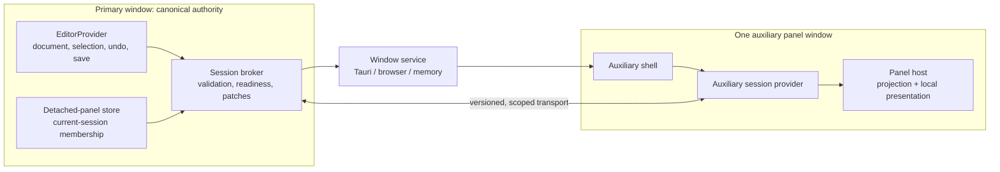

# Panel windows

**Status:** current implementation contract · **Scope:** desktop-first detached
panels · **Related:** [Workspace System](workspace-system.md),
[Focus Navigation](focus-navigation.md), [Security and CSP](security-csp.md)

This document is the current contract for detached panels. The earlier broad
multi-window exploration remains useful historical context, but it is not a
promise that every kind of window, dock layout, or canvas presentation exists.

## Product model: Model A

Varve implements **one supported panel in one auxiliary window**. A detached
panel remains part of the same editor session; it is not a second editor,
document, renderer, save authority, or undo stack.

| Panel type | Auxiliary window | Notes |
| --- | --- | --- |
| Layers, Inspector, Assets, Code, Logo | Supported | Each is a singleton and has an auxiliary renderer plus a transfer lifecycle. |
| Pages | Not advertised yet | An auxiliary renderer may exist, but there is no source detach command. |
| Timeline, History | Not supported | They remain primary-window panels until they meet the complete lifecycle and auxiliary-rendering contract. |

The registry in `workspace/panelDefinitions.ts` is authoritative. A panel is
not detachable merely because it has a drag handle or a visual representation.
It must be declared detachable, dockable, auxiliary-hostable, non-canvas/non-
renderer-dependent, and equipped with both a lifecycle and a bounded local
state codec.

Model A intentionally excludes these capabilities:

- multiple panels or tab groups in one auxiliary window;
- moving a panel directly between existing auxiliary windows;
- detached canvas/document views, renderer instances, or independent editors;
- automatic restoration of a detached relationship after an application crash
  or a new primary-session boot; and
- treating browser popups as a substitute for native desktop windows.

The default auxiliary-window limit is eight. This is a resource and recovery
boundary, not a license to create arbitrary webviews.

## Ownership and state partition



The primary window is the sole authority for document mutation, workspace
state, selection, undo/redo, persistence, commands, and the detached-panel
membership record. An auxiliary host mounts a projection-mode `EditorProvider`
from the broker snapshot so existing editor-coupled panel components can
render, but it has no canvas, render worker, WASM engine, model runtime,
media session/cache subscription/playback clock, independent save authority,
workspace-preference migration, or second persistence loop. Its mutations
route back to the primary through the broker.

| State | Owner | Cross-window rule |
| --- | --- | --- |
| Document, selection, workspace mode, undo/redo, save | Primary editor session | Broker snapshots and patches are projections; auxiliary code does not mutate an independent copy. |
| Detached membership | Primary `detachedPanelsStore` | Contains the panel, canonical window id, generation, and current primary-session id. A new session discards stale records so a dead window cannot hide a docked panel. |
| Panel-local presentation state | The panel lifecycle | A transfer snapshot is typed, versioned, serializable, and bounded (normally 64 KiB). It cannot contain DOM, functions, credentials, or a document copy. |
| Native placement and window state | Window service / machine-local storage | It never belongs in a design document or the shared editing session. |
| Transfer transaction and transport subscriptions | Broker/coordinator process lifetime | Terminal transactions, host reservations, listeners, and closed windows are released. |

`PanelHostContext` marks an auxiliary host explicitly. Nested detachment UI is
suppressed there, which prevents a panel from recursively creating another
window.

## Identity and broker protocol

`panelWindowSession.ts` creates a fresh opaque primary-session id at boot and
canonical `panel-*` window ids before a native window is created. That same id
is carried through the route, broker, detached record, and window service;
Tauri labels are sanitized derived implementation details, not identities.

The runtime protocol is `SESSION_BROKER_PROTOCOL_VERSION = 1` in
`workspace/sessionBroker.ts`. Its transport is session-scoped, but transport
membership alone is not trusted. Each auxiliary-to-primary message must carry
the protocol version, canonical window id, and a positive generation. The
broker rejects malformed, oversized, stale, mismatched, or unregistered
messages before they affect primary state.

Full-document projection edits also carry the primary `documentRevision` they
were based on. The broker accepts an edit only at its current revision. A
concurrent or stale edit is rejected and only that auxiliary host receives a
fresh authoritative snapshot; it cannot overwrite a newer primary or another
auxiliary edit while React is committing it.

The route is application-owned and contains only the identity and transfer
context needed to boot an auxiliary host: `surface=panel-window`, window and
session ids, panel type, transaction id, and panel-instance id. It is not a
general-purpose URL loading mechanism.

The important protocol exchange is:

1. The primary reserves the exact destination host with
   `reservePanelHost(transactionId, windowId, panelTypeId, panelInstanceId)`.
2. The auxiliary shell announces readiness with that exact identity and
   receives a snapshot plus the reserved transfer data.
3. The host restores its panel-local snapshot. Only then does it send
   `panel-hydrated`; a restore error sends `panel-hydration-failed` instead.
4. The broker resolves or rejects the reservation. Reattach and close requests
   are likewise broker-validated and acknowledged.

This acknowledgement is the boundary that prevents a newly hidden source from
turning into a blank, stale, or duplicated panel.

## Transactional transfer and recovery

`PanelTransferCoordinator` and `TransferStateMachine` implement detach as a
small transaction rather than an optimistic UI rearrangement:

```text
preparing source → creating destination → waiting ready → hydrating
      → acknowledged → committing → removing source → complete → idle
                                      any failure → failed → idle
```

For a detach, the coordinator validates runtime capability and registry
metadata, captures the panel snapshot, reserves the broker host, and creates
the auxiliary window with its canonical id. Native windows begin hidden. The
source panel remains mounted and visible until the matching host has restored
the snapshot and acknowledged hydration. Only then does the coordinator show
and focus the destination and commit the detached-membership record.

If creation, registration, hydration, or acknowledgement fails or times out,
the coordinator aborts the reservation, closes any created window, leaves the
source panel docked, restores focus to the invoking control, and announces the
failure. A repeated detach of an already detached singleton focuses the
existing host instead of creating a duplicate.

Reattachment routes through the same primary authority: the broker validates
the request, clears the detached record so the docked source returns, sends an
acknowledgement, and the auxiliary window closes. An unexpected auxiliary
close follows the safe direction too: reattach rather than leave a panel
marked detached. Repeated detach/dock cycles must not retain transactions,
event subscriptions, reservations, webviews, or panel snapshots.

## Placement, monitors, and DPI

`@varve/platform` is the only window/monitor API used by React. Its Tauri,
browser, and memory adapters share a logical `WindowPlacement` model and an
explicit capability value (`native`, `browser-popup`, or `single-window`).
No editor component imports Tauri window APIs directly.

Monitor APIs report physical geometry, while persisted window placement is in
logical pixels. `logicalWorkAreaForDisplay` is the conversion boundary. Code
must never compare a logical position or size directly with a physical monitor
work area. Tauri placement calls use logical position and size values as well.
Tauri 2 exposes `currentMonitor()` as a module-level command rather than a
`WebviewWindow` instance method. The adapter uses it only for the current
window and resolves another auxiliary host from `monitorFromPoint` or its
physical bounds; an unavailable monitor query never aborts detachment.

Per-panel placement records use schema version 2 and are machine-local. They
contain a panel type, a current runtime display hint, a durable display
fingerprint, normalized bounds relative to the display's **logical work area**,
logical fallback bounds, state, and update time. They do not enter document
files.

Recovery follows this order:

1. validate and de-duplicate the persisted record;
2. find the current display by fingerprint, then the current runtime id, then
   the primary display;
3. rebuild bounds from the normalized logical work area, enforce minimum size,
   and clamp the result so the title bar remains reachable;
4. restore maximized/fullscreen state only after safe geometry has been
   calculated; and
5. persist a refreshed v2 record after a successful placement update.

The reconciliation and “bring all panel windows here” helpers are pure, so
monitor removal, renamed displays, changed taskbars, resolution changes, and
mixed-DPI fixtures can be tested without a desktop compositor. Wayland and
other compositors may decline an exact requested location; placement is
therefore best-effort, but the recovery invariant remains that a window must
open reachable on an available display. Native testing must include negative
coordinates and independent scale factors; no assumption is made that monitors
form a left-to-right rectangle or share a scale factor.

The recovery actions are real primary-window commands, not diagnostics-only
helpers: **View → Bring All Panels to This Display** gathers live current-
session panel windows onto the display containing the primary window; **View →
Reset Window Layout** reattaches live panels and clears only their machine-
local panel-placement records. The same actions are registered for the command
and Quick Actions surfaces. Neither command changes the document or ordinary
workspace preferences.

## Accessible interaction

Dragging is optional enhancement, never the only transfer mechanism. Every
supported primary host supplies a plainly labelled detach button and a
header-context-menu command, and every auxiliary host supplies a plainly
labelled reattach button. Button, context-menu, and drag paths all call the
same transactional coordinator. Registry-provided labels keep the panel name
in the accessible name.

- Transfer progress, success, and rollback use a live status message; errors
  explain that the source remains docked.
- The header control is a real button with a minimum 28-by-28 CSS-pixel target
  (above WCAG 2.2's 24-pixel minimum), an accessible panel-specific name,
  visible hover/pressed/focus states, and a discoverable explanation when
  auxiliary windows are unavailable. Its token-driven presentation covers
  light, dark, high-contrast, forced-colors, and reduced-motion settings.
- Focus moves to the auxiliary window after successful detach. On rollback it
  returns to the invoker; after reattach it returns to a sensible primary
  control.
- The auxiliary document has a meaningful title, a labelled panel root, and a
  real landmark/heading rather than an unlabeled floating fragment.
- Window controls use native chrome where available. Any custom title bar must
  expose keyboard-operable minimize, maximize/restore, and close buttons plus
  a clearly scoped drag region; it cannot rely on pointer dragging alone.
- Focus indicators, text scaling, high contrast/forced colours, and reduced
  motion must remain usable during the short pending state. A transfer must
  not trap focus or leave a control permanently busy after a failure.

## Desktop and browser posture

| Runtime capability | Behaviour | Promise we make |
| --- | --- | --- |
| `native` | Creates a managed Tauri auxiliary webview, supports monitor/placement APIs, and waits for host hydration before showing it. | Desktop panel windows are supported, subject to each OS compositor's placement policy. |
| `browser-popup` | May open the same auxiliary route after a user gesture. Popup blockers, browser focus rules, and monitor APIs limit it. | Useful for demo/test coverage; it is not equivalent to native multi-monitor support. |
| `single-window` | Refuses detachment and leaves the panel docked with an honest desktop-only explanation. | No blank source, fake popup, or silent no-op. |

Browser Playwright coverage validates the UI protocol and fallback semantics;
it cannot prove native webview lifecycle, display enumeration, operating-system
focus, or compositor placement.

## Security and isolation

Auxiliary windows are application-owned projections, not arbitrary browsing
contexts. The window service accepts only canonical internal panel routes with
one allow-listed, bounded set of query fields; it rejects hashes, duplicate or
unknown fields, unsafe tokens, and a route/window identity mismatch. The shell
then requires exactly one registered detachable panel plus a complete
transactional identity before it creates a session transport. Tauri labels are
safe derivatives, not durable identities. The `panel-windows` capability lists
only the event and window lifecycle/geometry calls the adapter needs; it does
not inherit `core:default` or grant filesystem, dialog, path, webview, menu,
tray, or app access.

The broker treats transport data as untrusted even when it shares an origin:

- protocol versions, session/window identity, generation, panel membership,
  message shape, string lengths, serializability, and byte limits are checked;
- stale hosts and replayed generations cannot commit a transfer or reattach a
  different panel;
- transfer snapshots exclude DOM, functions, credentials, and large document
  payloads; and
- diagnostic events use ids, phases, logical geometry, and normalized error
  codes only. They must not include document content, file paths, tokens,
  clipboard values, or arbitrary panel payloads.

Panel-window diagnostics are local and bounded to 200 in-memory events. They
record automatically in development; a production troubleshooting session can
explicitly opt in with `localStorage['varve:panel-window-diagnostics'] = '1'`.
They are never sent as telemetry or persisted as layout data.

## Verification boundary

The required evidence is layered:

| Layer | What it proves | What it does not prove |
| --- | --- | --- |
| Unit and contract tests | Registry invariants, codecs, broker validation, state-machine rollback, stale-session reconciliation, logical geometry, monitor recovery, and adapter parity. | Browser/webview behaviour. |
| React tests | Auxiliary host registration, hydration acknowledgement/failure, semantic panel host, focus/error wiring. | Real browser popup or native window lifecycle. |
| Playwright | Keyboard, button, header-context-menu, and release-outside-header drag alternatives; WCAG target size/high-contrast checks; visible source-before-ready rule, browser fallback, and reattach UI in a real DOM. | Tauri permissions, mixed-DPI positioning, Wayland/X11/Windows/macOS focus policy. |
| Native desktop tests and manual visual checks | Real webview creation/close, capabilities, focus, scaling, monitor removal, title-bar behaviour, and screenshots on supported OSes. | Cross-platform coverage unless each target is exercised. |

Before extending this system or declaring a repair complete, run the impacted
unit/contract tests and browser E2E, inspect the produced visual evidence, and
run native coverage on the target desktop environment. A real test matrix must
include single and multiple monitors, a removed secondary monitor, negative
monitor coordinates, at least one mixed-DPI arrangement, keyboard-only
detach/reattach, a hydration failure, a popup-blocked browser case, and many
repeated detach/dock cycles. Memory and browser fixtures are deliberately not
evidence that an OS compositor accepted a requested placement.

## Extending the supported set

To make another panel detachable, do all of the following in one coherent
change:

1. register the panel's allowed host, minimum size, accessibility labels, and
   capabilities in the panel registry;
2. provide an auxiliary renderer that does not depend on the canvas, renderer,
   or model runtime;
3. implement `prepareForTransfer` and `restoreFromTransfer` plus a bounded,
   versioned codec that can decline unsafe local state;
4. route button, header-context-menu, and optional drag affordances through
   the transactional coordinator, never directly through `createWindow`; and
5. add failure, stale-session, placement, accessibility, browser, and native
   evidence appropriate to the new panel.

Keep Model A unless a later design deliberately introduces a different,
separately tested ownership and recovery model.
