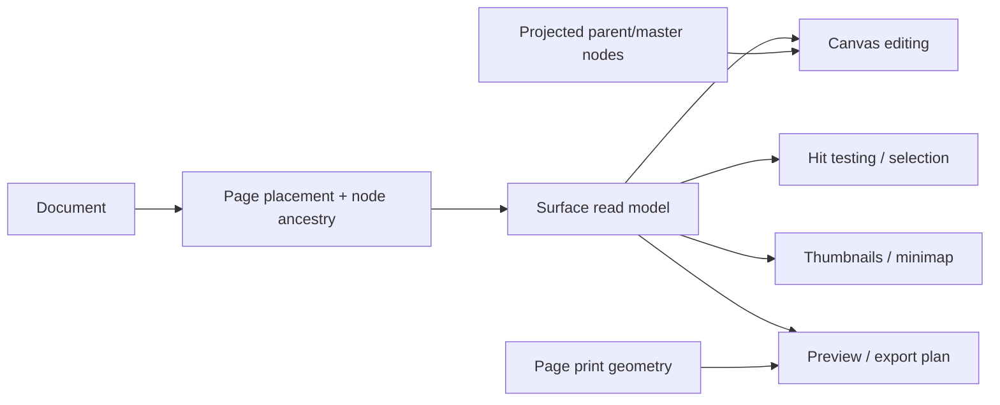

# Surface model

Current-state contract for page-layout surfaces, design frames, artboards, and
export markers.

## Why “page” is not one concept

Varve supports both page-layout work and open-ended screen/design work. These
workflows share the document, renderer, tools, history, and assets, but their
bounded surfaces have different semantics.

| Surface | Meaning | Geometry | Output behavior |
|---|---|---|---|
| Design Canvas | Named, unbounded design-workspace surface | Transparent document-owned content root | Organizes and scopes editable artwork; not a page export target |
| Page | Ordered publishing surface | Page trim plus resolved print geometry and spread placement | Participates in page export unless excluded |
| Frame | Authored container | Node transform and `w`/`h` | Direct bounds export; page-owned frames are included in that page’s scene |
| Artboard | Frame with the existing artboard capability | Same as frame | Same as frame; never implies a page |
| Export region | Export target marker | Node geometry | Export target only; never a page/frame surface |
| Pasteboard content | Authored content outside a surface | World-space node geometry | Explicit node/frame export only |

The distinction is intentional. A Figma-style file page is primarily an
organizational/view boundary for UI designs; its authored work areas are
frames. Varve’s page is closer to a publishing surface: page order, trim,
bleed, slug, numbering, sections, spreads, parent/master composition, and
page-oriented export all have meaning even when the page contains no frame.

## Product terminology

Varve reserves **Page** for a publishing page. It is an ordered output surface
with trim, print geometry, numbering, spreads, master-page composition, and
page-aware export. The editor labels this surface **Publishing pages** so it is
not confused with a design container.

The Figma-like organizational role is described as a **Design canvas** in Varve
product language. A document can contain multiple named design canvases, and
the Design workspace exposes them in a dedicated navigator above Layers. A
design canvas is an open-ended editing surface for exploration, screen design,
components, and prototypes. Its authored work areas are **Frames**: scene
nodes with their own transform, size, clipping, auto-layout, and direct export
behavior. A frame is never silently promoted to a publishing page, and a
publishing page is never represented as a frame.

The canvas's content root is transparent scene plumbing. It is used to scope
rendering, hit testing, insertion, filtering, and layer reordering, but it is
never emitted as a Layers row. This keeps the UI aligned with the Figma model:
the surface is navigation, while Frames, groups, text, images, and other
authored nodes are the layers.

The remaining terms are intentionally specific:

- **Page Navigator** — the compact control for switching and reordering
  publishing pages.
- **Pages panel** — the full publishing-page manager, including numbering,
  sections, page sides, and master assignments.
- **Master page** — a reusable source projected onto assigned publishing pages;
  it is not a duplicate frame and is not a second document page.
- **Design frame** — a frame used as a screen, artboard, component, or other
  editable design container.

When documenting Figma interoperability, “Figma page” may be used as the source
product’s term, followed by “Varve design canvas.” It must not be mapped to
`Document.pages` unless the imported object has publishing intent. Design
surfaces are persisted as `Document.designCanvases` with
`Document.activeDesignCanvasId`; the separate `Document.pages` collection
remains publishing-first.

The `Surface` projection in `@varve/scene` gives all consumers one vocabulary
over both persisted Design Canvas metadata and authored frame/page nodes. Use
`surfaceKey({ kind, id })` when page, canvas, and node ids might otherwise
collide.

## Coordinate and ownership contract

- Page-local coordinates are translated by the resolved page/spread
  placement; moving a page does not mutate child node transforms.
- Frame transforms remain node-local and are composed with their page
  placement when the frame is page-owned.
- Page trim/bleed is an output boundary, not an implicit editing clip.
- `clipContent` is an authored frame-container policy. It does not turn a
  frame into a page and it does not add page trim/bleed to frame exports.
- Ownership distinguishes page, master, pasteboard, and global content. A
  projected master node is inherited content; it is not copied into page
  children and does not become a local page-owned node.

## Workspace disclosure and exclusion

Workspace filtering is a UI disclosure policy, not a scene filter.

| Concern | Design workspace | Print workspace | Drawing, Image, Motion, Logo, Email, Codegen |
|---|---|---|---|
| Active surface rendering | Active Design Canvas | Publishing Pages | Active Design Canvas |
| Design Canvas navigator | Effective `pagenav` preference | Hidden; use Print's Publishing Pages panel | Hidden by default/config |
| Publishing page navigation | Hidden; switch to Print | Effective `pagenav` preference and at least one page | Hidden by default/config |
| Publishing pages panel | Hidden; switch to Print | Available, including an empty-state add-page affordance | Hidden by default/config |
| Print geometry controls | Hidden | Available for existing pages | Hidden |
| Frames/artboards | Always available to canvas/tools | Always available to canvas/tools | Always available to canvas/tools |
| Export regions | Marker system only | Marker system only | Marker system only |
| Explicit page commands/export | Available through commands and export UI | Available | Available; workspace does not delete or hide document semantics |

This means a hidden surface panel cannot delete or invalidate its underlying
content. A non-print workspace does not make Publishing Pages stop existing;
it simply exposes the active Design Canvas as its editing surface. Command
palette and keyboard paths must remain capable of adding, selecting, or
exporting Publishing Pages even when the panel is not disclosed. Conversely,
showing the Design Canvas navigator must not auto-convert a design document
into a page document.

The Print workspace may disclose bleed, slug, facing-page, section, and
preflight controls. Other workspaces can still work on the active Design
Canvas and retain access to explicit publishing commands, but should not imply
that print geometry is their primary workflow.

## Consumer rules

New consumers should:

1. call `listSurfaces`, `getSurface`, or `surfaceForNode` rather than classify
   ids by naming or by `contentRoot` ancestry;
2. use the effective workspace configuration only to decide whether controls
   are visible;
3. use page export targets and print geometry for page output, and frame/export
   region targets for design output;
4. preserve page ordering (`Page.order`) separately from visual placement;
5. treat parent/master projection as derived and avoid writing projected ids to
   local page children;
6. keep zero-page flat documents valid. “No page panel” is not an error state.

## Known boundaries

The projection is intentionally not a storage migration. Remaining work
includes completing native/browser multi-page PDF output and expanding
Playwright coverage for page placement, save/reopen, and exported artifacts.
Typed page/master operations, parent-source editing, and the core
page-management surfaces are already routed through the shared document/history
model. These remaining gaps are downstream consumers of this contract, not
reasons to give frames page semantics.
