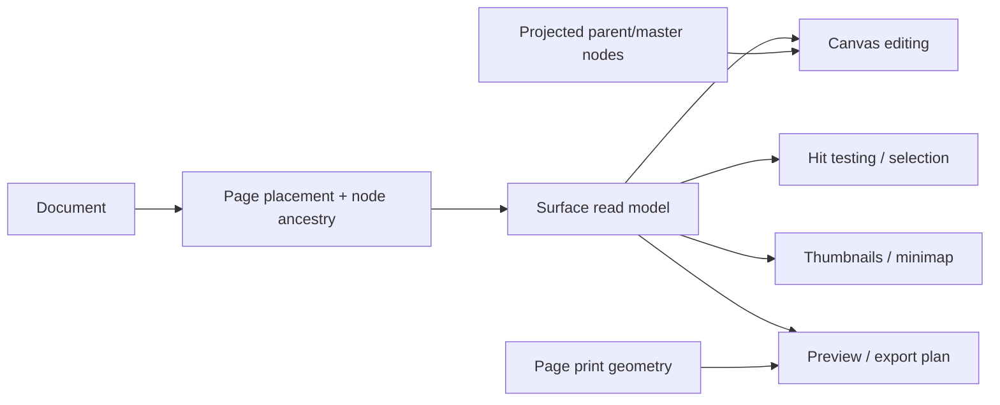

# Surface model

Current-state contract for page-layout surfaces, design frames, artboards, and
export markers.

## Why “page” is not one concept

Varve supports both page-layout work and open-ended screen/design work. These
workflows share the document, renderer, tools, history, and assets, but their
bounded surfaces have different semantics.

| Surface | Meaning | Geometry | Output behavior |
|---|---|---|---|
| Page | Ordered publishing surface | Page trim plus resolved print geometry and spread placement | Participates in page export unless excluded |
| Frame | Authored container | Node transform and `w`/`h` | Direct bounds export; page-owned frames are included in that page’s scene |
| Artboard | Frame with the existing artboard capability | Same as frame | Same as frame; never implies a page |
| Export region | Export target marker | Node geometry | Export target only; never a page/frame surface |
| Pasteboard content | Authored content outside a surface | World-space node geometry | Explicit node/frame export only |

The distinction is intentional. A Figma-style file page is primarily an
organizational/view boundary for UI designs; its authored work areas are
frames. Varve’s page is closer to a publishing surface: page order, trim,
bleed, slug, numbering, sections, spreads, parent/master composition, and
page-oriented export all have meaning even when the page contains no frame.

The `Surface` projection in `@varve/scene` gives all consumers one vocabulary
without changing persisted storage. Use `surfaceKey({ kind, id })` when page
and node ids might otherwise collide.

## Coordinate and ownership contract

- Page-local coordinates are translated by the resolved page/spread
  placement; moving a page does not mutate child node transforms.
- Frame transforms remain node-local and are composed with their page
  placement when the frame is page-owned.
- Page trim/bleed is an output boundary, not an implicit editing clip.
- `clipContent` is an authored frame-container policy. It does not turn a
  frame into a page and it does not add page trim/bleed to frame exports.
- Ownership distinguishes page, master, pasteboard, and global content. A
  projected master node is inherited content; it is not copied into page
  children and does not become a local page-owned node.

## Workspace disclosure and exclusion

Workspace filtering is a UI disclosure policy, not a scene filter.

| Concern | Design with pages | Print with pages | Drawing, Image, Motion, Logo, Email, Codegen |
|---|---|---|---|
| Canvas page rendering | Render | Render | Render |
| Page navigation | Effective `pagenav` preference and at least one page | Same | Hidden by default/config |
| Pages management panel | Effective `pagenav` preference and at least one page | Available, including an empty-state add-page affordance | Hidden by default/config |
| Print geometry controls | Hidden | Available for existing pages | Hidden |
| Frames/artboards | Always available to canvas/tools | Always available to canvas/tools | Always available to canvas/tools |
| Export regions | Marker system only | Marker system only | Marker system only |
| Explicit page commands/export | Available through commands and export UI | Available | Available; workspace does not delete or hide document semantics |

This means a hidden Pages panel cannot make page content disappear, and a
non-print workspace cannot make a page stop existing. Command-palette and
keyboard paths must remain capable of adding, selecting, or exporting pages
even when a panel is not disclosed. Conversely, showing a page panel must not
auto-convert an ordinary flat design document into a page document.

The Print workspace may disclose bleed, slug, facing-page, section, and
preflight controls. Other workspaces can still render and edit the same page
content, but should not imply that print geometry is their primary workflow.

## Consumer rules

New consumers should:

1. call `listSurfaces`, `getSurface`, or `surfaceForNode` rather than classify
   ids by naming or by `contentRoot` ancestry;
2. use the effective workspace configuration only to decide whether controls
   are visible;
3. use page export targets and print geometry for page output, and frame/export
   region targets for design output;
4. preserve page ordering (`Page.order`) separately from visual placement;
5. treat parent/master projection as derived and avoid writing projected ids to
   local page children;
6. keep zero-page flat documents valid. “No page panel” is not an error state.

## Known boundaries

The projection is intentionally not a storage migration. Remaining work
includes routing all page UI mutations through the typed operation/history
pipeline, completing native/browser multi-page PDF output, adding a dedicated
parent edit/override workflow, and adding Playwright coverage for page create,
switch, placement, save/reopen, and export. Those are downstream consumers of
this contract, not reasons to give frames page semantics.
