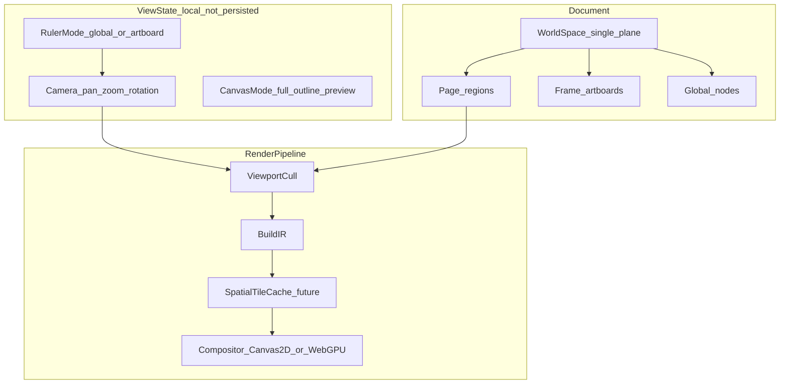

# Strata Canvas System Audit

**Date:** 2026-07-06 | **Implementation:** 2026-07-06 (Phases A–F) | **Scope:** `@varve/editor`, `@varve/engine`, `@varve/scene`, `@varve/shared`, `@varve/compositor`, `@varve/collab`, ADR-0001/0003

> **Staleness note (2026-07-12):** Section 1.5 below ("Existing problems") predates several fixes landed in the six days since this audit was written. Verified against current code this session: **view rotation is implemented** (`viewport.ts:496` composes real rotation; the `_cam` passthrough stub quoted at 1.5-P0 no longer exists), **zoom range is `[0.001, 64]`** (`viewport.ts:32,34`, not the audited 10%–1000%), **sticky/hysteresis snapping is implemented** (`snapping.ts:24-35`), **artboard-local coordinates exist** (`packages/shared/src/coordinates.ts`, `RulerMode`, tested), and **floating origin is wired through Canvas2D, the render worker, and the WebGPU camera uniform**. Don't action the P0–P3 items below without re-checking current code first. See `docs/architecture/render-pipeline.md`'s "Known Gaps" and "Canvas 2D Export Determinism & Size Limits" sections for the current, maintained gap list.

> **2026-07-13 hardening note:** The floating-origin implementation named above was
> found to move only the camera and not geometry, causing exact 512-unit jumps; it is
> now disabled at semantic zero pending atomic rebasing. Frame/text placement, canonical
> scene conversion, nested raster export, deterministic bundled fonts, worker rotation
> and DPR parity, image/pattern clipping, item filter isolation, software filter fallback,
> effect padding, context recovery, large-surface policy, dirty-region tracking, group
> resolution, thumbnail text/nesting, and PDF preflight were implemented. Treat the
> historical scorecard below as archival. See
> [canvas2d-system.md](../architecture/canvas2d-system.md) and the 2026-07-13 production
> hardening report for current status.

---

## Implementation Status (2026-07-06)

Phases A–F from Section 7 are **implemented** in the working tree:

| Phase | Status | Key deliverables |
|---|---|---|
| **A** | Done | Sticky snap (hysteresis), zoom `[0.001, 64]`, `Camera.rotation`, fit page/frame, view rotation UI + shortcuts |
| **B** | Done | `coordinates.ts`, `Page.rulerOrigin`, artboard ruler mode, inspector artboard readout |
| **C** | Done | Floating origin in `applyCameraTransform`, precision-safe replay |
| **D** | Done | `SubtreeIrCache`, `SubtreeReplayCache` rename, `canvas10k.bench.test.ts` |
| **E** | Done | Layout grid snap, baseline/isometric `DocumentGridOverlay` |
| **F** | Done | `PresenceIndicator` in Shell, `CollabCursorOverlay`, `@varve/collab` stub wired |

**Remaining deferred (explicit):** spatial tile renderer, WebGPU production on Linux, real-time transport / CRDT merge.

---

## Executive Summary

Strata's canvas subsystem is **not a visual container** — it is an integration hub: camera math, scene flattening, IR build, compositor replay, overlays, tools, and motion sampling all converge in `CanvasArea.tsx`. The foundation is stronger than a greenfield prototype (centralized viewport math, parent/spatial indexes, viewport culling, page model, guides/rulers, canvas modes, partial dirty-rect redraw). It is **not yet** a professional-grade platform engine comparable to Figma or Illustrator on the six priority axes identified for this audit.

### Priority scorecard (user-selected areas)

| Priority area | Rating | One-line evidence |
|---|---|---|
| **Artboard / coordinate model** | **Built** | Artboard-local ruler + inspector readout; `Page.rulerOrigin`; global/artboard toggle |
| **Rotation + zoom range** | **Built** | View rotation via `rotateAboutScreenPoint`; zoom `[0.001, 64]`; Alt+[/] rotate shortcuts |
| **Rendering performance at scale** | **Partial** | Viewport cull + `SubtreeIrCache` + 10k cull bench; spatial tile renderer still deferred |
| **Snapping / grids** | **Built** | Sticky snap, layout grid step, baseline/isometric overlays |
| **Numerical precision** | **Built** | Floating origin in camera transform; extended zoom range |
| **Collaboration readiness** | **Partial** | Presence UI mounted; stub cursors; no transport yet |

### Architecture strengths (keep and extend)

1. **Single source of truth for camera math** — `packages/shared/src/viewport.ts` (Session 13/16/36).
2. **ADR-0001 IR-replay seam** — scene → compact IR → webview replay; native Rust can compute IR without pixel push.
3. **Accelerated interaction paths** — `parentIndexCache.ts`, `spatialIndex.ts` (64px grid), viewport culling in draw loop.
4. **Document-level page model** — `Page` with bleed/safeArea/slug, `contentRoot`, multi-page CRUD (Session 35/37).
5. **Overlay stack decoupled from replay** — rulers, guides, selection, snap guides, minimap, motion overlays as separate layers.
6. **Canvas modes** — `full` / `outline` / `preview` for focus and wireframe workflows (Session 36).

### Critical gaps (block professional parity)

1. **No artboard-local coordinate space** — rulers and position readouts are always document-global.
2. **View rotation unimplemented** — stub function shipped in public viewport API.
3. **Zoom range 10x max** — Figma/Illustrator support orders of magnitude more; precision and UX both suffer.
4. **Magnetic snapping** — industry-documented #1 alignment frustration; users must disable snap for micro-adjustments.
5. **Full-frame IR replay at scale** — culling skips off-screen nodes but visible complex scenes still replay entirely each frame.
6. **Collaboration is UI scaffolding only** — no wire protocol, no ephemeral presence channel, no conflict model.

See `docs/architecture/render-pipeline.md` for the live draw path. **Next canvas session:** spatial tile renderer, WebGPU on Linux, real-time collab transport.

---

## 1. Current-State Audit

### 1.1 Existing canvas capabilities

| Capability | Location | Status | Notes |
|---|---|---|---|
| **Camera (pan/zoom)** | `packages/shared/src/viewport.ts` | Built | `screenToWorld`, `worldToScreen`, `zoomAboutPoint`, `fitBoundsCamera`, `revealBoundsCamera`, `lerpCamera`, `animateCamera`, `clampCamera` |
| **View rotation** | `viewport.ts:397-405` | **Stub** | `rotateAboutScreenPoint` returns `_cam` unchanged |
| **Zoom limits** | `viewport.ts:32-34` | Built (narrow) | `MIN_ZOOM=0.1`, `MAX_ZOOM=10` |
| **Editor camera state** | `context/types.ts:83-84`, `context.tsx` | Built | `zoom`, `pan`; `setZoom` wraps `clampZoom` |
| **Cursor-anchored wheel zoom** | `CanvasArea.tsx` wheel handler | Built | Session 16 fix; uses `zoomAboutPoint` |
| **Hand tool / pan** | `HandTool`, wheel scroll | Built | Two-finger scroll pans |
| **Zoom tool** | `tools/ZoomTool.ts` | Built | Click zoom anchored to cursor |
| **Fit / reveal** | `revealSelection`, StatusBar, shortcuts | Built | Shift+1/2, fit button |
| **Minimap** | `components/Minimap/MinimapPanel.tsx` | Built | 160px overview, viewport drag; mounted in layers sidebar via `Shell.tsx:387` |
| **Pages (publication model)** | `scene/types.ts:530`, `document.ts` | Built | `Page` id, dimensions, bleed/safeArea/slug, `contentRoot`, `backgrounds` |
| **Multi-page UI** | `PageNav.tsx`, `PageStrip.tsx` | Built | Horizontal strip + nav; `Shell.tsx:380` |
| **Artboards (as frames)** | `FrameNode`, `FrameTool`, `framePresets.ts` | Built | No separate artboard type; frames are spatial containers |
| **Infinite / pasteboard canvas** | Implicit world space | Partial | No explicit pasteboard bounds; `clampCamera` soft-limits pan around document bounds |
| **Rulers** | `components/Ruler/Ruler.tsx` | Built | Unit-aware ticks (px/pt/cm/mm/in); drag-to-create guide; **document-global origin only** |
| **Guides (H/V)** | `scene/types.ts:46`, `GuideOverlay.tsx` | Built | Document-level; lock, drag, context menu |
| **Snapping** | `tools/snapping.ts`, `SnapGuidesOverlay.tsx` | Built | Edge/center/midpoint/spacing/size-match; threshold 5px; toggle via `snapEnabled` |
| **Pixel grid overlay** | `CanvasArea.tsx:1954`, `pixelGridEnabled` | Built | Zoom-aware dot grid |
| **Frame layout grids** | `CanvasArea.tsx:1165+` | Built | Renders `gridTemplateColumns/Rows` on frames with layout style |
| **Canvas modes** | `CanvasMode`: `full`/`outline`/`preview` | Built | Outline strips fills; preview hides overlays (`showOverlays`) |
| **Selection overlay** | `SelectionOverlay.tsx` | Built | 8 resize handles, rotation handle, rotated bbox math |
| **Hit testing** | `context.tsx` `hitTestNode` | Built | DFS reverse paint order; `spatialIndex.ts` pre-filter |
| **Viewport culling (render)** | `CanvasArea.tsx:737-799`, `isWorldRectInViewport` | Built | Skips off-screen nodes during IR build |
| **Dirty-rect partial redraw** | `CanvasArea.tsx:380-914` | Built | When dirty region < 60% viewport |
| **Parent index cache** | `scene/parentIndexCache.ts` | Built | O(1) ancestor lookups |
| **Spatial index** | `scene/spatialIndex.ts` | Built | 64px grid; `queryPoint` for hit-test candidates |
| **Render pipeline** | `CanvasArea` → `buildIr` → `replayIr` / compositor | Built | ADR-0001; native IPC optional |
| **Compositor + tile cache** | `packages/compositor`, `tileCache.ts` | Partial | Wired in `CanvasArea`; cache keys on subtree hash + zoom bucket — **not full spatial tiling** |
| **WebGPU path** | `packages/compositor` WebGPU scaffold | Deferred | ADR-0003; WebKitGTK Linux stays Canvas2D |
| **Motion sampling on canvas** | `TimelineSampler` in draw path | Built | Ephemeral overrides before IR build |
| **Accessibility tree** | `CanvasAccessibilityTree.tsx` | Built | Viewport-culled SR navigation |
| **Soft proof / print overlays** | `SoftProofOverlay`, preflight | Partial | Print preview mode not a first-class canvas mode |
| **Collaboration presence** | `PresenceIndicator.tsx`, `presenceStore.ts` | **Unmounted** | Tests pass; not in `Shell.tsx` |
| **Collab transport** | `packages/collab/src/index.ts` | Stub | Hardcoded users; noop cursor IPC |
| **10k layers benchmarks** | `layers10k.bench.test.ts` | Built | Layers panel subsystems only — **not canvas draw FPS** |

### 1.2 Rendering pipeline (as implemented)

```
Document (@varve/scene)
  -> activePageNodes / walkNodes
  -> viewport cull (isWorldRectInViewport)
  -> world transforms (nodeWorldTransform + parentIndex)
  -> resolveAllStyles + timeline sampling + bindings
  -> flat EngineNode[]
  -> createEngine().buildIr()  [native IPC | wasm | TS stub]
  -> RenderItem[]
  -> replaySubtreeToCtx / compositor.drawVectorItems
  -> Canvas2D (primary on Linux Tauri)
```

Key files: `CanvasArea.tsx`, `packages/engine/src/engine.ts`, `packages/engine/src/replay.ts`, `packages/compositor/src/canvas2d/backend.ts`, `docs/architecture/render-pipeline.md`.

### 1.3 Coordinate systems (as implemented)

| Space | Definition | Used by |
|---|---|---|
| **Screen / client** | Browser viewport pixels | Raw pointer events |
| **Canvas-area CSS px** | After `clientToCanvas(rect, clientX, clientY)` | Camera pan/zoom, rulers, overlays |
| **World / document** | Single global 2D plane; origin top-left, Y down | Scene node transforms, guides, IR |
| **Local / node** | Per-node affine; composed to world via ancestor chain | Shape geometry, hit tests |
| **Artboard-local** | — | **Not implemented** |
| **DPR** | Applied in canvas `setTransform(dpr*zoom, …)` separately from camera | High-DPI bitmap surfaces |

There is no `CoordinateSystem` enum or conversion layer equivalent to Illustrator's `DOCUMENTCOORDINATESYSTEM` vs `ARTBOARDCOORDINATESYSTEM`.

### 1.4 Architecture strengths

- **Clean camera/document separation** (ADR-0001): Rust emits world-space IR; webview owns pan/zoom/DPR.
- **Immutable scene + ephemeral overrides**: Motion and prototype sampling do not mutate document during playback.
- **Deduped coordinate math** (Session 36): 19 duplicate `worldToScreen` sites eliminated; canonical `@varve/shared/viewport`.
- **Interaction acceleration without GPU**: Spatial + parent indexes make hit-test and snap target filtering cheap at 10k nodes (benchmarked).
- **Incremental render optimizations started**: Viewport culling, dirty-rect clip, compositor tile cache for static subtrees, optional OffscreenCanvas worker path (documented in render-pipeline.md).

### 1.5 Existing problems (evidence-backed)

#### P0 — View rotation is dead code

```397:405:packages/shared/src/viewport.ts
export function rotateAboutScreenPoint(
  _cam: Camera,
  _screenAnchor: Point,
  _radians: number,
): Camera {
  void rotateRad;
  return _cam;
}
```

No `Camera.rotation` field exists. Overlays, rulers, and replay assume axis-aligned view.

#### P0 — Artboard-local coordinates absent

`Page` stores physical print metadata but positions are not relative to page origin:

```530:545:packages/scene/src/types.ts
export interface Page {
  id: NodeId;
  name: string;
  width: number;
  height: number;
  bleed?: BleedConfig;
  safeArea?: SafeAreaConfig;
  slug?: SlugConfig;
  backgrounds: NodeId[];
  contentRoot: NodeId;
}
```

`Ruler.tsx` computes ticks from global `pan`/`zoom` only — no active artboard origin offset.

#### P1 — Magnetic snapping without escape hatch

```15:15:packages/editor/src/tools/snapping.ts
const SNAP_THRESHOLD = 5;
```

All snap modes use distance-based attraction within 5 world units (not even zoom-scaled to screen px consistently in all code paths). No sticky state, no "already snapped" hysteresis, no hold-modifier to bypass mid-drag.

#### P1 — Zoom range insufficient for pro workflows

Professional tools: Figma ~1%–6400%+, Illustrator extreme zoom for fine path work. Strata hard cap at 1000% (`MAX_ZOOM=10`) prevents validating sub-pixel rendering and masks precision issues.

#### P1 — Render path not benchmarked at canvas scale

`layers10k.bench.test.ts` covers flattenTree, spatialIndex, clone — not `CanvasArea.draw` IR build + replay latency with 1k–10k **visible** nodes.

#### P2 — Tile cache ≠ tile-based renderer

`TileCache` (`packages/compositor/src/canvas2d/tileCache.ts`) caches replay results by subtree hash and zoom bucket. It does **not** partition world space into spatial tiles for infinite-canvas memory bounds (Figma model).

#### P2 — Collaboration scaffolding unintegrated

`PresenceIndicator` has tests but `Shell.tsx` imports only `MinimapPanel` and `PageNav` — no presence UI. `@varve/collab` returns stub users after 100ms delay.

#### P2 — Deep selection / nested pick

No explicit deep-select (Ctrl+click through groups) documented in tool layer; hit test returns topmost in reverse paint order only.

#### P3 — Grid type gaps

- Pixel grid: yes (overlay).
- Frame CSS layout grids: yes (`gridTemplateColumns/Rows`).
- Document modular/baseline/isometric grids: **no**.
- Snap-to-layout-grid-cell: **no** (snap uses separate grid param in `snapPosition`, not frame layout guides).

---

## 2. Research Findings

Research conducted 2026-07-06 via Adobe documentation, Figma engineering publications, game-engine large-world techniques, and UX literature. Findings validated across multiple independent sources where noted.

### 2.1 Infinite canvas and pasteboard systems

**Figma** treats the canvas as unbounded world space with **tile-based GPU rendering** — only visible/dirty tiles redrawn, enabling infinite canvas without memory explosion (Evan Wallace, Medium 2015; Figma WebGPU blog 2025; third-party architecture summaries).

**Illustrator** uses an **infinite pasteboard** with multiple artboards placed at arbitrary world positions — artboards are regions, not the coordinate origin (Adobe Help: artboards within document).

**Implication for Strata:** Hybrid model fits ADR-0001 — infinite world space for UI design (Figma-like) plus bounded `Page` regions for print/publishing (InDesign-like). Strata already has both concepts (`FrameNode` + `Page`) but has not unified them under a coordinate policy.

Sources: [Figma — Building a professional design tool on the web](https://medium.com/figma-design/building-a-professional-design-tool-on-the-web-6332ed4f1fcc), [Figma — Rendering powered by WebGPU](https://www.figma.com/blog/figma-rendering-powered-by-webgpu/), [Kaelan — Figma architecture research](https://kaelan.fyi/research/figma-architecture/)

### 2.2 Artboard and page coordinate systems (Illustrator)

Illustrator exposes two ruler modes:

- **Global rulers** — origin at document upper-left (first artboard default).
- **Artboard rulers** — origin at active artboard upper-left; per-artboard ruler origins possible.

Scripting API distinguishes `DOCUMENTCOORDINATESYSTEM` vs `ARTBOARDCOORDINATESYSTEM`. Y-axis: UI uses top-left origin, Y down (CS5+); legacy scripting used bottom-left.

**Implication for Strata:** Add `RulerMode: 'global' | 'artboard'` as view state; store optional `Page.rulerOrigin` / `FrameNode.rulerOrigin`; convert for inspector readouts without migrating stored node transforms (keep world storage, display artboard-relative).

Sources: [Adobe — About rulers](https://helpx.adobe.com/illustrator/desktop/measure-and-align/grids-and-guides/about-rulers.html), [Illustrator Scripting — positioning/coordinates](https://ai-scripting.docsforadobe.dev/scripting/positioning/)

### 2.3 Rendering architectures (CPU vs GPU vs hybrid)

| Approach | Strength | Weakness |
|---|---|---|
| DOM/SVG | Accessible, simple | Cannot scale to 10k+ objects (Figma rejected) |
| Canvas2D immediate mode | Works everywhere; ADR-0001 proven 86fps on IR | Full re-upload each frame; single-threaded |
| WebGL/WebGPU custom 2D | GPU batching, tiles, filters on GPU | High engineering cost; WebKitGTK no WebGPU on Linux |
| Hybrid (CPU structure + GPU raster) | Figma's model since 2015 | Requires C++/WASM or large TS engine |

Strata's compositor router (Canvas2D default, WebGPU opt-in) matches industry fallback patterns. **Gap is spatial tiling and retained display lists**, not necessarily immediate WebGPU migration.

Sources: Figma Medium post (2015), Figma WebGPU blog (2025), `docs/architecture/render-pipeline.md`

### 2.4 Floating origin and numerical precision

At large world coordinates, **32-bit float** GPU paths lose precision (~7 significant digits — jitter at ~1e6 units). **64-bit double** CPU storage (JavaScript `number`) remains precise far longer but Canvas2D transforms are still float32 internally.

Industry mitigations:

1. **Floating origin** — subtract camera position before GPU upload (Babylon.js, Godot large worlds).
2. **Tile-relative coordinates** — render each tile in local space.
3. **Extended zoom only with camera-relative replay** — extending `MAX_ZOOM` without (1) or (2) will expose Canvas2D jitter.

Strata today: float64 scene storage, float32 canvas transforms, zoom capped at 10x — **latent risk deferred, not absent**.

Sources: [Babylon.js — Large world / floating origin](https://doc.babylonjs.com/features/featuresDeepDive/scene/large_world), [Godot — Large world coordinates](https://docs.godotengine.org/en/stable/tutorials/physics/large_world_coordinates.html)

### 2.5 Snapping: magnetic vs sticky

James Fisher (2025) documents the dominant "magnetic snap" failure mode: snap lines attract from distance, making it **impossible to place objects near but not on** guides without disabling snap entirely. **Sticky snap** only applies force after contact; macOS window snapping cited as reference UX.

Figma forum archives confirm chronic user frustration with smart-guide magnetism during fine adjustments.

**Implication for Strata:** Layer hysteresis state machine on `snapPosition` — cheap, high UX impact, no rendering changes.

Sources: [Sticky snap — a better snapping algorithm](https://jameshfisher.com/2025/06/29/a-better-snapping-algorithm/), [Figma Forum — Disable snap to smart guides](https://forum.figma.com/archive-21/disable-snap-to-smart-guides-27758)

### 2.6 Layout guides and grid systems (Figma 2025)

Figma renamed "layout grid" to **layout guide** (May 2025): column, row, and uniform grid types on frames; combines with constraints. Industry uses **8-point grid** (hard uniform vs soft spacing multiples).

Strata has frame `gridTemplateColumns/Rows` overlay rendering but not Figma's three-type layout guide inspector parity or baseline/isometric grids.

Sources: [Figma Help — Create layout guides](https://help.figma.com/hc/en-us/articles/360040450513-Create-layout-guides)

### 2.7 Canvas / view rotation

Professional tools distinguish:

- **Object rotation** — transforms artwork (Strata: built).
- **View rotation** — rotates camera only (Illustrator Rotate View, Photoshop rotate canvas) for ergonomic drawing on tablets.

Implementation pattern: extend `Camera` with `rotation` radians; compose `worldToScreenAffine` as translate → rotate → scale; rotate overlay inputs inversely.

Sources: Adobe Illustrator Rotate View documentation; [DEV — Rotation UX in canvas apps](https://dev.to/zhuojg/killing-the-lollipop-rebuilding-rotation-ux-in-react-konva-1lo7)

### 2.8 Collaboration-ready canvas (Figma)

Figma multiplayer architecture (2019–2025 publications):

- **Document ops** — server-authoritative, ordered, journaled; clients optimistic then reconcile.
- **Presence** — cursor, selection, viewport rect; **ephemeral**, same WebSocket, ~30Hz coalesced, not persisted; 200 cursor cap.
- **Not pure peer CRDT** — server is privileged replica; per-property versioning.

Strata alignment: `@varve/collab` transaction hooks + stub presence types are the right seam; Yjs/CRDT deferred to Phase 2 plan. Presence should not touch document undo stack.

Sources: [Figma — Making multiplayer more reliable](https://www.figma.com/blog/making-multiplayer-more-reliable/), [Sujeet Jaiswal — Figma multiplayer infrastructure](https://sujeet.pro/articles/figma-multiplayer-infrastructure), [ML Systems Review — Figma CRDT deep dive](https://mlsystemsreview.com/figma-crdt-deep-dive/)

---

## 3. Competitive Analysis

| Dimension | Strata (today) | Figma | Illustrator | Photoshop / Affinity |
|---|---|---|---|---|
| **Canvas model** | Infinite world + pages + frames | Infinite tile canvas | Infinite pasteboard + artboards | Infinite canvas + artboards |
| **Coordinate spaces** | World + local only | World (implicit) | Global + artboard rulers | Document + ruler origin |
| **Rendering** | Canvas2D IR replay (+ compositor cache) | C++/WASM GPU tiles, WebGPU | Native GPU vector | Native raster/vector hybrid |
| **Zoom range** | 10%–1000% | ~1%–6400%+ | Very high | Very high |
| **View rotation** | None (stub) | None (notable gap vs Adobe) | Rotate View tool | Rotate canvas |
| **Snapping** | Magnetic, 5px threshold | Magnetic smart guides | Smart guides + sticky options | Snap with modifiers |
| **Layout grids** | Frame CSS grid overlay | Column/row/uniform layout guides | Graph design grids | Guide/grid systems |
| **Multi-page** | `Page` model + strip | Separate files (historically) | Artboards in one doc | Artboards / canvas size |
| **Collaboration** | Stub only | Production multiplayer | Cloud docs | Cloud / none |
| **Precision strategy** | float64 scene, capped zoom | float32 GPU + tiles | Native double paths | Native |
| **Performance claim** | 86fps IR replay (600 shapes, ADR-0001) | 60fps 10k+ layers | Native optimized | GPU-heavy |

**Strata positioning:** Local-first, print-aware page model, motion/prototype on same canvas — differentiation vs Figma. **Cannot compete on raw canvas scale** until tiling/GPU path matures; **can match Adobe on print/page + artboard ruler semantics** with smaller scope.

---

## 4. Gap Analysis (priority areas)

### 4.1 Artboard / coordinate model

| Expected (pro) | Strata today | Gap |
|---|---|---|
| Global vs artboard ruler toggle | Global only | Missing view preference + tick origin math |
| Position readout in artboard coords | World coords in inspector | Missing `worldToArtboard()` helper |
| Per-artboard ruler origin | N/A | Missing optional origin on `Page`/`FrameNode` |
| Pasteboard vs trim area | Bleed/safe on `Page` | Partial — overlays not audited as full print preview mode |
| Artboard templates | `framePresets.ts` | Frames only; pages use separate presets |

**Severity:** High for print/publishing workflows; medium for UI design (Figma users tolerate global coords).

### 4.2 Rotation + zoom range

| Expected | Strata today | Gap |
|---|---|---|
| Rotate view (non-destructive) | Stub | Implement `Camera.rotation` + full pipeline |
| 0.01%–25600% zoom | 10%–1000% | Raise limits; add log-scale zoom UI |
| Zoom to selection / artboard / page | Selection + fit | Missing fit-to-active-page / fit-to-frame |
| Smooth animated navigation | `animateCamera` exists | Not wired to all reveal paths |

**Severity:** High — stub in public API is a correctness bug; zoom blocks icon/pixel workflows.

### 4.3 Rendering performance at scale

| Expected | Strata today | Gap |
|---|---|---|
| 60fps with 1k+ visible vectors | ADR-0001 ~600 shapes benchmark | No CI benchmark for 1k/5k/10k visible |
| Tile-based infinite canvas | Subtree hash tile cache only | No spatial tile partition |
| GPU filters/blur at scale | Software filters + partial GPU | WebGPU blocked Linux desktop |
| Incremental IR rebuild | Full batch per draw | Dirty node tracking incomplete |
| Worker offload | OffscreenCanvas path partial | Structural clip/mask stays main thread |

**Severity:** Critical for enterprise-scale UI files; moderate for typical Strata documents today.

### 4.4 Snapping / grid reliability

| Expected | Strata today | Gap |
|---|---|---|
| Sticky snap / hysteresis | Magnetic only | Algorithm change |
| Distance labels while dragging | Spacing guides partial | Inconsistent UX |
| Snap to layout grid cells | No | Wire frame layout guides into `snapPosition` |
| Baseline / isometric grids | No | New grid types + overlay renderer |
| Snap threshold in screen px | Mixed world px (5) | Scale threshold by `1/zoom` |

**Severity:** High — daily friction; low implementation cost relative to rendering rewrite.

### 4.5 Numerical precision

| Expected | Strata today | Gap |
|---|---|---|
| Stable transforms at 1e6 world units | Theoretically OK in JS | Untested; canvas transform still float32 |
| Sub-pixel at 6400% zoom | Blocked by MAX_ZOOM | Need camera-relative replay |
| Floating origin | None | Add `renderOrigin` subtract before `setTransform` |

**Failure threshold estimate:** With float64, node positions safe to ~1e12 px before ULP issues in addition; **Canvas2D rendering** likely degradates earlier (~1e4–1e6 depending on zoom) without floating origin.

**Severity:** Medium now (zoom cap hides it); High if zoom range extended.

### 4.6 Collaboration readiness

| Expected | Strata today | Gap |
|---|---|---|
| Live cursors | Stub types | Transport + Shell mount |
| Viewport follow | None | Presence viewport rect |
| Conflict-free editing | Local undo only | Server or CRDT layer |
| Presence ≠ document | Correct instinct in collab stub | Wire ephemeral channel |
| Multiplayer-safe camera | N/A | Camera is local view state (correct) |

**Severity:** Low for offline-first MVP; architecture must not paint into corner (e.g. don't put pan/zoom in shared CRDT doc).

---

## 5. Architecture Recommendations

### 5.1 Canvas platform model (target)

Adopt a **hybrid infinite pasteboard** with typed regions:



**Policy:**

- **Persist** all geometry in world space (no migration).
- **Display** artboard-relative coords via view-layer conversion.
- **Camera** (pan, zoom, rotation) stays editor-local — never sync verbatim to collaborators (only optional "follow" viewport).

### 5.2 Artboard-local coordinates (additive)

1. Add `getActiveArtboardBounds(doc, editorState): Rect | null` — active page content root or selected frame.
2. Add `worldToArtboard(point, artboardRect): Point` and inverse in `@varve/shared/coordinates.ts`.
3. Extend `Ruler` tick origin: `effectiveOrigin = rulerMode === 'artboard' ? artboardRect.topLeft : {0,0}`.
4. Inspector position fields: show world internally; label toggles artboard-relative readout.
5. Optional `Page.rulerOrigin?: Point` for print imposition workflows.

**Non-goal:** Rewriting node transforms to artboard-local storage.

### 5.3 View rotation

1. Extend `Camera` with `rotation: number` (radians, default 0).
2. Implement `rotateAboutScreenPoint` for real; update `worldToScreenAffine` to `translate(pan) · rotate(rotation) · scale(zoom)`.
3. Update pointer pipeline: `screenToWorld` inverts full matrix.
4. Rotate rulers/overlays/minimap consistently via shared affine helpers.
5. Shortcut: `R` with view tool (distinct from object rotation handle).
6. Respect `prefers-reduced-motion` for animated rotate-to-reset.

### 5.4 Zoom range and precision

1. Split limits: `MIN_ZOOM = 0.001` (0.1%), `MAX_ZOOM = 64` (6400%) — tune after perf testing.
2. Add **floating origin** in `CanvasArea.draw`: `origin = snapCameraToGrid(cam.pan, threshold)`; subtract from all world coords before replay.
3. Snap threshold in **screen pixels**: `worldThreshold = SNAP_THRESHOLD_PX / zoom`.
4. Log-scale zoom presets in status bar; preserve cursor anchor.

### 5.5 Rendering performance (incremental, ADR-aligned)

**Phase 1 (low risk):** Benchmark + profile harness in CI (`canvas10k.bench.test.ts`) measuring IR build + replay ms for N visible nodes.

**Phase 2:** Dirty-node graph — track changed node subtrees since last frame; skip IR rebuild for clean branches.

**Phase 3:** Spatial tiles — partition world into 512px cells; each cell holds cached `ImageBitmap` or IR slice; redraw dirty cells only. Integrate with existing `TileCache` naming to avoid two "tile" concepts (rename to `SubtreeReplayCache` vs `SpatialTileManager`).

**Phase 4:** WebGPU vector path on platforms where available; Linux Tauri stays Canvas2D per ADR-0003.

**Non-goal (this program):** Full Figma-style C++/WASM renderer rewrite.

### 5.6 Sticky snapping

Replace pure magnetic model:

1. Track `activeSnap: { axis, position } | null` per drag session.
2. **Acquire** snap when edge enters threshold while moving toward guide.
3. **Release** only when pointer moves away by `RELEASE_THRESHOLD` (hysteresis, typically 1.5x acquire).
4. Modifier keys: `Alt` = disable snap; `Shift` = constrain axis (existing patterns).
5. Unit tests: Fisher's "impossible placement" scenario must become solvable.

### 5.7 Grid and guide expansion

| Grid type | Recommendation |
|---|---|
| Uniform document grid | Extend `pixelGridEnabled` with spacing + subdivision |
| Layout guide snap | Parse frame grid tracks; snap to cell edges |
| Baseline grid | Typography overlay tied to `lineHeight` on text frames |
| Isometric | Optional overlay rotation 30°/150° snap angles |

### 5.8 Collaboration readiness

1. **Mount** `PresenceIndicator` in `Shell` status area when `@varve/collab` active.
2. Define `PresenceFrame { cursor, selection, viewport, userId, seq }` — broadcast at 20–30Hz, coalesced.
3. Keep `@varve/collab.registerTransactionHooks` as Yjs seam; document ops remain authoritative via future sync server.
4. **Do not** store camera in `Document`; follow-mode copies presenter viewport locally.
5. Cap visible cursors (Figma: 200) for perf.

---

## 6. Phased Implementation Roadmap

Ordered by ROI, dependency, and alignment with existing seams. Each phase ends with Cascade Review gate.

### Phase A — Interaction fidelity (1–2 sessions)

| Task | Files | Outcome |
|---|---|---|
| Sticky snap + screen-px threshold | `snapping.ts`, tests | Fixes #1 alignment UX complaint |
| Extend zoom range + log presets | `viewport.ts`, `context.tsx`, StatusBar | Pro zoom workflows |
| Implement `rotateAboutScreenPoint` + `Camera.rotation` | `viewport.ts`, `CanvasArea.tsx`, overlays | Remove public stub |
| Fit-to-page / fit-to-frame | `context.tsx`, shortcuts | Publishing navigation |

**Dependencies:** None. **Risk:** Low.

### Phase B — Artboard coordinate UX (1–2 sessions)

| Task | Files | Outcome |
|---|---|---|
| `worldToArtboard` helpers | `@varve/shared/coordinates.ts` | Display layer |
| Ruler mode toggle | `Ruler.tsx`, Menubar View | Illustrator parity |
| Inspector coord readout | PositionSizeSection | Artboard-relative labels |
| Optional `Page.rulerOrigin` | `scene/types.ts`, migration | Print imposition |

**Dependencies:** Phase A rotation helps ruler math. **Risk:** Low (display-only).

### Phase C — Precision hardening (1 session)

| Task | Files | Outcome |
|---|---|---|
| Floating origin in draw | `CanvasArea.tsx` | Stable replay at high zoom |
| Precision regression tests | `viewport.test.ts`, replay tests | Document ULP thresholds |
| Raise MAX_ZOOM with tests | viewport + bench | Validated extension |

**Dependencies:** Phase A zoom extension. **Risk:** Medium (visual golden updates).

### Phase D — Render performance (2–4 sessions)

| Task | Files | Outcome |
|---|---|---|
| Canvas draw benchmark 1k/5k/10k | `__benchmarks__/canvas10k.bench.test.ts` | CI perf gate |
| Dirty subtree IR cache | `CanvasArea.tsx`, engine | Incremental rebuild |
| Rename/clarify TileCache | `compositor/` | Reduce architectural confusion |
| Spatial tile manager (spike) | new module | Path to Figma-like scale |

**Dependencies:** Benchmark before optimize. **Risk:** Medium–high.

### Phase E — Grid/guide parity (1–2 sessions)

| Task | Outcome |
|---|---|
| Snap to layout grid cells | Frame-aware snapping |
| Baseline grid overlay | Typography workflows |
| Isometric overlay + snap angles | Illustration workflows |

**Dependencies:** Phase A snap refactor. **Risk:** Low.

### Phase F — Collaboration scaffolding (2+ sessions, infra)

| Task | Outcome |
|---|---|
| Mount presence UI | Visible multi-user dev testing |
| Wire `updateCursor` to websocket stub | End-to-end presence prototype |
| Document presence protocol | Future sync spec |

**Dependencies:** Phase 2 sync plan. **Risk:** Low locally; high for production.

### Explicit non-goals (this roadmap)

- Full C++/WASM renderer port (Figma parity).
- Real-time multiplayer document merge (deferred Phase 2).
- Photoshop-grade raster canvas (separate subsystem).
- WebGPU-on-Linux Tauri (blocked by WebKitGTK).

---

## 7. Test Strategy

| Phase | TDD approach | Example tests |
|---|---|---|
| A Sticky snap | Pure function tests first | `stickySnap.test.ts`: Fisher scenario — place rect near guide without snapping until contact |
| A Rotation | Affine round-trip | `screenToWorld(worldToScreen(p)) ≈ p` with rotation 30°/45°/90° |
| A Zoom | Boundary tests | `clampZoom(0.0001)`, cursor anchor invariance |
| B Artboard coords | Conversion tests | Point on artboard at (100,100) world reads (0,0) artboard-local |
| B Ruler | Component test | Artboard mode ticks start at artboard origin |
| C Floating origin | Golden replay | Same visual at world (1e5,1e5) vs (0,0) with origin shift |
| D Benchmark | Perf budget | `buildIr+replay` < 16ms for 1k rects @ 1080p viewport |
| E Grid snap | Integration | Drag to column edge snaps within 1px |
| F Presence | Component + store | Mount/unmount; max avatar overflow |

**Regression protocol (mandatory):** `pnpm format`, `pnpm typecheck`, `pnpm lint`, `pnpm test`, `pnpm audit:emoji`, `pnpm audit:tokens` after each phase touching types or interfaces.

**E2E (deferred):** Playwright specs for zoom shortcuts, ruler drag, snap toggle — add under `tests/e2e/canvas/`.

---

## 8. Risks and Non-Goals

| Risk | Likelihood | Mitigation |
|---|---|---|
| Extending zoom exposes Canvas2D jitter | High | Floating origin before raising MAX_ZOOM |
| Spatial tiling duplicates compositor TileCache | Medium | Rename + document; single owner for spatial tiles |
| Artboard coords confuse API users | Medium | World remains canonical; UI toggle only |
| View rotation breaks hit tests | Medium | Single inverse matrix in pointer pipeline |
| Perf benchmarks flaky in CI | Medium | Generous thresholds; median of 5 runs |
| Collaboration scope creep | High | Presence only in Phase F; no CRDT in canvas audit |

**Strategic non-goal:** Competing with Figma on GPU tile renderer in 2026 H2 — Strata's moat is local-first, print/page model, motion, and native Rust engine, not browser WASM parity.

---

## 9. Open Questions

1. **Ruler mode default:** Global (Figma-like) or artboard (Illustrator default since recent versions)?
2. **Artboard type:** Promote `FrameNode` with `role: 'artboard'` or add distinct `ArtboardNode` kind?
3. **Page vs artboard:** Should `Page` gain explicit world-space `x/y` for spread imposition?
4. **View rotation scope:** Ship desktop only first (Wacom ergonomics) or defer until tablet QA?
5. **Collaboration model:** Server-authoritative (Figma) vs Yjs CRDT (`@varve/collab` hooks) — needs ADR before Phase F.
6. **Benchmark SLO:** Target 60fps (16.6ms) or 120fps for Wayland high-refresh dev machines?

---

## 10. Future Enhancement Opportunities

- **Print preview canvas mode** — CMYK soft proof + bleed/safe/slug overlays as `CanvasMode.print`.
- **Focus mode** — hide panels, dim pasteboard, solo active artboard (extends `preview`).
- **Multi-canvas windows** — same doc, independent cameras (requires extracting `ViewportContext` fully).
- **Plugin API hooks** — `onDrawOverlay`, `onSnap`, `registerGridProvider` for ecosystem.
- **AI-assisted snap** — spacing harmonizer (`spacingHarmonizer.ts`) surfaced as smart guides.
- **Motion-aware culling** — don't cull nodes with active timeline overrides off-screen if motion path enters viewport.
- **Native hit_test IPC** — offload precision hit testing to Rust for 100k+ nodes (hook exists, unused).

---

## Appendix A — Key file index

| Concern | Path |
|---|---|
| Camera math | `packages/shared/src/viewport.ts` |
| Draw orchestration | `packages/editor/src/CanvasArea.tsx` |
| Editor state | `packages/editor/src/context/types.ts` |
| Snapping | `packages/editor/src/tools/snapping.ts` |
| Rulers | `packages/editor/src/components/Ruler/Ruler.tsx` |
| Guides | `packages/editor/src/components/GuideOverlay/GuideOverlay.tsx` |
| Page model | `packages/scene/src/types.ts`, `document.ts` |
| Spatial index | `packages/editor/src/scene/spatialIndex.ts` |
| Compositor | `packages/compositor/src/canvas2d/backend.ts` |
| Render architecture doc | `docs/architecture/render-pipeline.md` |
| ADR native IR | `docs/adr/0001-native-render-in-tauri-webview.md` |
| Collab stub | `packages/collab/src/index.ts` |
| Layers 10k bench | `packages/editor/src/components/LayersPanel/__benchmarks__/layers10k.bench.test.ts` |

---

## Appendix B — Verification evidence (audit session)

| Check | Result |
|---|---|
| Code audit | Live read of viewport, snapping, CanvasArea, Page, Ruler, compositor, collab |
| Web research | 6 topic areas, multiple sources each (Adobe, Figma, Babylon.js, Godot, UX) |
| AGENTS.md cross-ref | Sessions 14, 16, 22, 28, 36, 37 cited |
| Implementation | **None** — audit document only (per plan) |

**Remaining risks after audit:** Implementation order matters — zoom before floating origin will produce user-visible jitter; magnetic snap will continue to frustrate until Phase A lands.
