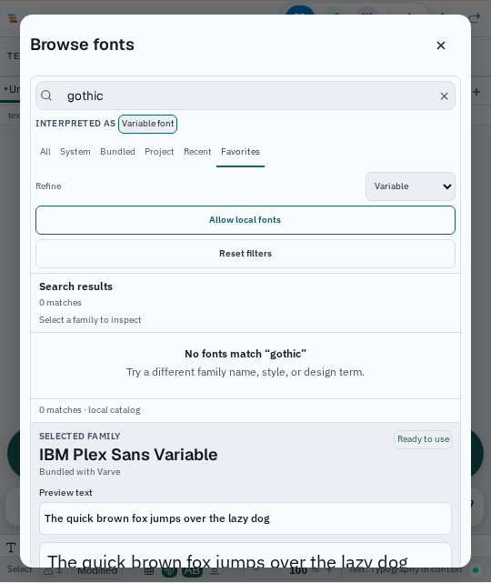
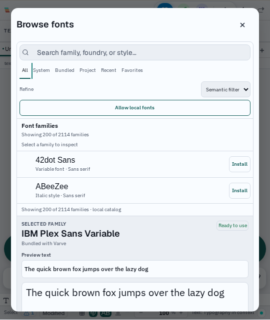

# Font browser filter keyboard evidence — 2026-09-13

The font browser source filters now follow a roving-tabindex model. **All**
is the only tab stop at the default state; selecting a source moves the single
tab stop to that source. ArrowLeft and ArrowRight wrap through the six source
tabs, while Home and End jump to the first and last tab. Each keyboard move
updates the active filter and focuses the new tab, so the visible result set and
focus target stay together.

This completes the reset-control interaction introduced in the preceding
[filter-reset evidence](font-browser-filter-reset-evidence-2026-09-13.md): a
user can narrow the catalog, reset it, and continue entirely from the keyboard.
The handler is local state only. It does not enumerate fonts, fetch provider
metadata, or change the selected face.

## Validation

```text
TMPDIR=/home/kevina/CodingProjects/varve/.tmp VARVE_E2E_PORT=1667 VARVE_E2E_WORKERS=1 VARVE_DISABLE_HMR=1 VARVE_E2E_OUTPUT_DIR=font-browser-filters-keyboard-20260913 npx playwright test tests/e2e/canvas/font-browser-filters.spec.ts --project=chromium --reporter=list --timeout=120000
```

Result: **1 passed (1.1m)** on Linux Chromium. The test combines a family
search, source filter, and semantic filter at 540 CSS pixels, measures modal
containment and stacked controls, resets all filters, and asserts ArrowRight,
End, and Home focus/selection transitions. The inspected captures are
[`filtered-narrow.png`](../screenshots/fonts/2026-09-13-filter-keyboard/filtered-narrow.png)
and [`reset-narrow.png`](../screenshots/fonts/2026-09-13-filter-keyboard/reset-narrow.png);
checksums and the exact run metadata are in
[`manifest.json`](../screenshots/fonts/2026-09-13-filter-keyboard/manifest.json).

The focused component suite passed **11 tests**, including the roving-tabindex
assertions. Formatting, lint, and the emoji audit passed in the affected plan.
The plan's first compiler lane remains blocked by unrelated current-tree errors
in `packages/engine/src/canvasFontAliases.ts` (`fontFaces`) and
`tests/e2e/canvas/typography-editing.spec.ts` (`HTMLElement.sheet`); the focused
unit and browser checks passed independently.




