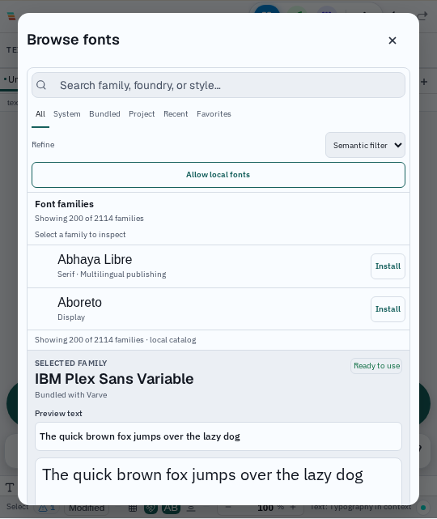

# Font browser filter reset evidence — 2026-09-13

The full font browser now exposes one **Reset filters** action whenever a
search query, source tab, or semantic refinement is active. It clears all
three controls together, returns the source tab to **All**, and removes itself
when the catalog is back at its default scope. The action is local state only;
it does not enumerate fonts, fetch provider metadata, or alter the selected
face.

The narrow layout uses the same compact control tokens as the rest of the
manager. At 540 CSS pixels, the source tabs remain horizontally scrollable,
the semantic control and local-font action stack, and Reset filters fills the
available control width. The modal and its toolbar remained within their own
client widths in the browser run.

## Implementation

- `FontBrowser` computes one `hasActiveFilters` predicate from the query and
  both filter controls.
- `resetFilters` clears query, source, and semantic state in one synchronous
  interaction.
- The button has an explicit accessible name, focus ring, high-contrast border,
  and full-width narrow treatment.
- The component test checks that all three values reset and that the action is
  removed at the default state.
- The browser test combines all three filters at 540 CSS pixels, checks the
  measured containment and stacked layout, clicks Reset filters, and captures
  before/after states.

## Validation

```text
TMPDIR=/home/kevina/CodingProjects/varve/.tmp VARVE_E2E_PORT=1665 VARVE_E2E_WORKERS=1 VARVE_DISABLE_HMR=1 VARVE_E2E_OUTPUT_DIR=font-browser-filters-20260913 npx playwright test tests/e2e/canvas/font-browser-filters.spec.ts --project=chromium --reporter=list --timeout=120000
```

Result: **1 passed (46.2s)** on Linux Chromium. The inspected captures are
[`filtered-narrow.png`](../screenshots/fonts/2026-09-13-filter-reset/filtered-narrow.png)
and [`reset-narrow.png`](../screenshots/fonts/2026-09-13-filter-reset/reset-narrow.png);
checksums and capture metadata are in the
[`manifest.json`](../screenshots/fonts/2026-09-13-filter-reset/manifest.json).
The run measured `scrollWidth <= clientWidth`, a column control layout, and a
reset button width equal to the control row at the narrow viewport.

Focused Vitest coverage also passed:

```text
TMPDIR=/home/kevina/CodingProjects/varve/.tmp pnpm exec vitest run packages/editor/src/components/FontBrowser/FontBrowser.test.tsx --config vitest.config.ts --pool=threads --maxWorkers=1 --no-file-parallelism --reporter=dot
```

Result: **10 tests passed**.

The impact-aware gate selected the editor package, the focused unit test, and
the browser file. Formatting, lint, and the emoji audit passed. Its first
compiler lane remains blocked by unrelated current-tree errors in
`packages/engine/src/canvasFontAliases.ts` (`fontFaces`) and
`tests/e2e/canvas/typography-editing.spec.ts` (`HTMLElement.sheet`); the
focused unit and browser checks above passed independently.



