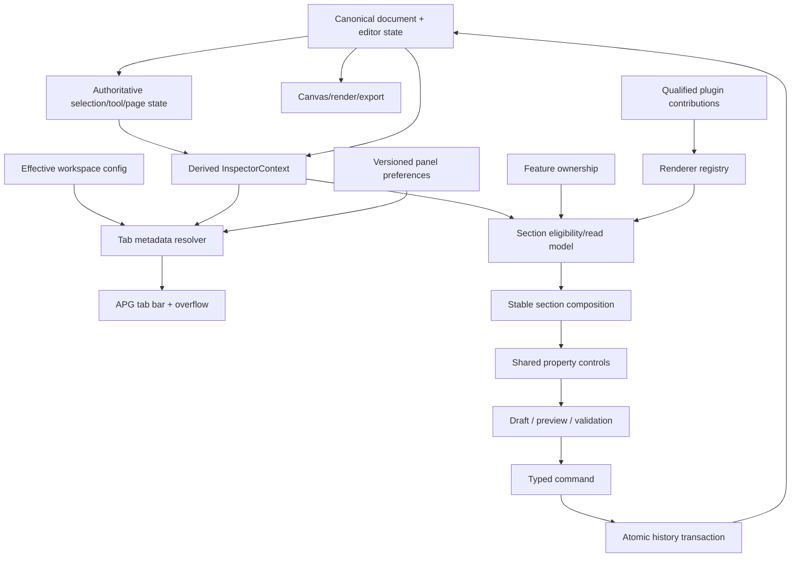
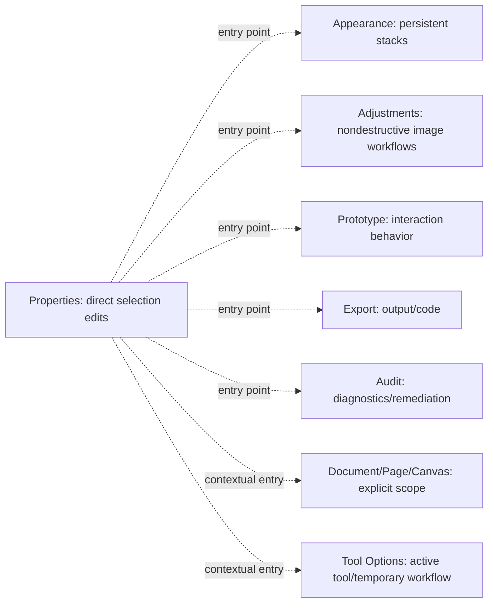
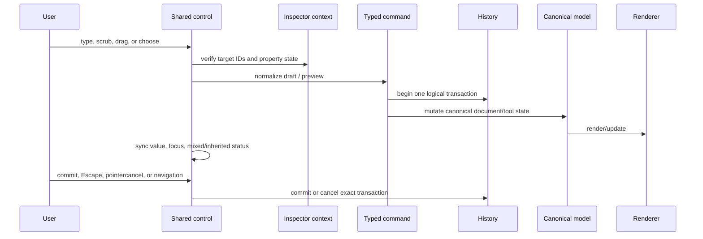
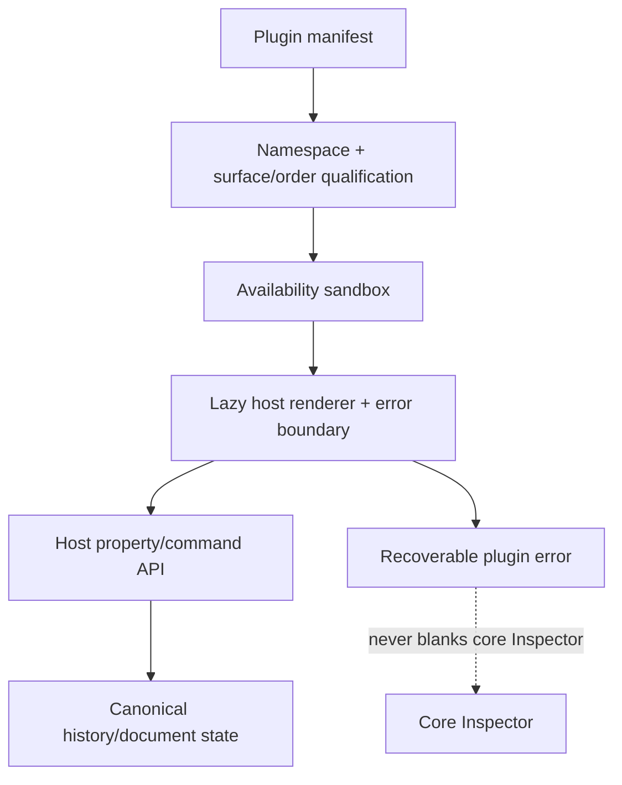

# Inspector organization audit — 2026-08-30

This is a repository-first audit and the record for the first six implementation
slices of the Inspector reorganization. It deliberately distinguishes shipped
behavior from proposed architecture and from unverified behavior. It does not
claim that the full Inspector program is complete.

## Environment

| Field | Actual value |
|---|---|
| Branch | `feat/adjustment-hardening` |
| Tab slice commit | `c1fb91add` |
| Context slice commit | `02c2e44b8` |
| Registry/header slice commit | `3259040da` |
| Property-state/control slice | `b29361917` (`feat(inspector): make numeric property states explicit`) |
| Commit subject | `feat(inspector): make numeric property states explicit` |
| Restriction presentation slice | `3cc99d4a9` (`feat(inspector): explain selection restrictions`) |
| Worktree | `/home/kevina/CodingProjects/varve` |
| Dirty state | Concurrent docs, engine thumbnail, and UI overlay work remained unstaged; Inspector slices were committed separately |
| Package manager | pnpm 11.9.0 |
| Node | v22.23.2 |
| Rust/Cargo | 1.97.1 / 1.97.1 |
| just | 1.58.0 |
| OS | Linux, Arch-family development environment |
| Browser fixture | Playwright Chromium; Firefox 154.0.1 is installed; Firefox/WebKit runs were not part of this slice |
| WebView/toolkit | WebKitGTK 2.52.6, GTK 3.24.52 available; Tauri runtime not launched in this slice |
| Workspace | Design in the representative E2E fixture |
| Inspector width | approximately 310 CSS px in the normal fixture; 80 CSS px in the overflow test |
| Active tab | Design (`properties`) in the normal fixture |
| Context | New document, no scene selection in baseline screenshots |
| Selection | Empty in baseline; rectangle workflow exercised by the existing ownership spec |

The branch advanced while the audit was in progress. The prior observed HEAD
was `8067c472a`; the tab slice is committed at `c1fb91add` and the derived
context slice at `02c2e44b8`. The concurrent Layers files were not rewritten
or reverted.

## Scope and invariant

The first six vertical slices establish one tab metadata path, a real
responsive tab surface, a pure derived context read model, deterministic
section ordering/integrity checks, a visible non-selection context header, and
an additive property-state contract with safer numeric editing.
Their invariants are:

> The rendered Inspector tab row is derived from effective workspace tab
> configuration, preserves configured order, exposes one APG tab for each
> visible destination, and moves low-priority destinations to an accessible
> menu when the row is too narrow.

> Inspector scope, valid targets, and effective selection restrictions are
> derived from authoritative editor/document state; stale IDs are discarded,
> ancestry is considered for lock/visibility safety, and no Inspector-only
> state is serialized or used as a second selection system.

> Locked and partially locked selections remain safe from accidental mutation,
> while the Inspector keeps the selected values visible and states the exact
> affected count and restriction source. Hidden selections remain inspectable
> and explain why canvas feedback is unavailable.

Out of scope for these slices: replacing manual section composition, adding a
context provider, changing property commands or scene state, changing the
canonical history model, migrating every control to source-aware states,
moving Selection Sources, adding mobile/detached variants, or altering the
concurrent Layers implementation.

## Executive diagnosis

The Inspector is mature in breadth but not yet coherent as a property system.
The repository already contains useful groundwork: a section registry, a
separate feature-ownership map, effective workspace configuration, shared
number/color/gradient controls, selection summaries, document settings, lazy
image workflows, and focused panel audits. The primary defect is that these
systems are parallel descriptions rather than one checked composition contract.

The five highest-impact root causes are:

1. `PropertiesPanel.tsx` remains a manual composition hub while
   `sectionRegistry.ts` describes availability and `featureOwnership.ts`
   describes placement. This permits registered-but-unmounted sections,
   rendered-but-unregistered sections, duplicated predicates, and ordering
   drift.
2. Workspace tab metadata and Inspector rendering were previously split between
   workspace config and fallback labels/order in `PropertiesPanel`. The first
   slice removes that duplicate path and adds actual overflow behavior, but
   contextual tab insertion and hidden-tab lifecycle still need integrity tests.
3. Property state semantics are uneven. `SelectionColorsSection` and several
   paint/effect controls model mixed or bound values, but there is no canonical
   property-state algebra applied to every NumberField, toggle, list, and stack.
4. Lock/visibility guarding was coarse. The restriction slice now presents
   effective source names and exact partial-selection counts without duplicating
   the notice across nested surfaces; locked content remains inert for safety,
   while control-level read-only/copy/source navigation is still deferred.
5. Control lifecycle and specialist workflow ownership are incomplete. Some
  controls use `beginTransaction`/`commitTransaction`, while cancellation,
  pointer loss, selection changes, and collapse/unmount policies are not
  consistently host-owned. The shared NumberField now covers pointer-cancel,
  window-blur, unmount, and scoped-draft handling; other controls remain
  incomplete. `AdjustmentsPanel` is lazy, but still mounts a
   long sequence of specialist sections once opened.

### Hypothesis results

| Hypothesis | Result | Evidence and consequence |
|---|---|---|
| Registry intent and manual composition drift | Confirmed | `sectionRegistry.ts` has metadata only; `PropertiesPanel.tsx:539-704` manually calls `add`. The `layout`/`layout-child` paths demonstrate predicate/render duplication. |
| Tab metadata drifts from workspace config | Confirmed and partly repaired | Config contains labels, groups, and priorities; prior `PropertiesPanel` had fallback labels and `TAB_ORDER`. `InspectorTabBar.tsx` and the workspace helpers now consume config metadata. |
| Properties contains workflows owned elsewhere | Partly confirmed | `AppearancePanel`, `AdjustmentsPanel`, `PrototypePanel`, `AuditPanel`, `DocumentPanel`, `CodeGenView`, and tool sections exist. Prior audits moved several workflows, but document settings and Selection Sources still need explicit context ownership. |
| Empty state is contradictory | Repaired for current contexts | `EmptySelectionState` describes the derived scope, non-selection contexts have a compact visible header, and tool contexts no longer mount document settings; the existing “No selection” illustration remains as a selection affordance. |
| Adjustments is an excessively long list | Confirmed after invocation | `AdjustmentsPanel.tsx` mounts Image Tuning plus eleven single-image workflows. It is lazy at tab boundary but not yet categorized into compact launchers/focused editors. |
| Appearance and Properties overlap | Confirmed, partly intentional | `AppearanceSection` summarizes routine properties while `AppearancePanel` owns masks, paints, palette, Object Filters, and Layer Effects. The summary/deep-editor boundary is undocumented at control level and duplicate-command audit remains. |
| Section customization exposes only part of its model | Confirmed | `sectionState.ts` stores order, hidden, and collapsed state; `SectionManagerTrigger` currently provides show/hide/reset, not reorder. |
| Legacy and registry disclosures coexist | Confirmed | `sectionState.ts` migration exists, but `DisclosureSection` callers and local/session state still need a complete inventory and removal plan. |
| Collapse destroys draft state | Unverified risk | No cross-control lifecycle matrix or E2E exists for collapse during every draft type. The current code does not establish a universal mounted/hidden policy. |
| Lock/visibility guarding is too coarse | Partly repaired | `inspectorContext.ts` derives direct and ancestor-effective restrictions, source IDs, and partial editable IDs; `SelectionLockGuard` now explains counts/sources once per active surface and preserves hidden inspection, while locked controls remain inert and control-level safe inspection is deferred. |
| Mixed values vary by control | Partly repaired | `propertyState.ts` now defines common/mixed/unset/partial and richer source/error vocabulary; `NumberField` consumes it, while other controls still use legacy booleans. |
| Numeric editing has lifecycle gaps | Partly repaired | `NumberField` now scopes Layout drafts by document/selection, selects the mixed placeholder for replacement, handles pointercancel/window blur/unmount, and coalesces arrow/scrub history; wheel and other control families remain to audit. |
| Plugins bypass product IA | Partly confirmed | `pluginSections.ts` has namespacing and availability metadata, but `PluginSectionContribution` has no renderer/factory despite its module contract, no surface ownership validation, no order band enforcement, and no host rendering path found in the current Inspector composition. |

## Evidence index

| ID | Modality | Source | Finding | Confidence |
|---|---|---|---|---|
| E1 | Git | `git branch --show-current`, `git rev-parse HEAD`, `git status --short` | Current branch, SHA, and dirty state recorded above | High |
| E2 | Source | `PropertiesPanel.tsx:93-704` | Manual tab and section composition hub; effective restriction guard; document panel in empty state | High |
| E3 | Source | `workspaceTypes.ts:1130-1210` | Workspace config is capable of owning tab metadata; effective helpers added in this slice | High |
| E4 | Source | `sectionRegistry.ts` and `featureOwnership.ts` | Availability and ownership are separate maps with no renderer registry | High |
| E5 | Source | `AppearancePanel.tsx`, `AdjustmentsPanel.tsx` | Persistent appearance and image workflows are already separated into lazy panels, but the adjustment panel is long after invocation | High |
| E6 | Source | `sectionState.ts`, `SectionManagerTrigger.tsx` | Persisted order exists while the visible manager is show/hide/reset oriented | High |
| E7 | Source | `pluginSections.ts` | Namespaced metadata exists; contribution rendering/qualification is incomplete | High |
| E8 | Unit | `InspectorTabBar.test.tsx`, `workspaceTypes.test.ts` | Overflow priority, pinning, metadata labels, grouping, and contextual fallback tested | High |
| E9 | E2E | `tests/e2e/inspector/ownership.spec.ts` | Existing ownership flows plus narrow overflow scenario | High for Chromium |
| E10 | Screenshot | `test-results/run-2915479-1463/.../test-failed-1.png` | Narrow style experiment exposed that the empty baseline has only Design + Export; the test was corrected to force overflow by reducing width | High |
| E11 | Screenshot | `test-results/run-2903636-1462/.../document-settings-actual.png` | Normal document context visually inspected; baseline mismatch is small but real | High |
| E12 | Screenshot | `test-results/run-2904049-1462/.../rectangle-properties-actual.png` | Rectangle context visually inspected; current Layout merge and group divider visible | High |
| E13 | Typecheck | `pnpm --filter @varve/editor typecheck`, `pnpm --filter @varve/engine typecheck` | Both affected package typechecks pass after the concurrent Layers commit; the separately dirty engine thumbnail file was not changed by this slice | High |
| E14 | E2E console | ownership run with current dirty Layers tree | `ReferenceError: Cannot access 'adjustmentSummary' before initialization` in `LayersRow`; treated as concurrent/pre-existing | High |
| E15 | Unit | `Inspector/inspectorContext.test.ts` | Seven pure derivation cases pass: document/canvas/tool/temporary scope, stale IDs, ancestor restrictions, and partial lock | High |
| E16 | Source | `Inspector/inspectorContext.ts`, `PropertiesPanel.tsx` | Context is read-only, stale-safe, ancestry-aware, and now drives the panel context marker and empty-state copy | High |
| E17 | Focused validation | `80` Inspector/workspace tests, Biome, docs, emoji, and token audits | Second slice passes focused tests and quality audits; affected gate remains blocked by concurrent Layers formatting | High |
| E18 | Focused unit/integration | `150` Inspector/workspace tests plus context-header assertions | Registry integrity, deterministic ordering, visible document/canvas/tool context, and tool/document separation pass | High |
| E19 | Screenshot | `tests/e2e/inspector/ownership.spec.ts-snapshots/{document-settings,rectangle-properties}-chromium-linux.png` | Reviewed updated baselines: context header is compact and readable; rectangle layout remains stable | High |
| E20 | Unit | `propertyState.test.ts`, `NumberField.test.tsx`, `selectionState.test.ts`, `ImageTuningSection.test.tsx` | Explicit property-state classification, legacy unset compatibility, mixed replacement, scoped-draft cancellation, pointer transaction cleanup, and updated shared mixed semantics pass | High |
| E21 | E2E + screenshot | `ownership.spec.ts` mixed geometry scenario and `mixed-properties-chromium-linux.png` | Two selected shapes show readable Mixed X/Y fields, stable Layout hierarchy, and `aria-valuetext="Mixed values"`; screenshot manually opened | High for Chromium |
| E22 | E2E + visual | `VARVE_E2E_PORT=1487 ... ownership.spec.ts` | Complete Inspector ownership suite passes 7/7, including normal, overflow, prototype/tool separation, mixed-value screenshot, and responsive drawer checks | High for Chromium |
| E23 | Affected validation | `VARVE_E2E_PORT=1489 VARVE_E2E_WORKERS=1 VARVE_TEST_WORKERS=1 pnpm verify:affected` | Tier 0, E2E typecheck, focused Inspector tests, and Inspector E2E pass; broad editor unit execution exposes unrelated menu snapshot drift and unrelated editor/ImageTuning failures. The ImageTuning expectation was corrected and its focused test then passed; broad run was stopped after hanging | High |
| E24 | Visual inspection | `view_image` on document, rectangle, and mixed Inspector snapshots | No clipping, unstable hierarchy, or unreadable mixed state observed; mixed X/Y fields visibly say `Mixed` and remain aligned | High |
| E25 | Unit/integration | `PropertiesPanel.test.tsx`, `restrictionState.test.ts`, `inspectorContext.test.ts` | Full, partial, ancestor-derived, and hidden restrictions are represented with source-aware copy; 31 focused tests pass | High |
| E26 | E2E + screenshot | `ownership.spec.ts` locked-selection scenario and `locked-properties-chromium-linux.png` | Real Layers lock action leaves Inspector values visible, presents one source-aware notice, keeps controls inert, and has no clipping at the normal panel width | High for Chromium |

## Current-state feature ownership matrix

The “renderer” column identifies where code was found, not a claim that every
registered entry is mounted in every eligible context. `manual` means the
renderer is selected by `PropertiesPanel` branches rather than a typed factory.

| Capability / section | Current surface | Current owner | Scope | Frequency / complexity | Duplicate or status | Target owner |
|---|---|---|---|---|---|---|
| page-print | Properties | `PagePrintSection` | active tool | occasional / compact | manual; functional | Tool Options or explicit Page context |
| table | Properties | `TableSection` | selection | frequent / moderate | manual; functional | Properties |
| table-cells | Properties | `TableCellsSection` | table edit | frequent / moderate | manual; functional | Table context |
| table-columns / rows | Properties | `TableTracksSection` | table edit | frequent / moderate | same renderer for two IDs | Table context |
| position-size | Properties | `PositionSizeSection` | mixed selection | frequent / compact | merged Layout after ADR-0230 | Properties / Layout |
| corner-radius | Properties | `CornerRadiusSection` | selection | frequent / compact | manual | Properties |
| layout | Properties | `LayoutSection` | frame selection | frequent / moderate | title collides with position-size Layout | Properties / Layout |
| layout-child | Properties | `LayoutChildSection` | child selection | frequent / moderate | manual path is duplicated/guarded | Properties / Layout |
| appearance | Properties | `AppearanceSection` | mixed selection | frequent / compact | summary plus deep appearance | Properties summary |
| mask | Appearance | `MaskSection` | single selection | occasional / moderate | lazy deep surface | Appearance |
| selection-colors | Properties | `SelectionColorsSection` | mixed selection | frequent / compact | manual | Properties |
| fills | Properties | `FillSection` | mixed selection | frequent / moderate | shared with paint/color primitives | Properties |
| paint-library | Appearance | `PaintLibrarySection` | mixed selection | occasional / moderate | deep appearance | Appearance |
| stroke | Properties | `StrokeSection` | mixed selection | frequent / moderate | manual | Properties |
| effects | Appearance | `EffectsSection` | mixed selection | occasional / large editor | stack workflow | Appearance / Effect Studio boundary |
| smart-filters | Appearance | `SmartFiltersSection` | single selection | occasional / large editor | object filters vs effects | Appearance |
| adjustment-layer-access | Properties | `AdjustmentLayerAccessSection` | mixed selection | occasional / compact | launcher | Properties summary |
| typography | Properties | `TypographySection` | text selection | frequent / moderate | fonts dialog deep link | Properties / Typography |
| text-on-path | Properties | `PathTextSection` | text path | occasional / moderate | manual | Properties |
| component | Properties | `ComponentSection` | instance | frequent / moderate | source/override depth incomplete | Properties + Components source |
| adjustment | Adjustments | `AdjustmentPanel` | adjustment node | frequent / large editor | canonical editor | Adjustments |
| frame-presets | Properties/tool | `FramePresetsSection` | active tool/frame | occasional / compact | dual create/resize owner | Tool Options + frame context |
| icon | Properties | `IconSection` | icon node | occasional / compact | manual | Properties |
| image-placement | Properties | `ImagePlacementSection` | image | frequent / moderate | image fit/crop audit pending | Properties |
| image-perspective | Properties | `PerspectiveSection` | image | occasional / moderate | manual | Properties / focused workflow |
| image-resolution | Properties | `ImageResolutionSection` | image | occasional / compact | derived/read-only semantics pending | Properties |
| image-crop | Properties/tool | `ImageCropSection` | image | occasional / moderate | crop tool owns temporary flow | Tool Options + image context |
| animation | Properties | `AnimationSection` | animated media | occasional / moderate | timeline boundary pending | Motion/Timeline entry |
| image-tuning | Adjustments | `ImageTuningSection` | image selection | frequent / moderate | batch support | Adjustments |
| image-enhancement | Adjustments | `ImageEnhancementSection` | image | rare / large editor | lazy panel, mounted after open | Adjustments launcher |
| background-removal | Adjustments | `BackgroundRemovalSection` | image | rare / large editor | async workflow | Adjustments launcher |
| colorize | Adjustments | `ColorizeSection` | image | rare / large editor | async workflow | Adjustments launcher |
| ai-denoise | Adjustments | `AIDenoiseSection` | image | rare / large editor | async workflow | Adjustments launcher |
| ai-tools-hint | Properties | `AiToolsHintSection` | image outside Photo | occasional / compact | mirror hint | Properties summary |
| lens-blur | Adjustments | `LensBlurSection` | image | rare / large editor | async/depth workflow | Adjustments launcher |
| line-art | Adjustments | `LineArtSection` | image | rare / large editor | async workflow | Adjustments launcher |
| content-aware-fill | Adjustments/dialog | `ContentAwareFillSection` | image | rare / large editor | focused dialog path | Adjustments launcher/dialog |
| detect-text | Adjustments | `DetectTextSection` | image | rare / large editor | analysis result | Analysis/Audit |
| ocr | Adjustments | `OcrSection` | image | rare / large editor | analysis result | Analysis/Audit |
| font-detect | Adjustments | `FontDetectSection` | image | rare / large editor | analysis result | Analysis/Audit |
| warp | Appearance/Properties | `WarpSection` | selection/tool | occasional / large editor | persistent modifier | Appearance |
| mockups | Properties | `MockupsSection` | frame | rare / large editor | manual | dedicated Mockups workflow |
| blend-images | Adjustments | `BlendImagesSection` | image | rare / large editor | combine workflow | Adjustments launcher |
| palette | Appearance | `PaletteSection` | image | occasional / moderate | palette extraction | Appearance / Analysis |
| adaptive-contrast | Adjustments | registry entry; renderer requires audit | image | rare / large editor | registry/render qualification to verify | Adjustments |
| align-distribute | Properties | `AlignDistributeBar` | selection | frequent / compact | toolbar-like control in Inspector | Canvas/selection toolbar with entry point |
| cognitive-load | Audit | `AuditPanel` | document | occasional / moderate | inline Insights disclosure | Audit |
| interaction | Prototype | `InteractionSection` | node | occasional / moderate | panel ownership | Prototype |
| prototype-flow | Prototype | `PrototypePanel` | prototype | occasional / large editor | panel ownership | Prototype |
| brush-settings | Tool Options | `BrushSection` | active tool | frequent / moderate | tool-owned | Tool Options |
| canvas-background | Document | `DocumentPanel` | document/canvas | occasional / compact | empty-state presentation | Document/Canvas context |
| document-color | Document | `DocumentPanel` | document | occasional / moderate | explicit document scope needed | Document Setup |
| document-proof | Document | `DocumentPanel` | document | rare / moderate | explicit document scope needed | Document Setup |
| document-grid | Document | `DocumentPanel` | document/canvas | occasional / moderate | display vs export distinction needed | Canvas settings |
| isometric-grid | Document | `DocumentPanel` | canvas | rare / moderate | display setting | Canvas settings |
| layer-states | Properties | `LayerStatesSection` | selection | occasional / moderate | view/state workflow boundary pending | Layers / Properties entry |

Primary conclusion: the ownership map is valuable, but it is not yet a
rendering contract. The next slice should make that relationship executable.

## Property ownership matrix

This matrix records the current model/control audit. “Trace pending” is an
intentional finding: it prevents an invented canonical path from becoming a
false architecture claim.

| Property | Canonical model path | Current control | Mixed semantics | Inheritance/binding | Reset | History/render/export |
|---|---|---|---|---|---|---|
| x / y | node geometry / transform | `PositionSizeSection` NumberField | section supports selection aggregation; lifecycle audit pending | source semantics pending | command-specific | document command; canvas render |
| width / height | node geometry / bounds | `PositionSizeSection` NumberField | batch path present | calculated bounds can differ | command-specific | document command; canvas render |
| rotation | node transform | `PositionSizeSection` | mixed audit pending | none identified | command-specific | document command; canvas render |
| scale | node transform | `PositionSizeSection`/transform tools | relative edit policy pending | none identified | command-specific | document command; canvas render |
| corner radius | shape/frame geometry | `CornerRadiusSection` | selection control audit pending | none identified | clear/default semantics pending | document command; canvas render |
| constraints | frame-child layout metadata | embedded `ConstraintSection` in merged Layout | frame-child applicability | inherited parent layout possible | reset semantics in ADR-0230 path | document command; layout render |
| auto-layout | frame layout metadata | `LayoutSection` | single frame | parent scope | reset pending | document command; layout render |
| child layout | child layout metadata | `LayoutChildSection` | mixed child support pending | parent-derived | reset pending | document command; layout render |
| visibility | node visibility | `AppearanceSection`/Layers | mixed toggle semantics audit pending | ancestor effective state absent in context | show/restore | document command; render |
| opacity | node appearance | `AppearanceSection` | common/mixed selector varies by path | style/binding audit pending | default/clear pending | document command; render/export |
| blend mode | node appearance | `AppearanceSection` | mixed select audit pending | none identified | default | document command; render/export |
| fill | node fills | `FillSection` | selection-color summary and fill list differ | variable binding exists in FillSection | clear/remove/unbind distinctness pending | document command; render/export |
| stroke | node strokes | `StrokeSection` | mixed stack audit pending | binding audit pending | clear/remove pending | document command; render/export |
| effects | node effect stack | `EffectsSection` | mixed stack policy pending | none identified | remove vs reset pending | document command; render |
| object filters | node adjustment/filter stack | `SmartFiltersSection` | single-selection gate | treatment binding exists in parts | remove/reset pending | document command; render/export |
| mask | node mask | `MaskSection` | single-selection | source/owner pending | remove/reset pending | document command; render |
| warp | node warp stack | `WarpSection` | partial batch behavior pending | none identified | remove/reset pending | document command; render |
| typography | text node text style | `TypographySection` | all-text gate; field-level audit pending | font/style/variable axes partial | reset pending | document command; text render/export |
| text-on-path | text path metadata | `PathTextSection` | single text path | source path relationship | reset pending | document command; text render |
| image placement/fit | image fill metadata | `ImagePlacementSection` + image fill controls | single image | asset relationship | reset pending | document command; render/export |
| crop | image crop/bounds | `ImageCropSection`/crop tool | single image | none identified | revert crop pending | document command; render/export |
| image resolution | image asset/placement metadata | `ImageResolutionSection` | single image | calculated PPI | read-only/derived | document/asset; export |
| component identity | frame component reference | `ComponentSection` | single instance | source/variant | detach/reset consequences pending | document command; render |
| component properties | instance override map | `ComponentSection` | partial support | source-bound/overridden | revert override pending | document command; render/export |
| prototype interaction | prototype interaction model | `InteractionSection` | selection scope pending | source/state semantics pending | delete/reset pending | document command; presenter |
| animation | motion track metadata | `AnimationSection`/Timeline | selection scope pending | timeline source | reset pending | document command; motion/render/export |
| export presets | node export settings | `AssetExportControls` | batch scope pending | no binding audit | remove/reset | document command; export |
| page properties | page model | `PagePrintSection`/Pages | page selection scope | master/default scope pending | reset page/default | document command; export |
| table properties | table model | `TableSection` | table selection | document defaults pending | reset pending | document command; layout/export |
| document color | document color settings | `DocumentPanel` | not selection property | document scope | revert/convert semantics | document command; render/export |
| grid | canvas/document display state | `DocumentPanel` | not selection property | workspace/document scope pending | default | view state or document, must separate |
| soft proof | document proof settings | `DocumentPanel` | not selection property | document scope | reset pending | document/export policy |
| selection colors | derived selected paint groups | `SelectionColorsSection` | explicit aggregate groups | none | N/A derived | document commands; render |
| adjustment properties | adjustment node payload | `AdjustmentPanel` | one node | scoped adjustment source | reset per adjustment | document command; render/export |

The matrix makes the main missing primitive explicit: controls need a shared
`PropertyState<T>`/edit-policy contract before mixed, inherited, binding, and
partial-applicability behavior can be made consistent.

## Context matrix

| Context | Target identity | Primary controls | Specialist surface | Unsupported/restriction | Default focus | Persistence |
|---|---|---|---|---|---|---|
| no document | none | empty workspace | none | document creation | New/open | workspace |
| loading document | document placeholder | loading status | none | edits blocked | status | transient |
| no selection | document/canvas (current implementation) | Canvas, Document Color, grid/proof | DocumentPanel | wording/context header ambiguous | Design | panel view |
| stale selection | no valid node | empty/recovery | none | safe no-op | context header | transient |
| one shape | node | Layout, Appearance, Fill, Stroke | Appearance/Prototype/Export | node restrictions | current tab | document + panel |
| one path | path node | Layout, Appearance, Stroke | Prototype/Export | path-specific controls | current tab | document + panel |
| one frame | frame | Layout, child layout | Components/Prototype/Export | component/master restrictions | current tab | document + panel |
| one component instance | instance/source | Component, Layout, Appearance | component source | overrides/source missing | Component or Design | document + panel |
| one text node | text | Layout, Fill, Stroke, Typography | fonts dialog, Prototype | active range semantics incomplete | Typography field pending | document + panel |
| active text range | range in text node | typography/content | text editor | node-level controls must be constrained | text caret | transient + document |
| one image | image | Layout, placement, crop | Adjustments, Appearance | heavy workflows lazy only at tab boundary | placement | document + panel |
| one adjustment layer | adjustment node | adjustment payload/scope | Adjustments | generic node controls excluded | adjustment editor | document + panel |
| one table | table | Table, cells, tracks | none | cell edit distinction | Table | document + panel |
| table-cell edit | cell/range | Cells, alignment | table workflows | row/column scope | cell field | document + panel |
| one page | page | page/print | Pages/Document Setup | not ordinary scene node | page settings | document + panel |
| master edit | master/page source | source metadata | Pages/Masters | inherited/override semantics pending | source | document + panel |
| export region | region | geometry/export | Export | frame layout intentionally excluded | export | document + panel |
| homogeneous multi | node set | shared geometry/appearance | none | stack compatibility | first mixed field | document + panel |
| heterogeneous multi | node set | defensible common properties | none | partial applicability policy pending | selection summary | document + panel |
| pixel/area selection | pixel selection | selection operations | Tool Options/Selections | separate from scene selection | operation | transient/document saved selection |
| active crop | crop workflow | crop handles/options | Tool Options | object properties should not masquerade | crop control | transient until commit |
| active warp | warp workflow | warp controls | Appearance/Tool Options | temporary vs persistent boundary | warp editor | transient/document |
| prototype mode | prototype target | interactions/flow | Prototype | node properties remain distinct | prototype | panel/document |
| inspect tool | inspected target | read-only/code | Export/Codegen | no unsafe object edit | code output | panel |
| locked/hidden | node + effective restriction | safe inspection/reveal | source navigation | mutation scope pending | diagnostic | document + panel |
| inherited/master content | source-linked node | effective value/source | Pages/Masters/Components | reset/revert pending | source badge | document + panel |
| plugin content | host target + plugin section | qualified contribution | plugin section | permission/error boundary incomplete | core context | plugin/view state |

## Section composition matrix

The registry has no render factory field. Therefore every row below is
registered and owned, but “manual/indirect” means integrity is not mechanically
enforced yet. IDs not directly named in `PropertiesPanel` are rendered by a
panel or are candidates for a registry/render gap and must not be treated as
complete solely because their definition exists.

| Section IDs | Registered | Ownership | Renderer found | Availability | Default/order issue |
|---|---|---|---|---|---|
| position-size, corner-radius, layout, layout-child | yes | yes | manual sections | registry + local guards | position-size and layout both title “Layout”; layout-child shares order 120 |
| appearance, selection-colors, fills, stroke | yes | yes | manual sections | registry + local guards | stable core group |
| mask, paint-library, effects, smart-filters, warp | yes | yes | AppearancePanel | panel gates + section gates | lazy deep surface merged into Design |
| adjustment-layer-access | yes | yes | manual section | registry | launcher in Properties |
| typography, text-on-path | yes | yes | manual sections | registry | text-only gates |
| component, icon, mockups | yes | yes | manual sections | registry + local guards | component/mockup source depth pending |
| adjustment | yes | yes | AdjustmentPanel | direct kind gate | canonical editor |
| frame-presets | yes | yes | tool/frame section | active tool or frame | dual context owner |
| image-placement, image-perspective, image-resolution, image-crop | yes | yes | manual sections | image predicates | image fit/crop duplicate audit pending |
| animation | yes | yes | manual section | animated-media predicate | Timeline boundary pending |
| image-tuning | yes | yes | AdjustmentsPanel | image selection | long workflow after tab open |
| image-enhancement, background-removal, colorize, ai-denoise | yes | yes | AdjustmentsPanel | image + Photo | heavy sections mount sequentially |
| lens-blur, line-art, content-aware-fill | yes | yes | AdjustmentsPanel/dialog | image + Photo | heavy/lazy policy pending |
| detect-text, ocr, font-detect, blend-images | yes | yes | AdjustmentsPanel | image + Photo | analysis/combine target surface pending |
| ai-tools-hint | yes | yes | manual section | image outside Photo | launcher/hint policy |
| palette | yes | yes | AppearancePanel | image | analysis placement pending |
| adaptive-contrast | yes | yes | renderer qualification pending | registry only verified | possible unreachable entry |
| align-distribute | yes | yes | `AlignDistributeBar` | selection | toolbar/Inspector boundary |
| cognitive-load | yes | yes | AuditPanel | document/audit | inline Insights disclosure |
| interaction, prototype-flow | yes | yes | PrototypePanel/section | Prototype | separate tab |
| brush-settings | yes | yes | BrushSection | active brush | Tool Options |
| canvas-background, document-color, document-proof, document-grid, isometric-grid | yes | yes | DocumentPanel | no-selection/document | explicit scope/header required |
| layer-states | yes | yes | manual section | selection or saved states | Layers/Inspector boundary pending |
| constraints | no (retired) | migrated | `ConstraintSection` embedded | ADR-0230 | stale persisted ID dropped by v2 migration |

Integrity tests needed next: exact set equality between registry IDs,
ownership IDs, renderer descriptors, and documented explicit omissions; unique
IDs; valid surfaces; deterministic order; and no duplicate semantic title in a
single active context without an accessible disambiguator.

## Duplicate-control matrix

| Concept | Surface A | Surface B | Same model/command? | Current judgment | Resolution |
|---|---|---|---|---|---|
| image fit/placement | Properties `ImagePlacementSection` | image fill controls/appearance | likely related, command equivalence not fully traced | accidental overlap risk | one canonical image-placement command; summary may link deep editor |
| crop/bounds | Properties `ImageCropSection` | crop tool options | intended summary vs temporary workflow | intentional boundary, needs return path | same command/property adapter |
| effects | Appearance `EffectsSection` | Effect Studio entry | related but different stack/treatment model | intentional summary/deep editor | document command ownership |
| filters | Appearance `SmartFiltersSection` | Effect Studio treatments | not identical | distinct object filters vs treatments | explicit labels and source metadata |
| adjustment access | Properties launcher | Adjustments selected-node editor | no, create vs edit | intentional two-stage | canonical adjustment command |
| typography/font discovery | Properties Typography | Fonts tab/dialog | same resource path, different workflow | summary + resource browser | retain dialog, remove standalone tab except deep link |
| export | Export Format | Export Code | same output surface, different output | intentional subtabs | canonical tab metadata and APG subtabs |
| layer states | Properties section | Layers panel | same document state concept | ownership ambiguous | Layers management, Inspector contextual entry |
| selection sources | Properties `SelectionSourcesPanel` | tool options/selection workflows | separate scene vs pixel selection models | wrong persistent placement risk | dedicated Selection/Tool Options owner with contextual entry |
| document settings | Design empty state | Page/Document menus | same document model, different scope | contradictory context risk | explicit Document/Canvas context |
| opacity/blend | Appearance summary | effects/filter UI | same node appearance only if controls exist | verify command identity | one command adapter and state contract |
| palette extraction | Appearance panel | image analysis/adjustments | analysis not appearance | misplaced specialist workflow | launcher under Analysis/Appearance entry |
| code generation | Export Code | Codegen workspace/panel | likely same generator | duplicate surface risk | one generator service, two intentional entry points |

## Control primitive matrix

| Control | Shared primitive | Mixed/inherited | Reset | Preview/transaction | Error/a11y | Usage |
|---|---|---|---|---|---|---|
| numeric field | `Inspector/controls/NumberField` | mixed support varies by caller | caller-defined | many callers use editor transactions | spinbutton coverage exists; lifecycle gaps | very high |
| slider/range | shared UI/section-specific | inconsistent audit | caller-defined | preview varies | slider semantics need matrix | high |
| segmented/select | `@varve/ui Select` and buttons | mixed/indeterminate varies | caller-defined | usually immediate | APG/label audit pending | high |
| toggle/checkbox | `@varve/ui`/native buttons | mixed toggle audit pending | caller-defined | immediate or transaction | pressed/checked semantics audit | high |
| color | `InspectorColorPopover` | mixed swatches/variable binding partial | clear/unbind distinction pending | onEditStart/onEditEnd in paint/effect paths | dialog/popover tests exist | high |
| gradient | `GradientEditor` | mixed stack audit pending | caller-defined | transaction callers exist | keyboard/list focus audit pending | medium |
| fills list | `FillSection` list rows | stack identity policy pending | remove/clear pending | reorder transaction present | keyboard reorder audit pending | high |
| strokes list | `StrokeSection` list rows | mixed stack pending | remove/reset pending | reorder transaction present | native inputs remain | high |
| effects list | `EffectsSection` | mixed stack pending | remove/reset pending | reorder/parameter transactions partial | large surface | medium |
| filters list | `SmartFiltersSection` | single selection | remove/reset pending | treatment customization paths | large surface | medium |
| native text input/select | multiple sections | no universal state wrapper | caller-defined | draft behavior varies | migration target | high |
| disclosure | `DisclosureSection` | central section state plus local callers | N/A | unmount policy unresolved | APG attributes expected | very high |

## Tab/workspace matrix

The order below is the configured order before contextual removal/merging. The
first slice preserves it rather than applying a second sort table.

| Workspace | Configured tabs | Actually rendered policy | Contextual tabs | Default/group/overflow |
|---|---|---|---|---|
| Design | Design, Appearance, Prototype, Export, Audit, Fonts | Appearance/Audit merged into Design; Fonts hidden except deep link | Prototype for single node; Adjustments for image | Design primary; configured groups; priority consumed by tab bar |
| Print | Design, Appearance, Audit, Export, Fonts | merged legacy tabs; Fonts deep link | context-dependent | Design default; group metadata configured |
| Draw | Design, Appearance, Export | merged legacy tabs | Adjustments for image where reachable | Design default |
| Photo | Design, Adjustments, Appearance, Export, Audit | Adjustments remains visible; Appearance/Audit merged | image workflows | Design/Adjustments configured groups |
| Motion | Design, Appearance, Prototype, Export | same merge policy | Motion-specific section/panel outside tab list | Design default |
| Logo | Design, Appearance, Prototype, Export | same merge policy | component/logo context as eligible | Design default |
| Email | Design, Appearance, Export, Audit | Email panel is separately reachable; tab policy needs audit | email context | Design default |
| Codegen | Codegen, Design, Audit, Export | Dedicated Shell `CodePanel` remains the owner; Inspector does not add a second Codegen editor | inspect/deep link | Codegen default; dedicated panel |

Prior E2E expected no More button at normal width. The first slice adds More
only when measured space is insufficient; overflow entries are `menuitem`s and
do not duplicate `role=tab` destinations.

## Platform parity matrix

| Capability | Chromium | Firefox | WebKitGTK | Tauri | Windows | macOS | Known difference |
|---|---|---|---|---|---|---|---|
| normal tab row | verified by existing/updated E2E | not run | not run | not run | not run | not run | browser-only evidence |
| APG arrows/Home/End | unit + Chromium existing flow | not run | not run | not run | not run | not run | needs SR/platform pass |
| measured overflow | unit + focused E2E after test correction | not run | not run | not run | not run | not run | ResizeObserver/WebKit pass pending |
| menu focus/portal | component + Chromium target | not run | not run | not run | not run | not run | verify portal clipping in detached panel |
| detached panel | not run | not run | not run | not run | not run | not run | deferred |
| 200% / forced colors / RTL | not run | not run | not run | not run | not run | not run | deferred accessibility matrix |
| Tauri IPC/document edits | not run in slice | N/A | not run | not run | not run | not run | no claim of parity |

## Architecture target

The target is additive and preserves the single document/selection authority.



Surface ownership should remain explicit:



Control lifecycle:



Plugin boundary:



## Architecture decisions

These are the decisions made or proposed by this audit. “Deferred” is a
deliberate implementation status, not an implied completion claim.

1. **Canonical Inspector context — accepted and implemented.** Derive it from
   editor/document state; never serialize it or create a second selection
   system. It must include scope, selected IDs, tool, page/master provenance,
   effective restrictions, and capabilities.
2. **Tab metadata ownership — accepted and implemented in this slice.**
   Workspace configuration owns labels, order, groups, defaults, visibility,
   and overflow priority. `InspectorTabBar` receives configs; it owns only
   measurement and APG interaction.
3. **Section metadata vs rendering — retain separate concerns, add checks.**
   Availability, ownership, and rendering may stay separate, but exact ID and
   surface integrity must be tested. Do not force every typed renderer into an
   untyped universal factory.
4. **Feature ownership/surface taxonomy — accepted.** Properties is the direct
   selection summary; Appearance, Adjustments, Prototype, Export, Audit,
   Document, and Tool Options retain their own scope. Entry points may be
   duplicated when the command is canonical and the scope is explicit.
5. **No-selection/document context — accepted as target, not complete.** The
   empty state must announce Document or Canvas context before showing settings;
   the contradictory copy and header are next-slice work.
6. **Progressive disclosure — accepted.** Immediate controls, expanded
   contextual sections, and focused heavy workflows are different levels.
   Collapsing is not an ownership fix.
7. **Mixed/partially applicable values — accepted and partially implemented.** Use
   explicit common/mixed/unset/inherited/bound/calculated/unavailable/error
   values. A batch edit must declare compatible target scope and never silently
   mutate a subset.
8. **Inherited/overridden/bound values — deferred.** Show resolved value and
   source, with reset/revert/unbind distinctions. This belongs in the shared
   property-state contract, not ad hoc badges.
9. **Draft/transaction lifecycle — accepted for NumberField, not universal.** Control or section may request
   a transaction, but one host command owns the boundary. Target IDs must be
   captured and stale commits rejected.
10. **Disclosure mount policy — deferred.** Each section declares preserve,
    cancel, external-draft, or safe-unmount. No universal unmount assumption.
11. **Section customization — retain persisted hidden/order state, but do not
    advertise reorder until the manager exposes it.** Add migration and
    deterministic category constraints next.
12. **Tab overflow — accepted and implemented.** Keep active and priority-zero
    tabs pinned; hide lower-priority tabs by stable configured order; expose
    destinations as menu items without duplicate tab roles.
13. **Selection Sources — separate model.** Pixel/area selection is not scene
    selection. The current placement needs an ownership decision and focused
    workflow audit.
14. **Appearance vs Adjustments — accepted boundary.** Object-local persistent
    appearance stays separate from raster/image correction and analysis. Heavy
    Adjustments content must become categorized launchers/focused editors.
15. **Plugin contributions — harden before renderer integration.** Require
    namespaced IDs, valid target surface, bounded order, lazy/error-safe host
    renderer, accessibility metadata, and canonical host commands.
16. **Responsive/detached state — view state only.** Keep tab, expansion,
    order, density, and scroll out of artwork history; detach must transfer
    contextual target and safe anchors, not active pointer/IME transactions.
17. **Performance subscription model — deferred measurement slice.** Use
    focused selectors and property-specific summaries, then profile selection
    switching and heavy workflow mounts before changing memoization.

## Information architecture specification

Current effective structure:

```text
Inspector
├── configured tab row (manual labels previously; now config-backed)
├── Design
│   ├── Section manager
│   ├── Selection Sources
│   ├── empty selection + DocumentPanel
│   ├── manual selection sections
│   ├── merged AppearancePanel
│   └── merged Insights/AuditPanel
├── Adjustments (lazy, long after open)
├── Prototype (lazy)
├── Export (Format / Code)
└── legacy/deep-link surfaces (Appearance, Audit, Fonts, Email, Codegen)
```

Target structure:

```text
Inspector
├── stable context header (scope, target, source, restrictions)
├── stable configured surface row + More overflow
├── Properties
│   ├── identity/status
│   ├── geometry/layout
│   ├── routine appearance
│   ├── content-specific properties
│   └── explicit specialist launchers
├── Appearance
├── Adjustments
│   ├── Tune
│   ├── Enhance
│   ├── Remove and repair
│   ├── Analyze and extract
│   └── Combine
├── Prototype
├── Export
├── Audit
└── explicit Document/Page/Canvas and Tool Options contexts
```

At normal width, the configured order remains stable. At narrow width, Design
and the active tab remain pinned while low-priority tabs move into More. On a
mobile drawer, the same semantic order is retained with one scroll owner. A
detached panel retains view state and context but cannot transfer an active
pointer capture or IME composition.

## Interaction specification

- Tabs use one `tablist`, `tab`, and `tabpanel` contract. Arrow keys wrap;
  Home/End move to the first/last visible tab; focus follows activation.
- Overflow destinations are `menuitem`s, not duplicate tabs. Opening More
  preserves the trigger as the focus return point.
- Section headers use disclosure buttons with `aria-expanded` and
  `aria-controls`; rare actions belong in section menus.
- Controls must expose labels, units, descriptions, mixed/inherited/bound/
  unavailable state, and errors. Color and stack controls need keyboard paths
  equivalent to pointer paths.
- Continuous edits preview during movement and commit one logical history
  entry. Escape, pointercancel, blur, and stale-selection changes require an
  explicit policy; this is not yet universal in the repository.
- Deep links must select the target, activate the owning surface, reveal the
  section, focus the target, and provide a safe return path.
- Screen readers should hear context and scope, not every scrub tick. Live
  announcements should cover batch count, unavailable reason, operation
  status, cancellation, and errors.

## Implementation slices

| File/symbol | Change | Reason |
|---|---|---|
| `workspace/workspaceTypes.ts` | Added effective tab definition/config helpers; changed built-in `properties` label to `Design`; grouped tabs accept effective config | Removes fallback labels/order drift |
| `context/types.ts` | Retained the existing Inspector tab union | Avoids broadening the Inspector into a second Codegen panel; dedicated Shell `CodePanel` remains the owner |
| `Inspector/InspectorTabBar.tsx` | Added measured overflow, APG roving keyboard navigation, group markers, menu destinations | Real narrow-width behavior without duplicate tab roles |
| `Inspector/PropertiesPanel.tsx` | Passes config objects to tab bar; removes local label/order map; metadata-driven deep-link labels | Makes the panel consume the canonical tab contract without adding a competing Codegen editor |
| `Inspector/inspector.css` | Overflow, group boundary, focus, and More styling | Stable visual grouping and narrow behavior |
| `Inspector/InspectorTabBar.test.tsx` | Pure overflow and DOM role tests | Pins active/essential tabs and prevents duplicate roles |
| `workspace/workspaceTypes.test.ts` | Config labels, order, groups, contextual fallback | Protects metadata ownership |
| `tests/e2e/inspector/ownership.spec.ts` | Narrow row overflow scenario | Real browser/layout verification |
| `docs/README.md` | Indexed ADR-0230 | Repairs docs audit drift from concurrent commit |
| `Inspector/inspectorContext.ts` | Pure derived scope, target, stale-selection, and effective restriction read model | Establishes authoritative context without a provider, document mutation, or serialized Inspector state |
| `Inspector/inspectorContext.test.ts` | Seven derivation and restriction cases | Protects document/canvas/tool/temporary scopes, stale IDs, ancestor restrictions, and partial-lock behavior |
| `Inspector/PropertiesPanel.tsx` | Consumes the derived context for scope metadata, effective lock/visibility guarding, and empty-state copy; keeps document settings out of active-tool empty states | Makes context explicit while preserving the existing visual structure and command paths |
| `Inspector/InspectorContextHeader.tsx` | Adds a compact accessible scope/target header for non-selection contexts | Makes Document, Canvas, Page, Master, Tool, and Pixel Selection ownership visible without duplicating object headers |
| `Inspector/sectionRegistry.ts` | Adds registry integrity diagnostics and explicit order/tie comparison | Removes reliance on incidental sort stability and makes invalid metadata test-detectable |
| `Inspector/__tests__/sectionRegistry.test.ts`, `featureOwnership.test.ts` | Verifies registry integrity, deterministic order, and complete ownership links | Prevents metadata drift before composition is refactored |
| `tests/e2e/inspector/ownership.spec.ts` and Inspector snapshots | Asserts visible context and refreshes the two manually reviewed current baselines | Keeps browser and visual evidence aligned with the intentional IA change |
| `Inspector/propertyState.ts` | Adds bounded common/mixed/unset/partial aggregation plus inherited/override/bound/calculated/unavailable/error vocabulary | Creates one extensible state contract without duplicating document state |
| `Inspector/selection/selectionState.ts` | Routes legacy `commonValue` equality through the shared classifier while preserving the existing sentinel and all-unset behavior | Consolidates selection comparison without changing existing callers |
| `Inspector/controls/NumberField.tsx` | Displays a readable Mixed state, accepts rich state descriptions, scopes drafts, and safely closes arrow/scrub transactions | Prevents ambiguous editing and stale-target commits |
| `Inspector/sections/PositionSizeSection.tsx` | Supplies document/selection draft scope and explicit X/Y property state to the shared number control | Makes one high-frequency geometry path safer without moving its UI |
| `Inspector/propertyState.test.ts`, `NumberField.test.tsx`, `selectionState.test.ts` | Covers common/mixed/unset/partial values, signed-zero compatibility, replacement editing, stale drafts, pointer cancel, and one-transaction scrub completion | Locks the interaction-critical semantics before wider control migration |
| `tests/e2e/inspector/ownership.spec.ts` and `mixed-properties-chromium-linux.png` | Adds a real two-shape mixed-selection visual/accessibility scenario | Confirms the new presentation in the browser and protects against visual regression |

## Verification and baseline

| Command/artifact | Result | Notes |
|---|---|---|
| `pnpm verify:plan` at initial dirty baseline | Pass (plan generated) | Selected editor closure, E2E/typecheck, docs/emoji; no full suite |
| Initial `pnpm verify:affected` | Stopped at docs audit | Correctly found missing ADR-0230 index entry |
| Focused Inspector Vitest baseline | Pass, 4 files / 101 tests | Registry, ownership, ordering, PropertiesPanel |
| `VARVE_TEST_WORKERS=1 pnpm exec vitest run packages/editor/src/components/Inspector/InspectorTabBar.test.tsx packages/editor/src/workspace/workspaceTypes.test.ts packages/editor/src/components/Inspector/PropertiesPanel.test.tsx --maxWorkers=1` | Pass, 3 files / 72 tests | Includes the new tab bar tests |
| `pnpm exec biome format --write` on six changed Inspector/workspace files | Pass | Formatting only on touched files |
| `pnpm --filter @varve/editor typecheck` | Fails outside Inspector slice | No errors in context or PropertiesPanel; remaining errors are engine thumbnail IR plus concurrent Layers files |
| `VARVE_E2E_PORT=1462 ... ownership.spec.ts` | 2 pass / 3 fail | Two screenshot baselines differ by ~0.01%; brush test has concurrent Layers `adjustmentSummary` ReferenceError and strict selector issue |
| `view_image` on document and rectangle actual/diff screenshots | Inspected | Differences are visible baseline/layout changes, not ignored |
| Focused overflow E2E before final width correction | Failed | Empty baseline had only Design + Export, which fit at 120 px; test corrected to 80 px to exercise overflow |
| `VARVE_E2E_PORT=1464 ... -g "accessible overflow"` and `VARVE_E2E_PORT=1466 ... -g "accessible overflow"` | Pass, one test each | Chromium verified the 80 px overflow path after width and contextual insertion fixes |
| `VARVE_TEST_WORKERS=1 pnpm exec vitest run ...InspectorTabBar...inspectorContext...workspaceTypes...PropertiesPanel... --maxWorkers=1` | Pass, 4 files / 80 tests | Combined tab and context focused suite |
| `VARVE_TEST_WORKERS=1 pnpm exec vitest run ...InspectorTabBar...inspectorContext...PropertiesPanel...sectionRegistry...featureOwnership...workspaceTypes... --maxWorkers=1` | Pass, 6 files / 150 tests | Registry, ownership, header wiring, tabs, and context suite |
| `./node_modules/.bin/biome check` on touched Inspector files | Pass | No formatting/lint diagnostics in the Inspector slice |
| `pnpm audit:docs` | Pass | 626 docs, 156 links, 170 ADRs indexed |
| `pnpm audit:emoji` | Pass | 3,910 files scanned |
| `pnpm audit:tokens` | Pass | All 135 contrast pairs pass across light, dark, and high-contrast themes |
| `VARVE_E2E_PORT=1470 ... ownership.spec.ts -g "tabs use one compact|common shape stays" --update-snapshots` | Pass, 2 tests | Reviewed and regenerated only the two affected Inspector snapshots |
| `VARVE_E2E_PORT=1482 ... ownership.spec.ts -g "tabs use one compact|common shape stays|accessible overflow"` | Pass, 3 tests | Fresh browser visual/interaction regression run on an isolated port |
| `VARVE_E2E_PORT=1483 ... ownership.spec.ts -g "mixed geometry values" --update-snapshots` | Pass, 1 test | Generated the mixed-selection baseline; screenshot opened and inspected manually |
| `VARVE_E2E_PORT=1484 ... ownership.spec.ts -g "mixed geometry values|tabs use one compact|common shape stays|accessible overflow"` | 3 pass, 1 infrastructure failure | Three existing visual checks passed; Chromium target crashed under severe host memory/swap pressure while creating the second mixed fixture; not an Inspector assertion failure |
| `VARVE_TEST_WORKERS=1 pnpm exec vitest run ...NumberField...propertyState...selectionState...sections --maxWorkers=1` | Pass, 4 files / 42 tests | Mixed-state and control-lifecycle regression suite after final compatibility fixes |
| `pnpm --filter @varve/editor typecheck` | Fails outside Inspector slice | Current error is concurrent dirty `LayersPanel/layerPresentation.ts:167,169` (`kind` on `never`); no Inspector diagnostics reported |
| `pnpm verify:affected` | Blocked at Tier 0 | Concurrent `LayersPanel/useFlatTree.ts` formatting error; no Inspector failure reached |
| Full suite | No | Not authorized by impact plan; no workspace/toolchain/schema/release escalation |

### Skipped as unrelated

- Full Vitest, full Playwright, Rust workspace tests, Tauri build, visual suite,
  Firefox/WebKit, platform matrix, profiler, memory trace, and export parity:
  not selected for this first tab-only slice.
- Concurrent dirty Layers files and their broad E2E behavior: preserved and
  reported separately; they are not part of the tab metadata implementation.

## Acceptance coverage

The 65 requested acceptance scenarios are tracked below by current status.
This is a status matrix, not a claim that all rows pass.

| Scenario range | Current status | Evidence / next owner |
|---|---|---|
| 1–9 context-specific object/page/image/component/table states | Partial | Document/Canvas/Tool context and stale/effective restriction derivation now covered; object/page/component/table UI remains |
| 10–15 common/mixed/relative/partial multi-selection | Partial | Common/mixed/unset/partial state contract and real mixed X/Y presentation are covered; relative semantics and batch-scope policy remain |
| 16–21 lock/hidden/effective/inherited/component/master | Partial | Effective ancestry and partial-lock read model now tested; source-aware safe inspection and component/master UI remain |
| 22–29 duplicate ownership/document/tool/image/selection surfaces | Partial | Ownership docs and existing panel split; duplicate command audit needed |
| 30–35 tabs/order/contextual/deep links/return | Partial | Tab metadata/order/overflow and visible context are covered; deep-link E2E remains |
| 36–42 search/customization/legacy/collapse | Deferred | Section manager and disclosure lifecycle slice |
| 43–51 numeric/color/gradient/undo/view history | Partial | NumberField lifecycle is covered for scoped drafts, scrub/arrow transactions, pointer cancel, blur, and unmount; color/gradient/stack integration remains |
| 52–56 plugins/heavy workflow/large selection/document switch | Deferred | Plugin host contract, lazy launchers, profiling |
| 57–65 detach/mobile/AT/scaling/RTL/themes/parity/manual artifacts | Deferred | Responsive/a11y/platform slice |

### Edge-case execution matrix

| Area | Cases covered by current evidence | Cases not yet executed |
|---|---|---|
| Selection context | empty document context; one rectangle; ownership fixture | stale ID, 1,000 nodes, mixed/parent-child, component/master, table/text range/pixel selection |
| Tab behavior | normal row; APG arrow navigation; narrow overflow menu in Chromium | active contextual removal, requested hidden tab, workspace/document switch, detached tab focus |
| Section behavior | registry ordering tests; existing section manager tests | dirty draft collapse/hide, open popover, plugin unload, stale order migration |
| Property states | shared classifier tests; mixed X/Y DOM and `aria-valuetext` screenshot | universal control migration; inherited/overridden/bound/calculated/error rendering |
| Numeric editing | NumberField replacement, scoped draft, pointercancel, blur/unmount cleanup, scrub/arrow transaction tests | IME, wheel policy, cross-control selection switching, full exact cancel history assertion |
| Color/gradient | color popover and gradient component tests | wide gamut, viewport edge, mode switch, collapse during draft |
| Ordered stacks | fill/effect focused unit coverage | keyboard reorder across every stack, invalid import, mixed identity alignment |
| Restrictions | direct/ancestor lock and visibility, source IDs, partial editable subset | read-only linked resource, control-level source explanation, unlock/reveal workflows |
| Responsive/accessibility | normal Chromium DOM roles; Chromium overflow | 200%, RTL, forced colors, screen reader, touch/stylus, Firefox/WebKitGTK/Tauri |
| Persistence | section-state migration tests and existing panel state tests | save/reload with drafts, plugin removal, detached multi-document state |

## Residual risks

- The tab bar’s measured behavior uses `ResizeObserver`; WebKitGTK/Tauri and
  detached windows still need runtime verification.
- Contextual tab insertion has a fallback metadata path but no integrity test
  proving every contextual ID has a valid ordering position in every workspace.
- `PropertiesPanel` remains a high-complexity manual hub. The next architecture
  change must respect the repository’s complexity/import budgets.
- The derived context identifies ancestor restriction sources, but the current
  whole-selection guard still obscures safe inspection and does not expose
  source-aware control affordances.
- `PropertiesPanel` derives context from the whole EditorState object, so the
  next performance slice should measure and narrow subscriptions rather than
  adding speculative memoization.
- The context header intentionally does not replace existing selection headers;
  table-cell and temporary-workflow visual ownership still need dedicated
  treatment.
- The new property-state algebra is intentionally additive. Only X/Y in the
  high-frequency Layout path consumes it; the rest of the Inspector still has
  legacy `mixed` booleans and must migrate control family by control family.
- The mixed visual baseline was generated successfully and manually reviewed;
  a later four-test rerun had one Chromium target crash while seeding shapes
  under severe host memory pressure. This is an environment limitation, not a
  passed runtime claim for that failed attempt.
- Adjustment workflows are lazy at panel boundary, but not yet launcher-based
  after opening; model/resource initialization and memory need profiling.
- Plugin metadata promises a factory/error-safe rendering model that is not
  yet represented by the contribution interface or mounted by the core panel.
- Typecheck remains blocked by the pre-existing engine thumbnail IR mismatch.
- The current dirty Layers work produced an E2E runtime error during the broad
  ownership run; it must be isolated before using that spec as a clean release
  signal.
- No Tauri, WebKitGTK, Firefox, Windows, macOS, screen reader, forced-colors,
  RTL, or 200% scaling claim is made.

## Next vertical slice

Implement source-aware restriction presentation, beginning with pure contracts
and one safe read-only control path:

1. Keep locked and hidden selections inspectable while exposing effective
   ancestor/source reasons in the context header or field description.
2. Define and test partial-edit policy before enabling any subset mutation.
3. Add inherited/overridden/bound state presentation to one canonical control,
   including reset/revert/unbind semantics without changing document history
   ownership.
4. Extend the property-state contract to one toggle and one color control only
   after the numeric path has focused interaction tests.

Acceptance: restrictions explain their source, no unsafe partial edit is
silently applied, one source-aware control can inspect and recover its value,
and no existing scene/history command path changes.
