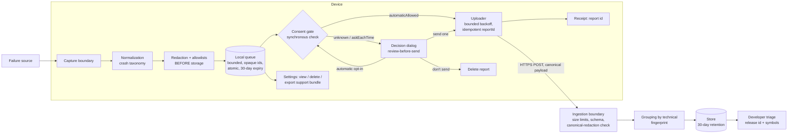

# Crash reporting and recovery — overview

Privacy-first crash reporting and crash recovery for Varve.

| Document | Contents |
|---|---|
| `docs/privacy/crash-audit.md` | Existing-system audit, failure-source map, data inventory, prohibited-data list, architecture map |
| `docs/privacy/consent-state.md` | Versioned consent state machine specification |
| `docs/privacy/redaction.md` | Redaction rules, bounds, fixtures, attack-resistance, field-add process |
| `docs/privacy/ingestion.md` | Ingestion contract, reference validator, server-side security controls |
| `docs/privacy/retention.md` | Local and server retention, consent-driven deletion |
| `docs/privacy/runbooks.md` | Crash-triage, symbols, privacy-incident, safe-mode, and support runbooks |

## Principles

1. Crash reporting is disabled by default; unknown consent fails closed.
2. No crash report or diagnostic event leaves the device before explicit
   consent. Redaction runs before local storage.
3. Crash reporting is separate from analytics, performance telemetry, and
   update checks. Varve runs no analytics.
4. Users can send one report without enabling automatic reporting, review
   what is sent, remove optional attachments, revoke consent, and delete
   queued reports.
5. Recovery and local diagnostics work when reporting is disabled.
6. The reporter never blocks startup, never blocks UI, and has strict
   memory/disk budgets.

## Data flow

The consent gate is checked (a) at capture-time routing, (b) synchronously
at every upload dispatch, and (c) at revocation (aborts in flight). Native
panics bypass the webview: the Rust panic hook writes a minimal emergency
record to the report directory, which the next boot imports through the
same redaction → queue → consent path.

## Implementation map

| Layer | Location |
|---|---|
| Core (consent, schema, redaction, queue, uploader, service, crash loop, safe mode, metrics, ingestion validator) | `packages/crash/src/` |
| UI (recovery dialog, review dialog, settings, safe-mode screen, controller, test hooks) | `packages/editor/src/crash/` |
| Native panic hook + report filesystem | `apps/desktop/src-tauri/src/crash.rs` |
| Release stamp | `apps/desktop/vite.config.ts` (`__VARVE_RELEASE__`) |
| Tests | colocated `*.test.ts(x)`; `tests/e2e/crash/privacy-network.spec.ts`, `tests/e2e/crash/screenshots.spec.ts` |

## UX screenshots

`docs/crash-reporting/screenshots/` (captured from the running app by
`screenshots.spec.ts`): crash-recovery dialog, review-before-send,
report-id receipt, safe-mode screen, and Privacy & Diagnostics settings.

## Performance and memory budgets

- Strict breadcrumb cap: 32 events × 120 chars, in-memory only.
- Strict queue: 10 reports / 25 MB, 30-day expiry.
- No synchronous network during crash handling; no startup-blocking
  request; no upload on metered connections when disabled.
- Capture path performs no large allocations; the native panic record is
  bounded (~1 KB).
- Reporter metrics are local-only and never transmitted.
